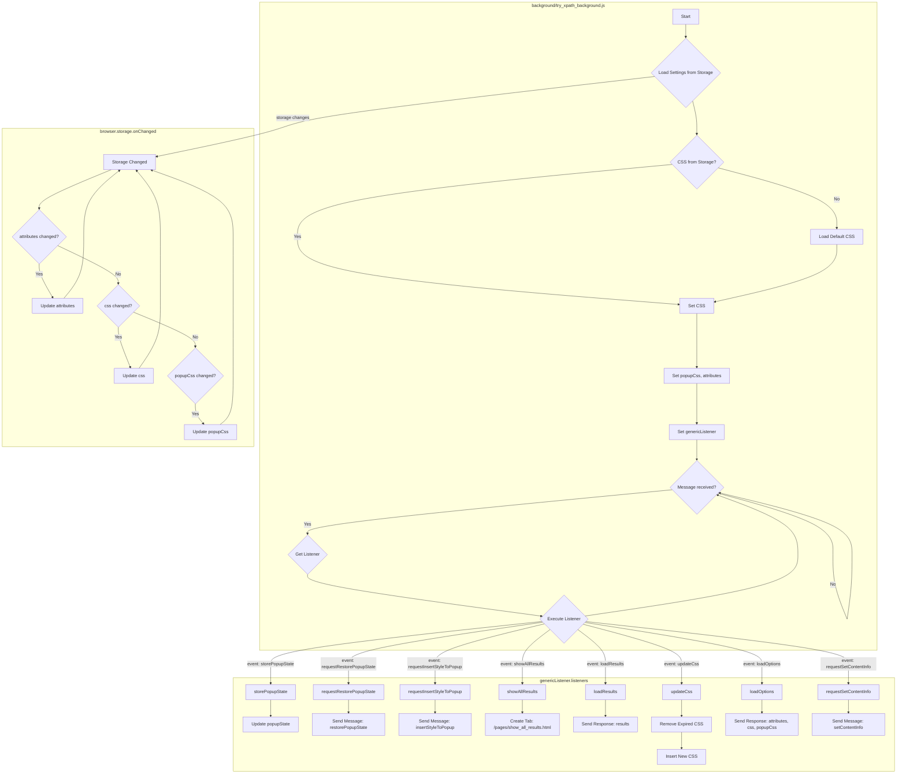

## <алгоритм>
1. **Инициализация:**
   - Устанавливаются псевдонимы `tx` (для `tryxpath`) и `fu` (для `tryxpath.functions`).
   - Инициализируются переменные:
     - `popupState`: для хранения состояния всплывающего окна (первоначально `null`).
     - `popupCss`: CSS для всплывающего окна.
     - `results`: объект для хранения результатов.
     - `css`: CSS для вставки в веб-страницы (первоначально пустая строка).
     - `attributes`: объект с атрибутами данных, используемыми для элементов на странице.
     - Пример:
       ```javascript
       var popupState = null;
       var popupCss = "body{width:367px;height:auto;}";
       var results = {};
       var css = "";
       var attributes = {
           "element": "data-tryxpath-element",
           "context": "data-tryxpath-context",
           "focused": "data-tryxpath-focused",
           "focusedAncestor": "data-tryxpath-focused-ancestor",
           "frame": "data-tryxpath-frame",
           "frameAncestor": "data-tryxpath-frame-ancestor"
       };
       ```

2. **`loadDefaultCss()`**: Загрузка CSS по умолчанию:
   - Создает `XMLHttpRequest` для запроса файла CSS.
   - При успешной загрузке `resolve` с текстом CSS, иначе происходит ошибка.
   - Пример:
     ```javascript
     function loadDefaultCss() {
        return new Promise((resolve, reject) => {
            var req = new XMLHttpRequest();
            req.open("GET",
                     browser.runtime.getURL("/css/try_xpath_insert.css"));
            req.responseType = "text";
            req.onreadystatechange = function () {
                if (req.readyState === XMLHttpRequest.DONE) {
                    resolve(req.responseText);
                }
            };
            req.send();
        });
    }
     ```

3. **`genericListener(message, sender, sendResponse)`**: Слушатель сообщений:
   - Вызывает обработчик сообщений на основе `message.event`.
   - `genericListener.listeners`: объект, хранящий обработчики сообщений.
   - Пример:
     ```javascript
    function genericListener(message, sender, sendResponse) {
        var listener = genericListener.listeners[message.event];
        if (listener) {
            return listener(message, sender, sendResponse);
        }
    };
     ```

4. **Обработчики сообщений `genericListener.listeners`:**
   - `storePopupState`: Сохраняет состояние всплывающего окна.
   - `requestRestorePopupState`: Отправляет сообщение для восстановления состояния всплывающего окна.
   - `requestInsertStyleToPopup`: Отправляет сообщение для вставки CSS во всплывающее окно.
   - `showAllResults`: Создает вкладку с результатами.
   - `loadResults`: Отправляет текущие результаты в ответ.
   - `updateCss`: Обновляет CSS на вкладке, удаляя старый CSS и добавляя новый.
   - `loadOptions`: Отправляет текущие атрибуты, css и popupCss в ответ.
   - `requestSetContentInfo`: Отправляет сообщение для установки `attributes` в контенте страницы.
    - Пример:
      ```javascript
        genericListener.listeners.storePopupState = function (message) {
            popupState = message.state;
        }
    
        genericListener.listeners.requestRestorePopupState = function (message) {
            browser.runtime.sendMessage({
                "timeout":0,"timeout_for_event":"presence_of_element_located","event": "restorePopupState",
                "state": popupState
            });
        };
      ```

5. **`browser.storage.onChanged.addListener()`**: Слушатель изменений в хранилище:
   - Обновляет `attributes`, `css` и `popupCss` при изменении в хранилище.
   - Пример:
     ```javascript
     browser.storage.onChanged.addListener(changes => {
          if (changes.attributes && ("newValue" in changes.attributes)) {
              attributes = changes.attributes.newValue;
          }
          if (changes.css && ("newValue" in changes.css)) {
              css = changes.css.newValue;
          }
          if (changes.popupCss && ("newValue" in changes.popupCss)) {
              popupCss = changes.popupCss.newValue;
          }
      });
     ```

6. **`browser.storage.sync.get()`**: Загрузка настроек из хранилища:
   - Получает `attributes`, `css` и `popupCss` из хранилища.
   - Если `css` равен `null`, загружает `css` по умолчанию.
    - Пример:
      ```javascript
        browser.storage.sync.get({
              "attributes": attributes,
              "css": null,
              "popupCss": popupCss
          }).then(items => {
              attributes = items.attributes;
              popupCss = items.popupCss;
              if (items.css !== null) {
                  return items.css;
              } else {
                  return loadDefaultCss();
              }
          }).then(loadedCss => {
              css = loadedCss;
          }).catch(fu.onError);
      ```

## <mermaid>

**Объяснение зависимостей `mermaid`:**

- **`background/try_xpath_background.js`**:  Основной скрипт, управляющий фоновыми операциями расширения.
    - `A[Start]`: Начало работы фонового скрипта.
    - `B{Load Settings from Storage}`: Загрузка настроек (атрибуты, CSS, CSS для попапа) из хранилища браузера.
    - `C{CSS from Storage?}`: Проверка, есть ли пользовательский CSS в хранилище.
    - `D[Set CSS]`: Установка CSS из хранилища или загруженного по умолчанию.
    - `E[Load Default CSS]`: Загрузка CSS по умолчанию, если пользовательский CSS отсутствует.
    - `F[Set popupCss, attributes]`: Установка значений для popupCss и attributes.
    - `G[Set genericListener]`: Настройка обработчика сообщений `genericListener`.
    - `H{Message received?}`: Проверка, получено ли сообщение от других частей расширения.
    - `I{Get Listener}`: Получение функции-обработчика для полученного сообщения.
    - `J{Execute Listener}`: Выполнение функции-обработчика.

- **`genericListener.listeners`**: Объект, хранящий функции-обработчики для разных типов сообщений.
    - `K[storePopupState]`: Сохранение состояния всплывающего окна.
    - `L[Update popupState]`: Обновление переменной `popupState`.
    - `M[requestRestorePopupState]`: Отправка запроса на восстановление состояния всплывающего окна.
    - `N[Send Message: restorePopupState]`: Отправка сообщения с событием `restorePopupState`.
    - `O[requestInsertStyleToPopup]`: Отправка запроса на вставку CSS во всплывающее окно.
    - `P[Send Message: insertStyleToPopup]`: Отправка сообщения с событием `insertStyleToPopup`.
    - `Q[showAllResults]`: Создание новой вкладки для отображения результатов.
    - `R[Create Tab: /pages/show_all_results.html]`: Открытие новой вкладки с `/pages/show_all_results.html`.
    - `S[loadResults]`: Отправка текущих результатов в ответ.
    - `T[Send Response: results]`: Отправка `results` обратно в ответ на сообщение.
    - `U[updateCss]`: Обновление CSS на странице.
    - `V[Remove Expired CSS]`: Удаление устаревшего CSS со страницы.
    - `W[Insert New CSS]`: Добавление нового CSS на страницу.
    - `X[loadOptions]`: Отправка текущих настроек.
    - `Y[Send Response: attributes, css, popupCss]`: Отправка `attributes`, `css` и `popupCss` обратно в ответ на сообщение.
    - `Z[requestSetContentInfo]`: Отправка сообщения для установки информации о контенте.
    - `AA[Send Message: setContentInfo]`: Отправка сообщения с событием `setContentInfo` и `attributes`.

- **`browser.storage.onChanged`**: Слушатель изменений в хранилище браузера.
    - `AB[Storage Changed]`: Срабатывает при изменении данных в хранилище.
    - `AC{attributes changed?}`: Проверка, изменился ли ключ `attributes`.
    - `AD[Update attributes]`: Обновление переменной `attributes`.
    - `AE{css changed?}`: Проверка, изменился ли ключ `css`.
    - `AF[Update css]`: Обновление переменной `css`.
    - `AG{popupCss changed?}`: Проверка, изменился ли ключ `popupCss`.
    - `AH[Update popupCss]`: Обновление переменной `popupCss`.

## <объяснение>
### Импорты:
- В данном коде нет явных импортов, он использует глобальные переменные `tryxpath` и `browser`, которые предоставляются окружением расширения Firefox.
- `browser`: API для работы с браузером, включая вкладки, хранилище, сообщения.
- `tryxpath`: Библиотека для работы с XPath (предположительно, из того же проекта).

### Классы:
- В коде нет явно определенных классов.

### Функции:
- **`loadDefaultCss()`**:
  -   **Аргументы:** Нет.
  -   **Возвращаемое значение:** `Promise` с текстом CSS.
  -   **Назначение:** Загружает CSS по умолчанию из файла `try_xpath_insert.css`.
  -   **Пример:**
        ```javascript
        loadDefaultCss().then(cssText => {
             console.log("CSS текст:", cssText)
        })
        ```
- **`genericListener(message, sender, sendResponse)`**:
  -   **Аргументы:** `message` (объект сообщения), `sender` (объект отправителя), `sendResponse` (функция для отправки ответа).
  -   **Возвращаемое значение:** результат работы обработчика.
  -   **Назначение:** Слушатель сообщений, вызывает соответствующие обработчики.
  -   **Пример:**
        ```javascript
        //Отправка сообщения (где-то в другом скрипте расширения)
        browser.runtime.sendMessage({"event": "storePopupState", "state": true})

        // Обработка (в данном background скрипте)
        genericListener({
            event: "storePopupState",
            state: true
        }, sender, sendResponse); // sender and sendResponse are predefined in webext API
        ```
- **Обработчики сообщений (`genericListener.listeners.*`)**:
  - `storePopupState(message)`:
     - **Аргументы:** `message` (объект сообщения, содержит `state`).
     - **Возвращаемое значение:** Нет.
     - **Назначение:** Сохраняет состояние всплывающего окна (например, `true` если открыто, `false` если закрыто).
     - **Пример:**
       ```javascript
         genericListener.listeners.storePopupState({state:true});
         console.log(popupState) // true
        ```
  - `requestRestorePopupState(message)`:
     - **Аргументы:** `message` (объект сообщения).
     - **Возвращаемое значение:** Нет.
     - **Назначение:** Отправляет сообщение для восстановления состояния всплывающего окна.
     - **Пример:**
       ```javascript
         genericListener.listeners.requestRestorePopupState({});
        ```
  - `requestInsertStyleToPopup(message)`:
    - **Аргументы:** `message` (объект сообщения).
    - **Возвращаемое значение:** Нет.
    - **Назначение:** Отправляет сообщение для вставки CSS во всплывающее окно.
    - **Пример:**
        ```javascript
        genericListener.listeners.requestInsertStyleToPopup({});
        ```
  - `showAllResults(message, sender)`:
    - **Аргументы:** `message` (объект сообщения с результатами), `sender` (объект отправителя).
    - **Возвращаемое значение:** Нет.
    - **Назначение:** Создает вкладку для отображения всех результатов XPath.
    - **Пример:**
       ```javascript
         genericListener.listeners.showAllResults({results: [1,2,3]}, {tab: {id:1}, frameId:0})
       ```
  - `loadResults(message, sender, sendResponse)`:
    - **Аргументы:** `message` (объект сообщения), `sender` (объект отправителя), `sendResponse` (функция для отправки ответа).
    - **Возвращаемое значение:** `true` (для асинхронных ответов).
    - **Назначение:** Отправляет текущие результаты в ответ на запрос.
    - **Пример:**
       ```javascript
           genericListener.listeners.loadResults({},{}, function(response){
               console.log(response) // {tabId:1, frameId:0, results: [1,2,3]}
           })
       ```
  - `updateCss(message, sender)`:
    - **Аргументы:** `message` (объект сообщения с `expiredCssSet`), `sender` (объект отправителя).
    - **Возвращаемое значение:** Нет.
    - **Назначение:** Обновляет CSS на странице, удаляя старый и вставляя новый.
    - **Пример:**
        ```javascript
        genericListener.listeners.updateCss({expiredCssSet: ['.class1', '.class2']}, {tab: {id:1}, frameId:0})
        ```
  - `loadOptions(message, sender, sendResponse)`:
    - **Аргументы:** `message` (объект сообщения), `sender` (объект отправителя), `sendResponse` (функция для отправки ответа).
    - **Возвращаемое значение:** `true` (для асинхронных ответов).
    - **Назначение:** Отправляет текущие значения атрибутов, css и popupCss в ответ.
    - **Пример:**
       ```javascript
           genericListener.listeners.loadOptions({},{}, function(response){
               console.log(response) // {attributes: {}, css: 'body{color:red}', popupCss:'body{width:367px;height:auto;}'}
           })
       ```
  - `requestSetContentInfo(message, sender)`:
    - **Аргументы:** `message` (объект сообщения), `sender` (объект отправителя).
    - **Возвращаемое значение:** Нет.
    - **Назначение:** Отправляет сообщение контенту для установки атрибутов.
    - **Пример:**
       ```javascript
          genericListener.listeners.requestSetContentInfo({}, {tab: {id:1}, frameId:0});
       ```
- **Анонимная функция `browser.storage.onChanged.addListener(changes => {...})`**:
  -   **Аргументы:** `changes` (объект с изменениями в хранилище).
  -   **Возвращаемое значение:** Нет.
  -   **Назначение:** Обновляет `attributes`, `css` и `popupCss` при изменении в хранилище.
- **Анонимная функция `browser.storage.sync.get({...}).then(items => {...})`**:
  -  **Аргументы:** Нет.
  - **Возвращаемое значение:** Нет.
  - **Назначение:** Загружает настройки из хранилища, устанавливает начальный css и атрибуты.
   
### Переменные:
- `tx`: Псевдоним для `tryxpath`.
- `fu`: Псевдоним для `tryxpath.functions`.
- `popupState`: Состояние всплывающего окна (логическое значение или `null`).
- `popupCss`: CSS для всплывающего окна (строка).
- `results`: Объект, хранящий результаты XPath (объект).
- `css`: CSS для вставки на страницы (строка).
- `attributes`: Объект с именами атрибутов данных (объект).

### Потенциальные ошибки и области для улучшения:
- **Обработка ошибок:** В основном используется `catch(fu.onError)`, что может скрывать ошибки. Желательно добавить более специфичную обработку ошибок.
- **Асинхронность:** Некоторые функции асинхронные, но не всегда явно обрабатывают ошибки или показывают прогресс.
- **Сложная логика обновления CSS**: Функция updateCss сложная и требует тщательного тестирования.

### Взаимосвязь с другими частями проекта:
- **Контентные скрипты:** Обменивается сообщениями с контентными скриптами через `browser.tabs.sendMessage`.
- **Страница результатов:** Создает вкладку `show_all_results.html` для отображения результатов.
- **Хранилище браузера:** Использует `browser.storage.sync` для хранения и загрузки настроек.
- **`tryxpath` библиотека**: Данный скрипт работает с функционалом библиотеки `tryxpath` (ее реализация в данном коде не видна)

Этот скрипт является фоновым скриптом расширения, который управляет состоянием, стилями и обработкой данных.