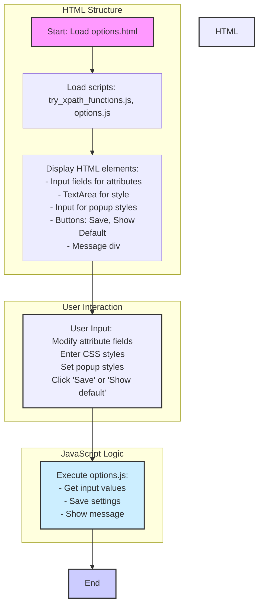

## АНАЛИЗ КОДА: `hypotez/src/webdriver/firefox/extentions/try_path_1.3.5/pages/options.html`

### 1. <алгоритм>

1.  **Загрузка HTML-страницы:** Браузер загружает `options.html`. Эта страница является интерфейсом для настройки расширения.
    *   Пример: Пользователь открывает страницу настроек расширения в Firefox.

2.  **Загрузка JavaScript:** HTML-страница загружает два скрипта:
    *   `../scripts/try_xpath_functions.js`: Предположительно, содержит функции для работы с XPath.
    *   `options.js`: Содержит логику для страницы настроек.
    *   Пример: Браузер загружает эти скрипты перед отображением страницы.

3.  **Отображение HTML:** Браузер отображает элементы HTML:
    *   Раздел "Attributes":
        *   Поля ввода для различных атрибутов элементов (результирующих элементов, контекстных элементов, и т.д.)
        *   Пример: Пользователь видит поле ввода "Resulted elements"
    *   Раздел "Style to be inserted":
        *   Текстовая область для ввода CSS-стилей.
        *   Пример: Пользователь может ввести CSS в текстовое поле.
    *   Раздел "Popup styles":
        *   Поля для настройки ширины и высоты всплывающего окна.
        *   Пример: Пользователь может задать "Body width" как "300px".
    *   Кнопки "Save" и "Show default":
        *   Кнопка "Save" для сохранения настроек.
        *   Кнопка "Show default" для установки значений по умолчанию.
        *   Пример: Пользователь нажимает кнопку "Save".
    *   Сообщение:
        *   Элемент `div` с id "message" для отображения сообщений.
        *   Пример:  Сообщение об успехе сохранения настроек.
4.  **Взаимодействие пользователя:** Пользователь может изменять значения в полях ввода и нажимать кнопки.
    *   Пример: Пользователь вводит значения для различных атрибутов и нажимает "Save".

5.  **JavaScript обработка:** Скрипт `options.js` обрабатывает пользовательские действия:
    *   Получает значения из полей ввода.
    *   Сохраняет настройки (вероятно, используя API браузера для хранения расширений).
    *   Отображает сообщения в `div#message`.
    *   Пример: `options.js` сохраняет ширину и высоту всплывающего окна и отображает сообщение об успехе.

### 2. <mermaid>



### 3. <объяснение>

**Импорты:**

*   В данном HTML-файле нет явных импортов Python, т.к. это файл разметки. Однако, в HTML подключаются два JavaScript файла:
    *   `../scripts/try_xpath_functions.js` - вероятно, содержит функции для работы с XPath, которые используются для выбора элементов на странице. Этот файл необходим для работы с путями элементов, если таковая функциональность подразумевается.
    *   `options.js` - файл, который содержит логику обработки событий и работы с настройками на этой странице. Он обеспечивает интерактивность элементов HTML и сохраняет введенные настройки.

**Классы:**

*   В представленном HTML-коде отсутствуют классы. HTML-код отвечает за структуру и представление интерфейса. Классы (как в JavaScript) могут использоваться в подключенных `options.js`.

**Функции:**

*   Функций в HTML коде нет, но `options.js` предположительно будет содержать функции для обработки событий, такие как:
    *   `saveSettings()` - сохраняет введенные настройки.
    *   `showDefaultSettings()` - устанавливает значения настроек по умолчанию.
    *   `updateMessage(message)` - показывает сообщения пользователю.
    *   `getValuesFromInputs()` - извлекает данные из полей ввода.
    *   Пример функции:
    ```javascript
    function saveSettings() {
        const elementAttribute = document.getElementById('element-attribute').value;
        // ... Получение других значений
        browser.storage.sync.set({
        elementAttribute: elementAttribute,
        // ... Сохранение других значений
        }).then(() => {
           updateMessage('Settings saved');
        });
    }
    ```

**Переменные:**

*   В HTML-коде определены идентификаторы (id) элементов, которые используются для доступа к этим элементам из JavaScript:
    *   `element-attribute`, `context-attribute`, `focused-attribute`, `ancestor-attribute`, `frame-attribute`, `frame-ancestor-attribute` - поля ввода для различных атрибутов.
    *   `style` - текстовая область для CSS-стилей.
    *   `popup-body-width`, `popup-body-height` - поля ввода для размеров всплывающего окна.
    *   `save` - кнопка для сохранения настроек.
    *   `show-default` - кнопка для показа настроек по умолчанию.
    *   `message` -  элемент для показа сообщений.
*   В JavaScript файле `options.js` предположительно будут переменные для хранения считанных значений из полей.

**Потенциальные ошибки и области для улучшения:**

*   **Отсутствие валидации данных:** Не хватает валидации вводимых данных. Например,  можно добавить проверку форматов `popup-body-width` и `popup-body-height` для предотвращения ошибок.
*   **Ограниченная информативность:** Недостаточно контекста. Например, отсутствует описание того, как именно используются эти атрибуты (например,  для каких именно элементов выполняется поиск).
*   **Недостаточное взаимодействие:** Нет явного механизма для связи между HTML и `try_xpath_functions.js` . Необходимо понимать, как функции из этого файла применяются.
*   **Отсутствие обработки ошибок:** Не предусмотрена обработка ошибок, возникающих во время сохранения данных или при считывании значений.

**Цепочка взаимосвязей:**

*   **HTML -> `options.js`:**  HTML  предоставляет структуру и пользовательский интерфейс, `options.js`  обрабатывает взаимодействие пользователя, сохраняет данные и отображает сообщения.
*  **`options.js`-> `browser.storage`:** `options.js` использует API браузера `browser.storage` для сохранения и получения настроек расширения.
*   **`options.js`-> `try_xpath_functions.js`:**  `options.js`, вероятно, вызывает функции из `try_xpath_functions.js` для работы с XPath.
*   **Расширение Firefox -> `options.html`:** Расширение загружает `options.html` для отображения настроек.

В целом,  `options.html` является частью пользовательского интерфейса расширения, который позволяет настраивать его параметры. JavaScript-код (в `options.js`)  обеспечивает логику для взаимодействия с пользователем и сохранения данных, а `try_xpath_functions.js`, возможно, отвечает за работу с элементами на странице.