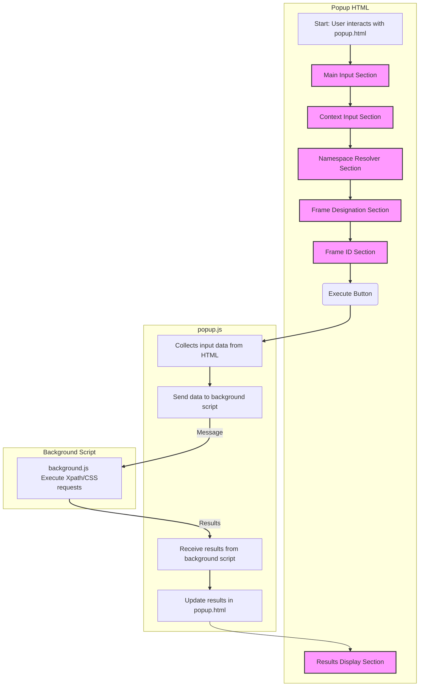

## ИНСТРУКЦИЯ:

Анализируй предоставленный код подробно и объясни его функциональность. Ответ должен включать три раздела:

1.  **<алгоритм>**: Опиши рабочий процесс в виде пошаговой блок-схемы, включая примеры для каждого логического блока, и проиллюстрируй поток данных между функциями, классами или методами.
2.  **<mermaid>**: Напиши код для диаграммы в формате `mermaid`, проанализируй и объясни все зависимости,
    которые импортируются при создании диаграммы.
    **ВАЖНО!** Убедитесь, что все имена переменных, используемые в диаграмме `mermaid`,
    имеют осмысленные и описательные имена. Имена переменных вроде `A`, `B`, `C`, и т.д., не допускаются!

    **Дополнительно**: Если в коде есть импорт `import header`, добавьте блок `mermaid` flowchart, объясняющий `header.py`:\
    ```mermaid
    flowchart TD
        Start --> Header[<code>header.py</code><br> Determine Project Root]

        Header --> import[Import Global Settings: <br><code>from src import gs</code>]
    ```

3.  **<объяснение>**: Предоставьте подробные объяснения:
    *   **Импорты**: Их назначение и взаимосвязь с другими пакетами `src.`.
    *   **Классы**: Их роль, атрибуты, методы и взаимодействие с другими компонентами проекта.
    *   **Функции**: Их аргументы, возвращаемые значения, назначение и примеры.
    *   **Переменные**: Их типы и использование.
    *   Выделите потенциальные ошибки или области для улучшения.

Дополнительно, постройте цепочку взаимосвязей с другими частями проекта (если применимо).

Это обеспечивает всесторонний и структурированный анализ кода.
## Формат ответа: `.md` (markdown)
**КОНЕЦ ИНСТРУКЦИИ**

## <алгоритм>

Представленный HTML-код является структурой пользовательского интерфейса для расширения браузера, предназначенного для тестирования XPath и CSS-селекторов. Он состоит из нескольких разделов, позволяющих пользователю:

1.  **Выбор метода и типа**:
    *   Пользователь выбирает метод (например, `evaluate`, `querySelector`, `querySelectorAll`) и тип (например, `ANY_TYPE`, `NUMBER_TYPE`, `STRING_TYPE` и т.д.) для выполнения запроса из выпадающего списка в разделе "Main".
    *   *Пример:* Выбор `querySelector` и `""` (пусто) в качестве типа.

2.  **Ввод выражения**:
    *   Пользователь вводит XPath или CSS-выражение в текстовое поле "Expression" в разделе "Main".
    *   *Пример:* Ввод `.my-class` в поле "Expression" при выборе метода `querySelector`.

3.  **Установка контекста**:
    *   (Опционально) Пользователь может выбрать метод и ввести выражение для определения контекста, в котором будет выполняться основной запрос. Это делается в разделе "Context". Результат этого запроса используется как контекст для основного запроса.
    *   *Пример:* Выбор `querySelector` и ввод `div.container` в поле "Expression" для определения контекстного элемента.

4.  **Установка namespaceResolver**:
    *   (Опционально) Пользователь может указать префиксы и URI пространств имен в поле "Resolver" в разделе "namespaceResolver". Это необходимо для работы с XML-документами и XPath с пространствами имен.
    *   *Пример:* Ввод `{"x":"http://www.w3.org/1999/xhtml"}` для работы с XHTML-пространством имен.

5.  **Настройка frame**:
    *   Пользователь может определить фрейм для выполнения запроса.
        *   *Frame without id*:  Ввод массива индексов фреймов в поле "Frame" для выбора вложенных фреймов, не имеющих ID.
        *    *frameId*:  Выбор `frameId` из списка или ввод `frameId` вручную.
    *   *Пример:* Ввод `[0,1]` в поле "Frame" для выбора второго фрейма внутри первого. Выбор frameId с именем "frame_1" из списка frameId.

6.  **Выполнение запроса**:
    *   При нажатии на кнопку "Execute" на странице `popup.js` выполняется запрос с использованием выбранных параметров и выражений.

7.  **Отображение результатов**:
    *   Результаты выполнения запроса, включая сообщения, количество элементов и детали, отображаются в разделе "Results".
    *   Включает кнопки для отображения всех результатов, открытия настроек, установки и сброса стилей, а также для навигации по страницам результатов.

8.  **Взаимодействие с DOM**:
    *   Кнопки "Focus frame" и "Focus designated frame" позволяют переключать фокус на выбранный фрейм.
    *   Кнопки для установки и сброса стилей позволяют визуально подсвечивать элементы на странице.

**Поток данных:**

1.  **Ввод пользователя:** HTML-форма собирает данные из полей ввода, выпадающих списков и чекбоксов.
2.  **Обработка в `popup.js`:** JavaScript-файл `popup.js` получает данные из HTML-формы.
3.  **Выполнение запроса:** `popup.js` отправляет сообщение на background script.
4.  **Обработка в background script:** Background script выполняет запрос с использованием данных, полученных из `popup.js`.
5.  **Возврат результатов:** Background script возвращает результаты запроса в `popup.js`.
6.  **Отображение результатов:** `popup.js` обновляет HTML-страницу, отображая результаты.

## <mermaid>



**Описание зависимостей:**

*   `popup.html` содержит HTML-структуру пользовательского интерфейса.
*   `popup.js` обрабатывает ввод пользователя из `popup.html`, отправляет сообщения в `background.js`, а также получает и отображает результаты.
*   `background.js` является background script, который выполняет запросы на основе данных, полученных от `popup.js`, и возвращает результаты.
*   Связь между `popup.html` и `popup.js` осуществляется через HTML-элементы и JavaScript DOM API.
*   Связь между `popup.js` и `background.js` осуществляется через механизм обмена сообщениями расширения браузера.

## <объяснение>

**Импорты:**

В данном HTML-файле нет импортов в том смысле, в каком они используются в Python или JavaScript. Однако, он содержит ссылки на внешние ресурсы:

*   `<link rel="stylesheet" href="popup.css"/>`: Импортирует стили CSS из файла `popup.css` для оформления HTML-страницы.
*   `<script src="../scripts/try_xpath_functions.js"></script>`: Импортирует JavaScript-файл `try_xpath_functions.js`, который, вероятно, содержит функции для работы с XPath.
*   `<script src="popup.js"></script>`: Импортирует JavaScript-файл `popup.js`, который управляет логикой страницы и взаимодействует с `background.js`.

**Классы:**

В HTML-файле нет определения классов в том смысле, в каком они используются в объектно-ориентированном программировании. HTML использует классы CSS для стилизации элементов. Примеры:

*   `class="help"`: Используется для стилизации элементов, содержащих пояснения.
*   `class="none"`: Используется для скрытия элементов по умолчанию.

**Функции:**

В самом HTML-коде нет функций. Функции, которые управляют поведением страницы, находятся в JavaScript-файлах `try_xpath_functions.js` и `popup.js`. Функции, определенные в `popup.js` будут обрабатывать события, которые создаются элементами HTML (например нажатие кнопки Execute, изменение значения в выпадающем списке).

**Переменные:**

*   `MODE = 'debug'`: JavaScript-переменная, объявленная в самом начале HTML-кода. Она может использоваться для включения или отключения режима отладки в `popup.js` или `try_xpath_functions.js`.
*   `id="execute"`, `id="help-switch"`: Идентификаторы HTML-элементов, которые могут быть использованы JavaScript для управления этими элементами.

**Потенциальные ошибки и области для улучшения:**

*   **Отсутствие валидации ввода:** HTML-код не валидирует вводимые пользователем данные, что может привести к ошибкам при выполнении запросов. В `popup.js` необходимо валидировать и обрабатывать пользовательский ввод.
*   **Зависимость от `try_xpath_functions.js`:** Функциональность расширения зависит от внешнего скрипта `try_xpath_functions.js`, что делает ее менее модульной. Было бы лучше, если бы `popup.js` содержал весь необходимый код, или если бы функции `try_xpath_functions.js` были более общими и использовались в разных частях проекта.
*   **Жестко заданные данные в HTML:** HTML-код содержит статические выпадающие списки с вариантами методов и типов. Было бы лучше динамически генерировать их на основе некоторого конфигурационного файла или из API браузера. Это позволит добавить новые методы и типы в будущем, не изменяя HTML-код.
*   **Дублирование кода:** Разделы "Main" и "Context" имеют схожую структуру (выпадающий список и текстовое поле), что можно было бы вынести в общий шаблон или компонент.
*   **Недостаточная обработка ошибок:** HTML-код отображает сообщения об ошибках в элементе `span` с `id="results-message"`, но не содержит подробной информации о том, что пошло не так. Необходимо более детально отлавливать ошибки и выводить соответствующую информацию для пользователя.
*   **Слабая доступность:** Код не имеет атрибутов aria, что затрудняет использование расширения людьми с ограниченными возможностями.

**Цепочка взаимосвязей:**

1.  `popup.html` предоставляет пользовательский интерфейс.
2.  `popup.js` обрабатывает действия пользователя и взаимодействует с `background.js`.
3.  `background.js` выполняет запросы и возвращает результаты в `popup.js`.
4.  `try_xpath_functions.js` (вероятно) содержит вспомогательные функции для выполнения XPath запросов.
5.  `popup.css` задает стили для пользовательского интерфейса.
6.  Расширение взаимодействует с DOM страницы, на которой оно работает, через механизм контента скриптов.

Этот анализ позволяет получить полное представление о структуре, функциональности и потенциальных проблемах данного HTML-кода.