## ИНСТРУКЦИЯ:

Анализируй предоставленный код подробно и объясни его функциональность. Ответ должен включать три раздела:

1.  **<алгоритм>**: Опиши рабочий процесс в виде пошаговой блок-схемы, включая примеры для каждого логического блока, и проиллюстрируй поток данных между функциями, классами или методами.
2.  **<mermaid>**: Напиши код для диаграммы в формате `mermaid`, проанализируй и объясни все зависимости, которые импортируются при создании диаграммы.
    **ВАЖНО!** Убедитесь, что все имена переменных, используемые в диаграмме `mermaid`, имеют осмысленные и описательные имена. Имена переменных вроде `A`, `B`, `C`, и т.д., не допускаются!
    
    **Дополнительно**: Если в коде есть импорт `import header`, добавьте блок `mermaid` flowchart, объясняющий `header.py`:
    ```mermaid
    flowchart TD
        Start --> Header[<code>header.py</code><br> Determine Project Root]
    
        Header --> import[Import Global Settings: <br><code>from src import gs</code>] 
    ```

3.  **<объяснение>**: Предоставьте подробные объяснения:
    *   **Импорты**: Их назначение и взаимосвязь с другими пакетами `src.`.
    *   **Классы**: Их роль, атрибуты, методы и взаимодействие с другими компонентами проекта.
    *   **Функции**: Их аргументы, возвращаемые значения, назначение и примеры.
    *   **Переменные**: Их типы и использование.
    *   Выделите потенциальные ошибки или области для улучшения.

Дополнительно, постройте цепочку взаимосвязей с другими частями проекта (если применимо).

Это обеспечивает всесторонний и структурированный анализ кода.
## Формат ответа: `.md` (markdown)
**КОНЕЦ ИНСТРУКЦИИ**

## <алгоритм>

### Основной алгоритм:

1. **Инициализация:**
    - Проверяется, существует ли пространство имен `tryxpath`. Если нет, оно создается.
    - Проверяется, существует ли пространство имен `tryxpath.functions`. Если нет, оно создается.
    - Устанавливаются псевдонимы `tx` для `tryxpath` и `fu` для `tryxpath.functions`.
    - Проверяется, была ли уже выполнена инициализация `fu.done`. Если да, функция завершается.

2. **`fu.execExpr(expr, method, opts)`**:
    - Принимает XPath выражение `expr`, метод `method` (evaluate, querySelector, querySelectorAll) и опции `opts`.
    - Устанавливает контекст выполнения `context` (по умолчанию `document`) и ресолвер `resolver`.
    - Получает документ `doc` из контекста.
    - Выполняет XPath запрос или CSS-селектор в зависимости от метода:
        - **"evaluate"**: Выполняет XPath запрос, преобразует результат в массив.
            *   Пример: `fu.execExpr('//div', 'evaluate', { context: document.body })` - ищет все div внутри body.
        - **"querySelector"**: Выполняет CSS-селектор, возвращает первый элемент.
            *   Пример: `fu.execExpr('.my-class', 'querySelector', { context: document.getElementById('my-container') })` - ищет первый элемент с классом my-class внутри элемента с id my-container.
        - **"querySelectorAll"**: Выполняет CSS-селектор, возвращает все элементы.
             *   Пример:  `fu.execExpr('li', 'querySelectorAll', { context: document.getElementById('my-list') })` - ищет все элементы li внутри элемента с id my-list.
    - Возвращает объект с массивом найденных элементов `items`, методом `method` и типом результата `resultType`.

3. **`fu.resToArr(res, type)`**:
    - Принимает результат XPath запроса `res` и тип `type`.
    - Преобразует результат в массив в зависимости от `resultType` (число, строка, булево, итератор, снимок, один узел).
    - Возвращает массив.
    *   Пример: Если res это `xpathResult.ORDERED_NODE_ITERATOR_TYPE`, функция  перебирает элементы и помещает их в массив.

4. **`fu.makeResolver(obj)`**:
    - Принимает объект `obj`, который может быть функцией или строкой/объектом JSON.
    - Если `obj` функция, возвращает ее.
    - Если `obj` строка, пытается ее распарсить как JSON. Если не удается, возвращает ошибку.
    - Если `obj` объект, преобразует его в Map и возвращает функцию, которая может разрешать префиксы.
    - Если `obj` не является допустимым, возвращает ошибку.

5. **`fu.isValidDict(obj)`**:
    - Проверяет, является ли объект `obj` допустимым словарем для преобразования в ресолвер (все значения должны быть строками).

6. **`fu.objToMap(obj)`**:
    - Преобразует объект в Map.

7. **`fu.isDocOrElem(obj)`**:
    - Проверяет, является ли объект `obj` документом или элементом.

8.  **`fu.listToArr(list)`**:
    - Преобразует HTMLCollection или NodeList в массив.

9.  **`fu.getItemDetail(item)`**:
     - Принимает элемент `item` любого типа.
     - Возвращает объект с информацией о типе, имени, значении и тексте элемента.
     *   Пример: Если `item` это `Element`, то возвращаются его nodeName, textContent, type.

10. **`fu.getItemDetails(items)`**:
    - Принимает массив элементов `items`.
    - Возвращает массив объектов с детальной информацией для каждого элемента, используя `fu.getItemDetail()`.

11. **`fu.getNodeTypeStr(nodeType)`**:
    - Преобразует числовой код типа узла в строковое представление (например, `Node.ELEMENT_NODE` в `"ELEMENT_NODE"`).

12. **`fu.getxpathResultStr(resultType)`**:
    - Преобразует числовой код типа результата XPath в строковое представление (например, `xpathResult.NUMBER_TYPE` в `"NUMBER_TYPE"`).

13. **`fu.getxpathResultNum(resultTypeStr)`**:
    - Преобразует строковое представление типа результата XPath в числовой код.

14. **`fu.isAttrItem(item)`**:
    - Проверяет, является ли объект `item` атрибутом (Attr).

15. **`fu.isNodeItem(item)`**:
    - Проверяет, является ли объект `item` узлом (не атрибутом, числом или строкой).

16. **`fu.isElementItem(item)`**:
    - Проверяет, является ли объект `item` элементом (Element).

17. **`fu.addClassToItem(clas, item)`**:
    - Добавляет класс `clas` к элементу `item`.

18. **`fu.addClassToItems(clas, items)`**:
    - Добавляет класс `clas` ко всем элементам в массиве `items`.

19. **`fu.saveItemClass(item)`**:
    - Сохраняет класс элемента `item` в объекте, чтобы потом можно было восстановить.

20. **`fu.restoreItemClass(savedClass)`**:
    - Восстанавливает класс элемента из сохраненных данных.

21. **`fu.saveItemClasses(items)`**:
    - Сохраняет классы массива элементов `items`.

22. **`fu.restoreItemClasses(savedClasses)`**:
    - Восстанавливает классы массива элементов из сохраненных данных.

23. **`fu.setAttrToItem(name, value, item)`**:
    - Устанавливает атрибут `name` со значением `value` для элемента `item`.

24. **`fu.removeAttrFromItem(name, item)`**:
    - Удаляет атрибут `name` из элемента `item`.

25. **`fu.removeAttrFromItems(name, items)`**:
    - Удаляет атрибут `name` из всех элементов в массиве `items`.

26. **`fu.setIndexToItems(name, items)`**:
    - Устанавливает атрибут `name` со значением индекса для каждого элемента в массиве `items`.

27. **`fu.getParentElement(item)`**:
     - Принимает элемент `item`, и возвращает его родительский элемент.

28. **`fu.getAncestorElements(elem)`**:
     - Принимает элемент `elem`, и возвращает массив всех его родительских элементов.

29. **`fu.getOwnerDocument(item)`**:
    - Возвращает документ, которому принадлежит элемент.

30. **`fu.createHeaderRow(values, opts)`**:
    - Создает строку таблицы `<tr>` с заголовками `<th>` из массива значений `values`.

31. **`fu.createDetailTableHeader(opts)`**:
    - Создает строку таблицы с заголовками для детальной информации об элементах.

32. **`fu.createDetailRow(index, detail, opts)`**:
     - Принимает индекс `index`, объект с деталями элемента `detail`, и опции `opts`.
     - Создает строку таблицы `<tr>` с деталями элемента `detail`.
     *   Пример: создает строку для элемента с индексом 0 и деталями {type: "Node", name: "div", value: ""}

33. **`fu.appendDetailRows(parent, details, opts)`**:
    - Асинхронно добавляет строки таблицы с деталями элементов в родительский элемент `parent`, использует DocumentFragment для оптимизации.
    - Разбивает добавление на чанки для избежания блокировки UI.
     *   Пример: если есть 2000 элементов, то с `chunkSize: 1000` в начале 1000 элементов добавится, а затем остальные 1000.

34. **`fu.updateDetailsTable(parent, details, opts)`**:
    - Обновляет таблицу с деталями элементов, создавая заголовок и добавляя строки с деталями.
    - Очищает таблицу перед добавлением данных.

35. **`fu.emptyChildNodes(elem)`**:
     - Очищает все дочерние узлы элемента `elem`.

36. **`fu.saveAttrForItem(item, attr, storage, overwrite)`**:
    - Сохраняет значение атрибута `attr` элемента `item` в Map `storage`.
    - `overwrite` указывает, перезаписывать ли атрибут.

37. **`fu.saveAttrForItems(items, attr, storage, overwrite)`**:
    - Сохраняет значения атрибута `attr` для массива элементов `items` в Map `storage`.

38. **`fu.restoreItemAttrs(storage)`**:
    - Восстанавливает атрибуты элементов из сохраненных данных в Map `storage`.

39. **`fu.getFrameAncestry(inds, win)`**:
     - Принимает массив индексов `inds` и окно `win`.
     - Возвращает массив фреймов, полученных путем последовательного доступа через `win.frames` по индексам в `inds`.

40. **`fu.isNumberArray(arr)`**:
    - Проверяет, является ли `arr` массивом чисел.

41. **`fu.onError(err)`**:
    - Функция для обработки ошибок (в данном случае пустая).

42. **`fu.isBlankWindow(win)`**:
    - Проверяет, является ли окно `win` пустым (about:blank).

43. **`fu.collectBlankWindows(top)`**:
    - Собирает все пустые окна (about:blank) из текущего окна и его фреймов рекурсивно.

44. **`fu.findFrameElement(win, parent)`**:
    - Находит iframe-элемент, содержащий окно `win` в родительском элементе `parent`.

45. **`fu.findFrameIndex(win, parent)`**:
     - Принимает окно `win` и родительский элемент `parent`.
     - Находит индекс фрейма, содержащего окно `win`, среди фреймов родительского элемента `parent`.

46. **`fu.makeDetailText(detail, keys, separator, replacers)`**:
     - Принимает объект с деталями `detail`, массив ключей `keys`, разделитель `separator` и объект с функциями замены `replacers`.
     - Создает строку с деталями элемента, используя ключи, разделитель и функции замены.

### Поток данных:

1.  **`execExpr`**: Принимает XPath выражение и контекст, возвращает результаты в виде массива элементов и метаданных.
2.  **`resToArr`**: Преобразует результаты XPath в массив.
3.  **`getItemDetail`**:  Преобразует элементы в объекты с подробной информацией.
4.  **`getItemDetails`**:  Преобразует массив элементов в массив объектов с подробной информацией.
5.  **`createDetailRow`**: Создает строку таблицы на основе данных.
6.  **`appendDetailRows`**: Асинхронно добавляет строки в таблицу, разбивая процесс на чанки.
7.  **`updateDetailsTable`**: Обновляет таблицу с деталями, вызывая `appendDetailRows`.

```mermaid
graph TD
    subgraph tryxpath
        direction TB
        
        subgraph functions
            
            execExpr(execExpr) -->|expr, method, opts| resToArr(resToArr)
            
            resToArr -->|res, type| items
            
            execExpr(execExpr) -->|method| querySelector(querySelector)
            execExpr(execExpr) -->|method| querySelectorAll(querySelectorAll)
            
            querySelector -->|expr, context| items
            querySelectorAll -->|expr, context| items
            
            makeResolver(makeResolver) -->|obj| resolver
            isValidDict(isValidDict) -->|obj| isValid
            objToMap(objToMap) -->|obj| map
            isDocOrElem(isDocOrElem) -->|obj| isDocOrElem_result
            listToArr(listToArr) -->|list| array
            getItemDetail(getItemDetail) -->|item| detail
            getItemDetails(getItemDetails) -->|items| details
            getNodeTypeStr(getNodeTypeStr) -->|nodeType| nodeTypeString
            getxpathResultStr(getxpathResultStr) -->|resultType| xpathResultString
            getxpathResultNum(getxpathResultNum) -->|resultTypeStr| xpathResultNumber
            isAttrItem(isAttrItem) -->|item| isAttr
            isNodeItem(isNodeItem) -->|item| isNode
            isElementItem(isElementItem) -->|item| isElement
            addClassToItem(addClassToItem) -->|clas, item| addClass
            addClassToItems(addClassToItems) -->|clas, items| addClasses
            saveItemClass(saveItemClass) -->|item| savedClass
            restoreItemClass(restoreItemClass) -->|savedClass| restoreClass
            saveItemClasses(saveItemClasses) -->|items| savedClasses
            restoreItemClasses(restoreItemClasses) -->|savedClasses| restoreClasses
            setAttrToItem(setAttrToItem) -->|name, value, item| setAttribute
            removeAttrFromItem(removeAttrFromItem) -->|name, item| removeAttribute
            removeAttrFromItems(removeAttrFromItems) -->|name, items| removeAttributes
            setIndexToItems(setIndexToItems) -->|name, items| setIndex
            getParentElement(getParentElement) -->|item| parentElement
            getAncestorElements(getAncestorElements) -->|elem| ancestorElements
            getOwnerDocument(getOwnerDocument) -->|item| ownerDocument
            createHeaderRow(createHeaderRow) -->|values, opts| headerRow
            createDetailTableHeader(createDetailTableHeader) -->|opts| detailTableHeader
            createDetailRow(createDetailRow) -->|index, detail, opts| detailRow
            appendDetailRows(appendDetailRows) -->|parent, details, opts| appendRows
            updateDetailsTable(updateDetailsTable) -->|parent, details, opts| updateTable
            emptyChildNodes(emptyChildNodes) -->|elem| empty
            saveAttrForItem(saveAttrForItem) -->|item, attr, storage, overwrite| attrStorage
            saveAttrForItems(saveAttrForItems) -->|items, attr, storage, overwrite| attrsStorage
            restoreItemAttrs(restoreItemAttrs) -->|storage| restoreAttrs
            getFrameAncestry(getFrameAncestry) -->|inds, win| frames
            isNumberArray(isNumberArray) -->|arr| isNumberArr
            onError(onError) -->|err| error
            isBlankWindow(isBlankWindow) -->|win| isBlank
            collectBlankWindows(collectBlankWindows) -->|top| blankWindows
            findFrameElement(findFrameElement) -->|win, parent| frameElement
            findFrameIndex(findFrameIndex) -->|win, parent| frameIndex
            makeDetailText(makeDetailText) -->|detail, keys, separator, replacers| detailText
        end
    end
    
    style tryxpath fill:#f9f,stroke:#333,stroke-width:2px
    style functions fill:#ccf,stroke:#333,stroke-width:1px
    
```

## <mermaid>



### Объяснение зависимостей `mermaid`:

*   **`tryxpath`**: Это пространство имен, которое содержит все функции и переменные, относящиеся к функциональности, предоставляемой этим кодом. Оно выделено в отдельный `subgraph`.
*   **`tryxpath.functions`**: Это вложенное пространство имен, в котором определены все функции, предоставляемые этим кодом. Оно выделено в отдельный `subgraph`.
*   **`execExpr`**: Главная функция, которая выполняет XPath выражения или CSS селекторы. Она принимает XPath выражение, метод и опции. Её выходные данные - это массив элементов или метаданные и передается к функциям `resToArr`, `querySelector`, `querySelectorAll`.
*   **`resToArr`**:  Преобразует результат XPath запроса в массив. Принимает результат запроса `res` и тип данных `type`. Возвращает массив `items`.
*   **`querySelector`**:  Выполняет CSS селектор и возвращает первый найденный элемент. Принимает выражение `expr` и контекст `context`. Возвращает `items`.
*    **`querySelectorAll`**:  Выполняет CSS селектор и возвращает все найденные элементы. Принимает выражение `expr` и контекст `context`. Возвращает `items`.
*   **`makeResolver`**: Функция для создания ресолвера пространства имен. Принимает объект `obj` и возвращает `resolver`.
*  **`isValidDict`**: Проверяет, является ли объект допустимым словарем для ресолвера. Принимает объект `obj`, возвращает булево значение `isValid`.
*   **`objToMap`**: Преобразует объект в Map. Принимает объект `obj` и возвращает Map `map`.
*   **`isDocOrElem`**: Проверяет, является ли объект документом или элементом. Принимает объект `obj` и возвращает булево значение `isDocOrElem_result`.
*   **`listToArr`**: Преобразует HTMLCollection или NodeList в массив. Принимает список `list` и возвращает `array`.
*  **`getItemDetail`**:  Получает детальную информацию об элементе. Принимает элемент `item` и возвращает его `detail`.
*   **`getItemDetails`**: Получает детальную информацию о массиве элементов. Принимает массив элементов `items` и возвращает массив деталей `details`.
*  **`getNodeTypeStr`**: Преобразует числовой код типа узла в строковое представление. Принимает тип узла `nodeType` и возвращает строку `nodeTypeString`.
*   **`getxpathResultStr`**: Преобразует числовой код типа результата XPath в строку. Принимает тип результата `resultType` и возвращает строку `xpathResultString`.
*    **`getxpathResultNum`**:  Преобразует строковое представление типа результата XPath в числовой код. Принимает строку `resultTypeStr` и возвращает число `xpathResultNumber`.
*   **`isAttrItem`**: Проверяет, является ли элемент атрибутом. Принимает элемент `item`, возвращает булево `isAttr`.
*   **`isNodeItem`**: Проверяет, является ли элемент узлом. Принимает элемент `item`, возвращает булево `isNode`.
*    **`isElementItem`**: Проверяет, является ли элемент `Element`. Принимает элемент `item`, возвращает булево `isElement`.
*   **`addClassToItem`**: Добавляет класс к элементу. Принимает класс `clas` и элемент `item`.
*   **`addClassToItems`**: Добавляет класс к массиву элементов. Принимает класс `clas` и массив элементов `items`.
*   **`saveItemClass`**: Сохраняет класс элемента для последующего восстановления. Принимает элемент `item` и возвращает объект `savedClass`.
*   **`restoreItemClass`**: Восстанавливает класс элемента из сохраненных данных. Принимает `savedClass`.
*   **`saveItemClasses`**: Сохраняет классы массива элементов. Принимает массив элементов `items` и возвращает массив `savedClasses`.
*   **`restoreItemClasses`**: Восстанавливает классы массива элементов из сохраненных данных. Принимает `savedClasses`.
*    **`setAttrToItem`**: Устанавливает атрибут для элемента. Принимает имя `name`, значение `value` и элемент `item`.
*    **`removeAttrFromItem`**: Удаляет атрибут из элемента. Принимает имя атрибута `name` и элемент `item`.
*   **`removeAttrFromItems`**: Удаляет атрибут из массива элементов. Принимает имя `name` и массив `items`.
*   **`setIndexToItems`**: Устанавливает атрибут с индексом для массива элементов. Принимает имя атрибута `name` и массив элементов `items`.
*    **`getParentElement`**: Возвращает родительский элемент. Принимает элемент `item` и возвращает `parentElement`.
*   **`getAncestorElements`**: Возвращает массив всех родительских элементов. Принимает элемент `elem` и возвращает массив `ancestorElements`.
*   **`getOwnerDocument`**: Возвращает документ, которому принадлежит элемент. Принимает элемент `item` и возвращает документ `ownerDocument`.
*  **`createHeaderRow`**: Создает строку таблицы с заголовками. Принимает массив значений `values` и опции `opts`. Возвращает HTML элемент `headerRow`.
*    **`createDetailTableHeader`**:  Создает строку таблицы с заголовками для деталей. Принимает опции `opts` и возвращает HTML элемент `detailTableHeader`.
*   **`createDetailRow`**: Создает строку таблицы с детальной информацией. Принимает индекс `index`, детали элемента `detail` и опции `opts`. Возвращает HTML элемент `detailRow`.
*   **`appendDetailRows`**: Асинхронно добавляет строки в таблицу. Принимает родительский элемент `parent`, детали элементов `details` и опции `opts`. Возвращает промис `appendRows`.
*  **`updateDetailsTable`**: Обновляет таблицу с деталями элементов. Принимает родительский элемент `parent`, детали элементов `details` и опции `opts`. Возвращает промис `updateTable`.
*  **`emptyChildNodes`**: Очищает все дочерние узлы элемента. Принимает элемент `elem` и возвращает void `empty`.
*   **`saveAttrForItem`**: Сохраняет атрибут элемента. Принимает элемент `item`, имя атрибута `attr`, хранилище `storage` и флаг перезаписи `overwrite`. Возвращает хранилище `attrStorage`.
*   **`saveAttrForItems`**: Сохраняет атрибуты массива элементов. Принимает массив `items`, имя атрибута `attr`, хранилище `storage` и флаг перезаписи `overwrite`. Возвращает хранилище `attrsStorage`.
*   **`restoreItemAttrs`**: Восстанавливает атрибуты элементов из хранилища. Принимает хранилище `storage` и возвращает void `restoreAttrs`.
*   **`getFrameAncestry`**: Получает массив родительских фреймов по индексам. Принимает массив индексов `inds` и окно `win`. Возвращает массив `frames`.
*   **`isNumberArray`**: Проверяет, является ли массив массивом чисел. Принимает массив `arr` и возвращает `isNumberArr`.
*   **`onError`**: Функция обработки ошибок. Принимает ошибку `err`.
*   **`isBlankWindow`**: Проверяет, является ли окно пустым. Принимает окно `win` и возвращает булево `isBlank`.
*   **`collectBlankWindows`**: Собирает пустые окна в текущем окне и фреймах. Принимает текущее окно `top` и возвращает массив `blankWindows`.
*   **`findFrameElement`**: Находит элемент фрейма по окну. Принимает окно `win` и родительский элемент `parent`, возвращает элемент `frameElement`.
*   **`findFrameIndex`**: Находит индекс фрейма в родительском окне. Принимает окно `win` и родительский элемент `parent`, возвращает индекс `frameIndex`.
*    **`makeDetailText`**: Создает текстовую строку из деталей. Принимает детали `detail`, массив ключей `keys`, разделитель `separator` и объект `replacers`. Возвращает `detailText`.

## <объяснение>

### Импорты

В данном коде нет явных импортов, таких как `import ... from ...`. Этот код предназначен для работы в контексте браузера и использует глобальные объекты, такие как `window`, `document`, `Node`, `xpathResult` и `Map`. Все необходимые зависимости предоставлены браузером и не требуют явного импорта.

### Классы

В данном коде нет определения классов. Вместо этого используется функциональный подход, где все операции выполняются через функции в пространстве имен `tryxpath.functions`.

### Функции

1.  **`fu.execExpr(expr, method, opts)`**:
    *   **Аргументы**:
        *   `expr`: строка, представляющая XPath выражение или CSS селектор.
        *   `method`: строка, определяющая метод выполнения запроса (`"evaluate"`, `"querySelector"`, `"querySelectorAll"`).
        *   `opts`: объект, содержащий дополнительные опции, такие как:
            *   `context`: узел, относительно которого выполняется запрос (по умолчанию `document`).
            *   `resolver`: объект или функция для разрешения пространства имен в XPath.
            *   `document`: документ, в котором выполняется запрос.
            *    `resultType`: тип результата для xpath evaluate.
    *   **Возвращаемое значение**: Объект, содержащий:
        *   `items`: массив найденных элементов.
        *   `method`: метод, который использовался для выполнения запроса.
        *   `resultType`: тип результата xpath запроса (null, если использовался querySelector, querySelectorAll).
    *   **Назначение**: Выполняет XPath выражения или CSS селекторы и возвращает результаты.
    *   **Пример**: `fu.execExpr('//div[@class="my-class"]', 'evaluate', { context: document.getElementById('my-container') })` - ищет все div с классом "my-class" внутри элемента с id "my-container", используя XPath.

2.  **`fu.resToArr(res, type)`**:
    *   **Аргументы**:
        *   `res`: результат выполнения XPath запроса.
        *   `type`: (опционально) тип результата.
    *   **Возвращаемое значение**: массив, содержащий результаты.
    *   **Назначение**: Преобразует результат XPath запроса в массив, обрабатывая разные типы результатов.
    *   **Пример**: Если res это `xpathResult.ORDERED_NODE_ITERATOR_TYPE`, то функция перебирает каждый узел и добавляет его в массив.

3.  **`fu.makeResolver(obj)`**:
    *   **Аргументы**:
        *   `obj`: объект, функция или строка JSON, представляющая ресолвер пространства имен.
    *   **Возвращаемое значение**: функция-ресолвер или null.
    *   **Назначение**: Создает функцию ресолвера для обработки префиксов пространства имен в XPath.
    *    **Пример**: `fu.makeResolver('{"my":"http://example.com"}')` - создает resolver для префикса "my".

4.  **`fu.isValidDict(obj)`**:
    *   **Аргументы**:
        *   `obj`: объект для проверки.
    *   **Возвращаемое значение**: `true` если объект является корректным словарем, иначе `false`.
    *   **Назначение**: Проверяет, что объект является допустимым словарем для ресолвера (все значения должны быть строками).

5.  **`fu.objToMap(obj)`**:
    *   **Аргументы**:
        *   `obj`: объект для преобразования.
    *   **Возвращаемое значение**: `Map`.
    *   **Назначение**: Преобразует объект в Map.

6.  **`fu.isDocOrElem(obj)`**:
    *   **Аргументы**:
        *   `obj`: объект для проверки.
    *   **Возвращаемое значение**: `true`, если объект является `Document` или `Element`, иначе `false`.
    *   **Назначение**: Проверяет, является ли объект документом или элементом.

7.  **`fu.listToArr(list)`**:
    *   **Аргументы**:
        *   `list`: `HTMLCollection` или `NodeList` для преобразования.
    *   **Возвращаемое значение**: массив.
    *   **Назначение**: Преобразует `HTMLCollection` или `NodeList` в массив.

8.  **`fu.getItemDetail(item)`**:
    *   **Аргументы**:
        *   `item`: элемент для получения информации.
    *   **Возвращаемое значение**: Объект с типом, именем, значением и текстовым содержимым элемента.
    *   **Назначение**: Получает детальную информацию об элементе.
    *   **Пример**: `fu.getItemDetail(document.getElementById('my-div'))` - вернет объект с информацией о div элементе.

9.  **`fu.getItemDetails(items)`**:
    *   **Аргументы**:
        *   `items`: массив элементов.
    *   **Возвращаемое значение**: массив объектов с информацией о каждом элементе.
    *   **Назначение**: Получает детальную информацию о массиве элементов, вызывая `getItemDetail` для каждого из них.

10. **`fu.getNodeTypeStr(nodeType)`**:
    *   **Аргументы**:
        *   `nodeType`: числовой код типа узла.
    *   **Возвращаемое значение**: строковое представление типа узла.
    *   **Назначение**: Преобразует числовой код типа узла в строковое представление.

11. **`fu.getxpathResultStr(resultType)`**:
    *   **Аргументы**:
        *   `resultType`: числовой код типа результата XPath.
    *   **Возвращаемое значение**: строковое представление типа результата XPath.
    *   **Назначение**: Преобразует числовой код типа результата XPath в строковое представление.

12. **`fu.getxpathResultNum(resultTypeStr)`**:
    *   **Аргументы**:
        *   `resultTypeStr`: строковое представление типа результата XPath.
    *   **Возвращаемое значение**: числовой код типа результата XPath.
    *   **Назначение**: Преобразует строковое представление типа результата XPath в числовой код.

13. **`fu.isAttrItem(item)`**:
    *   **Аргументы**:
        *   `item`: элемент для проверки.
    *   **Возвращаемое значение**: `true`, если элемент является `Attr`, иначе `false`.
    *   **Назначение**: Проверяет, является ли объект атрибутом.

14. **`fu.isNodeItem(item)`**:
    *   **Аргументы**:
        *   `item`: элемент для проверки.
    *   **Возвращаемое значение**: `true`, если элемент является узлом (не атрибутом, числом или строкой), иначе `false`.
    *   **Назначение**: Проверяет, является ли объект узлом.

15. **`fu.isElementItem(item)`**:
    *   **Аргументы**:
        *   `item`: элемент для проверки.
    *   **Возвращаемое значение**: `true`, если элемент является `Element`, иначе `false`.
    *   **Назначение**: Проверяет, является ли объект элементом.

16. **`fu.addClassToItem(clas, item)`**:
    *   **Аргументы**:
        *   `clas`: класс для добавления.
        *   `item`: элемент.
    *   **Возвращаемое значение**: void.
    *   **Назначение**: Добавляет класс к элементу.

17. **`fu.addClassToItems(clas, items)`**:
    *   **Аргументы**:
        *   `clas`: класс для добавления.
        *   `items`: массив элементов.
    *   **Возвращаемое значение**: void.
    *   **Назначение**: Добавляет класс к массиву элементов.

18. **`fu.saveItemClass(item)`**:
    *   **Аргументы**:
        *   `item`: элемент.
    *   **Возвращаемое значение**: объект с элементом и оригинальным классом или null.
    *   **Назначение**: Сохраняет класс элемента перед модификацией.

19. **`fu.restoreItemClass(savedClass)`**:
    *   **Аргументы**:
        *   `savedClass`: объект с элементом и сохраненным классом.
    *   **Возвращаемое значение**: void.
    *   **Назначение**: Восстанавливает класс элемента.

20. **`fu.saveItemClasses(items)`**:
    *   **Аргументы**:
        *   `items`: массив элементов.
    *   **Возвращаемое значение**: массив объектов с элементами и сохраненными классами.
    *   **Назначение**: Сохраняет классы массива элементов перед модификацией.

21. **`fu.restoreItemClasses(savedClasses)`**:
    *