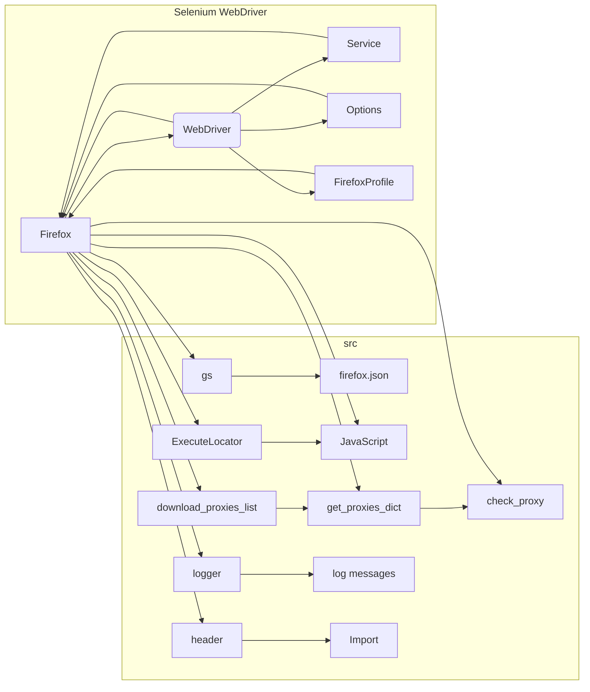

# <input code>

```python
## \file hypotez/src/webdriver/firefox/firefox.py
# -*- coding: utf-8 -*-\

#! venv/bin/python/python3.12

"""
Модуль для работы с WebDriver Firefox
=========================================================================================

Этот модуль содержит класс :class:`Firefox`, который расширяет функционал стандартного 
`webdriver.Firefox`. Он предоставляет возможность настройки пользовательского профиля, 
запуска в режиме киоска и установки пользовательских настроек, включая прокси.

Пример использования
--------------------

Пример использования класса `Firefox`:\n

.. code-block:: python

    if __name__ == "__main__":
        profile_name = "custom_profile"
        geckodriver_version = "v0.29.0"
        firefox_version = "78.0"
        proxy_file_path = "path/to/proxies.txt"

        browser = Firefox(
            profile_name=profile_name, 
            geckodriver_version=geckodriver_version, 
            firefox_version=firefox_version,
            proxy_file_path=proxy_file_path
        )
        browser.get("https://www.example.com")
        browser.quit()
"""


import os
import random
from pathlib import Path
from typing import Optional
from selenium.webdriver import Firefox as WebDriver
from selenium.webdriver.firefox.options import Options
from selenium.webdriver.firefox.service import Service
from selenium.webdriver.firefox.firefox_profile import FirefoxProfile
from selenium.common.exceptions import WebDriverException

from src import gs
from src.webdriver.executor import ExecuteLocator
from src.webdriver.js import JavaScript
from src.webdriver.proxy import download_proxies_list, get_proxies_dict, check_proxy
from src.utils.jjson import j_loads_ns
from src.logger import logger
from fake_useragent import UserAgent

import header

class Firefox(WebDriver):
    """
    Расширение для `webdriver.Firefox` с дополнительной функциональностью.

    :param profile_name: Имя пользовательского профиля Firefox.
    :param geckodriver_version: Версия geckodriver.
    :param firefox_version: Версия Firefox.
    :param user_agent: Пользовательский агент в формате строки.
    :param proxy_file_path: Путь к файлу с прокси.
    """
    driver_name: str = 'firefox'

    # ... (остальной код)
```

# <algorithm>

**Блок-схема:**

```mermaid
graph TD
    A[Инициализация Firefox] --> B{Чтение настроек из firefox.json};
    B --> C[Получение путей к geckodriver и Firefox];
    C --> D[Инициализация Service];
    D --> E[Настройка Options];
    E --> F[Установка user-agent];
    F -- Прокси? --> G[Настройка прокси (set_proxy)];
    F -- Нет прокси --> H[Настройка профиля (FirefoxProfile)];
    G --> I[Запуск WebDriver (super().__init__)];
    H --> I;
    I --> J[Выполнение пользовательских действий (_payload)];
    J --> K[Обработка исключений];
    K -- Ошибка --> L[Логирование ошибки и возврат];
    K -- Без ошибки --> M[Конец инициализации];
```

**Описание:**

1. **Инициализация:** Читает настройки из `firefox.json`, получает пути к исполняемым файлам, инициализирует `Service` для управления драйвером, настраивает `Options` (опции браузера), устанавливает пользовательский агент.
2. **Настройка прокси:** Если включена настройка прокси, выбирает рабочий прокси из словаря, полученного из `get_proxies_dict()`, и настраивает его в `Options`.
3. **Настройка профиля:** Создает объект `FirefoxProfile`, используя заданный или стандартный профиль, и подготавливает необходимые параметры для настройки браузера.
4. **Запуск WebDriver:** Вызывает конструктор родительского класса `WebDriver` для запуска драйвера, передавая ему подготовленные `service` и `options`.
5. **Обработка ошибок:** Обрабатывает возможные ошибки при запуске WebDriver (например, отсутствие Firefox или geckodriver) и регистрирует их.
6. **Пользовательские действия:** Вызывает метод `_payload`, который позволяет выполнить дополнительные действия после инициализации WebDriver, как например, загрузку функций для работы с JavaScript.

**Примеры данных:**

* **Входные данные:**  `profile_name`, `geckodriver_version`, `firefox_version`, `proxy_file_path`
* **Выходные данные:** экземпляр класса `Firefox` с инициализированным WebDriver.
* **Переменные:** `service`, `options`, `profile` хранят данные, необходимые для создания и настройки WebDriver.

# <mermaid>



**Объяснение диаграммы:**

Диаграмма изображает взаимосвязи между классами и модулями в коде.  `Firefox` является центральным элементом, который использует `WebDriver`, `Service`, `Options`, и `FirefoxProfile` для запуска Firefox.  `gs` предоставляет настройки из `firefox.json`.  `ExecuteLocator` и `JavaScript` — это вспомогательные классы для работы с локаторами и JavaScript.  `download_proxies_list`, `get_proxies_dict` и `check_proxy` - модули для работы с прокси-серверами. Модуль `logger` отвечает за логирование ошибок и событий.  `header` — это модуль, импортируемый, но его функциональность неясна.

# <explanation>

**Импорты:**

* `from selenium.webdriver import Firefox as WebDriver`: импортирует класс `WebDriver` из `selenium.webdriver` для создания и управления браузером Firefox.
* `from src import gs`: импортирует модуль `gs`, который вероятно содержит настройки приложения.
* `from src.webdriver.executor import ExecuteLocator`: импортирует класс `ExecuteLocator` из подмодуля `executor` для выполнения JavaScript кода.
* `from src.webdriver.js import JavaScript`: импортирует класс `JavaScript` для работы с JavaScript кодом в браузере.
* `from src.webdriver.proxy import ...`: импортирует функции для работы с прокси-серверами.
* `from src.utils.jjson import j_loads_ns`: импортирует функцию для загрузки настроек из JSON файла.
* `from src.logger import logger`: импортирует logger для логирования.
* `from fake_useragent import UserAgent`: импортирует библиотеку для генерации случайных user-agent строк.
* `import header`: импортирует модуль `header`, но его функциональность неясна из представленного кода.

**Классы:**

* `Firefox`: расширяет функциональность `selenium.webdriver.Firefox`, предоставляя дополнительные методы для настройки профиля, user-agent, прокси.  Ключевое отличие — инициализация дополнительных функций, таких как работа с JavaScript (`JavaScript`, `ExecuteLocator`).
* `ExecuteLocator`: содержит методы для поиска и взаимодействия с элементами страницы.
* `JavaScript`: методы для выполнения JavaScript кода в браузере.

**Функции:**

* `set_proxy`: настраивает прокси-сервер для WebDriver. Выбирает случайный работающий прокси из словаря, полученного из `get_proxies_dict()`.
* `_payload`: выполняет пользовательские действия после инициализации WebDriver. Пример — настройка JavaScript функций.

**Переменные:**

* `settings`:  хранит загруженные из `firefox.json` настройки (профили, пути к исполняемым файлам, настройки прокси и т.д.).
* `geckodriver_path`: путь к исполняемому файлу geckodriver.
* `firefox_binary_path`: путь к исполняемому файлу Firefox.
* `profile_directory`: путь к профилю Firefox.

**Возможные ошибки и улучшения:**

* **Обработка ошибок:** код содержит обработку исключений `WebDriverException` и общих исключений, но может быть дополнительно улучшен обработкой специфичных ошибок.
* **Универсальность:** функция `set_proxy` могла бы быть улучшена для работы с различными типами прокси.
* **Ясность кода:**  комментарии к некоторым участкам кода могли бы быть более подробными, особенно для неявных зависимостей.
* **Настройка прокси:**  нет проверки валидности прокси, что может привести к ошибкам. Желательно использовать библиотеки для работы с прокси для лучшего управления.
* **Переменные:**  использование `*args, **kwargs` в конструкторе класса `Firefox` может привести к непредсказуемому поведению, если не все аргументы будут корректно обрабатываться.
* **Проверка входных данных:** полезно добавить проверки на корректность входных данных (например,  путей к файлам, версий браузера) для повышения надежности.


**Цепочка взаимосвязей:**

Код взаимодействует с различными модулями и классами `src` (например, `gs`, `logger`, `JavaScript`, `ExecuteLocator`, и т.д.). Настройки из `firefox.json`  используются для конфигурации Firefox WebDriver. `src.webdriver.proxy` предоставляет функции для получения и проверки прокси.  `logger` регистрирует события, что позволяет отслеживать работу приложения.