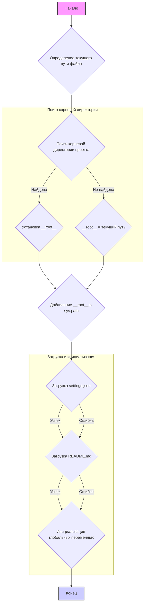

## Анализ кода `hypotez/src/webdriver/firefox/header.py`

### 1. <алгоритм>

**Блок-схема:**



**Примеры для логических блоков:**

1.  **Определение текущего пути файла (B):**
    *   Пример: `__file__` может быть `/home/user/hypotez/src/webdriver/firefox/header.py`, тогда `current_path` станет `/home/user/hypotez/src/webdriver/firefox`.
2.  **Поиск корневой директории проекта (C):**
    *   Пример 1: Если в `/home/user/hypotez` есть файл `__root__`, то цикл остановится, и `__root__` станет `/home/user/hypotez`.
    *   Пример 2: Если ни в одной из родительских директорий нет файла `__root__` (или `.git`), то `__root__` останется равным начальному значению `current_path`, то есть `/home/user/hypotez/src/webdriver/firefox`.
3.  **Установка `__root__` (D, E):**
    *   Пример: `__root__` присваивается найденная родительская директория (если такая есть) или текущая директория.
4.  **Добавление `__root__` в `sys.path` (F):**
    *   Пример: Если `__root__` это `/home/user/hypotez`, то `/home/user/hypotez` будет добавлено в начало `sys.path`.
5.  **Загрузка `settings.json` (G):**
    *   Пример: Если файл `/home/user/hypotez/src/settings.json` существует, то он будет загружен в переменную `settings`. В случае отсутствия файла, `settings` останется `None`
6.  **Загрузка `README.md` (H):**
    *   Пример: Если файл `/home/user/hypotez/src/README.MD` существует, то его содержимое будет загружено в переменную `doc_str`. В случае отсутствия файла, `doc_str` останется `None`
7.  **Инициализация глобальных переменных (I):**
    *   Пример: `__project_name__` будет установлено из `settings.get("project_name", "hypotez")` если `settings` успешно загружены, в противном случае будет установлен `hypotez`. Аналогично для других глобальных переменных.

### 2. <mermaid>

```mermaid
flowchart TD
    Start[Начало] --> SetProjectRootCall[Вызов set_project_root()]
    SetProjectRootCall --> FindRoot[Определение корневой директории]
    FindRoot --> RootFound{Корневая директория найдена?}
    RootFound -- Да --> SetRootVariable[Присвоение __root__ найденной директории]
    RootFound -- Нет --> SetRootVariableDefault[Присвоение __root__ текущей директории]
    SetRootVariable --> AddRootToPath[Добавление __root__ в sys.path]
    SetRootVariableDefault --> AddRootToPath
    AddRootToPath --> LoadSettings[Загрузка settings.json]
    LoadSettings --> LoadReadme[Загрузка README.md]
    LoadSettings --> InitGlobalVars
    LoadReadme --> InitGlobalVars[Инициализация глобальных переменных]

   InitGlobalVars --> End[Конец]

    
    subgraph "set_project_root()"
        SetProjectRootCall
        FindRoot
        RootFound
        SetRootVariable
        SetRootVariableDefault
        AddRootToPath
    end
```

**Зависимости:**

*   **`sys`**: Модуль `sys` используется для работы с интерпретатором Python, в частности, для доступа к `sys.path` и добавления корневой директории в путь поиска модулей.
*   **`json`**: Модуль `json` используется для загрузки данных из файла `settings.json`.
*    **`pathlib`**: Модуль `pathlib` используется для работы с путями к файлам и директориям в объектно-ориентированном стиле, что упрощает манипуляции с путями.
*   **`packaging.version`**: используется для управления версиями пакетов.

    **Дополнительно:**

    ```mermaid
    flowchart TD
        Start --> Header[<code>header.py</code><br> Determine Project Root]
    
        Header --> import[Import Global Settings: <br><code>from src import gs</code>] 
    ```

### 3. <объяснение>

**Импорты:**

*   `sys`: Используется для модификации `sys.path`, чтобы добавить корневую директорию проекта для корректного импорта других модулей. Это позволяет запускать скрипты из разных директорий проекта без проблем с поиском модулей.
*   `json`: Используется для загрузки настроек из файла `settings.json`, который содержит информацию о проекте, такую как имя, версия, автор и т.д.
*  `packaging.version` - используется для работы с версиями программного обеспечения.
*   `pathlib`: Используется для представления путей к файлам и директориям в объектно-ориентированном стиле, что делает код более читаемым и лаконичным.
*   `from src import gs`: Импортирует глобальные настройки из пакета `src`, которые вероятно содержат константы, пути к файлам и другие общие параметры проекта. Это обеспечивает доступ к общим ресурсам и константам в проекте.

**Функции:**

*   `set_project_root(marker_files: tuple) -> Path`:
    *   **Аргументы**: `marker_files` (tuple): Кортеж имен файлов или директорий, которые идентифицируют корневую директорию проекта. По умолчанию: `('__root__', '.git')`.
    *   **Возвращаемое значение**: `Path`: Объект `Path`, представляющий корневую директорию проекта.
    *   **Назначение**: Функция ищет корневую директорию проекта, начиная с директории, в которой находится файл, и поднимаясь вверх по дереву директорий. Поиск останавливается, когда найдена директория, содержащая один из `marker_files`. Если корневая директория не найдена, возвращается директория, где расположен скрипт.
    *   **Пример**: Если в директории `/home/user/hypotez` есть файл `__root__`, то при запуске скрипта из любого подкаталога, `set_project_root()` вернет путь `/home/user/hypotez`.

**Переменные:**

*   `__root__`: (`Path`): Хранит путь к корневой директории проекта.
*   `settings`: (`dict` или `None`): Словарь, содержащий настройки проекта, загруженные из `settings.json`. Может быть `None`, если загрузка не удалась.
*   `doc_str`: (`str` или `None`): Содержимое файла `README.md`. Может быть `None`, если загрузка не удалась.
*   `__project_name__`: (`str`): Имя проекта, по умолчанию `hypotez`.
*   `__version__`: (`str`): Версия проекта.
*   `__doc__`: (`str`): Содержимое файла документации.
*   `__details__`: (`str`): Дополнительная информация о проекте (в данном коде пустая строка).
*   `__author__`: (`str`): Автор проекта.
*   `__copyright__`: (`str`): Информация о копирайте.
*    `__cofee__`: (`str`): Инфомация о возможности поддержки разработчика.

**Объяснения:**

1.  **Поиск корневой директории:**
    *   Функция `set_project_root()` обеспечивает гибкое определение корневой директории проекта, что важно, если проект может располагаться в различных местах. Это позволяет скриптам работать независимо от текущего рабочего каталога.
2.  **Загрузка настроек:**
    *   Файл `settings.json` используется для хранения настроек проекта. Это позволяет управлять различными аспектами проекта, такими как имя, версия, автор, и т.д.
    *   Загрузка `README.md` обеспечивает доступ к описанию проекта из кода.
3.  **Инициализация глобальных переменных:**
    *   Глобальные переменные используются для хранения информации о проекте, такой как имя, версия, автор, и т.д. Это позволяет получать доступ к этой информации из любого места в проекте, что обеспечивает удобство использования.
4.  **Обработка ошибок:**
    *   Использование `try-except` блоков при загрузке `settings.json` и `README.md` предотвращает сбои программы в случае отсутствия этих файлов. Если файл не найден или ошибка `json` или другая ошибка, переменным присваивается значение `None`, что позволяет программе продолжать работу, используя значения по умолчанию или пустые строки.

**Потенциальные ошибки и области для улучшения:**

1.  **Обработка ошибок `settings.json` и `README.md`**: В случае ошибок при загрузке, программа не генерирует никаких уведомлений, что может усложнить отладку. Целесообразно добавить логирование ошибок или вывод предупреждений в консоль.
2.  **`__details__` не используется**: Переменная `__details__` определена, но не присваивается никакого значения, что делает её бесполезной.
3.  **Отсутствие проверок на типы данных при загрузке из `settings.json`:** При получении данных из `settings` следует проверять соответствие типов.

**Взаимосвязи с другими частями проекта:**

*   Этот модуль используется как заголовочный файл, который инициализирует основные переменные и настраивает среду выполнения для всего проекта.
*   `from src import gs` указывает на то, что данный модуль зависит от глобальных настроек проекта, определенных в пакете `src`.
*   Глобальные переменные, такие как `__project_name__`, `__version__`, могут использоваться в других модулях проекта.

Этот подробный анализ предоставляет полное представление о структуре, функциональности и зависимостях кода.