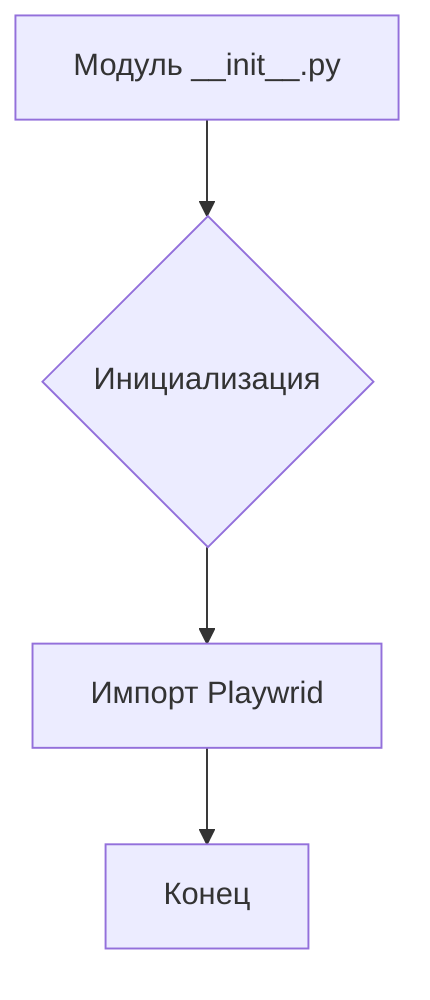
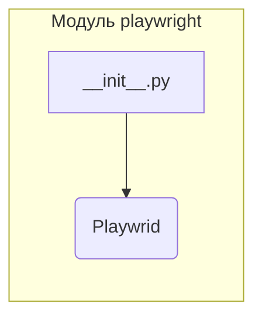

```MD
# Анализ кода hypotez/src/webdriver/playwright/__init__.py

## <input code>

```python
## \file hypotez/src/webdriver/playwright/__init__.py
# -*- coding: utf-8 -*-\

#! venv/bin/python/python3.12

"""
.. module: src.webdriver.playwright 
	:platform: Windows, Unix
	:synopsis:
https://chatgpt.com/share/67428d3f-6b18-800d-a585-eb414eef60e2
"""


from .playwrid import Playwrid
```

## <algorithm>

Этот код определяет модуль `src.webdriver.playwright`.  Поскольку он является `__init__.py`, он инициализирует пакет.  Блок-схема в данном случае простая:



В примере данных нет, так как это всего лишь инициализирующий модуль.


## <mermaid>



## <explanation>

**Импорты**:

- `from .playwrid import Playwrid`: Этот импорт подключает класс `Playwrid` из модуля `playwrid.py` в текущем подпакете `playwright`.  Значок `. ` указывает, что модуль `playwrid` находится в том же каталоге, что и `__init__.py`.  

**Классы**:

- Нет определений классов напрямую в `__init__.py`.   `Playwrid` изначально определен в отдельном модуле (`playwrid.py`).


**Переменные**:

- ``:  Переменная, которая, вероятно, определяет режим работы (например, 'dev', 'prod')  для дальнейшего использования в коде.  Эта информация важна для конфигурации и выбора поведения.


**Функции**:

Нет функций в этом файле. `__init__.py` файл используется для импорта элементов из других файлов, а не для определения собственных функций.


**Возможные ошибки и улучшения**:

- **Отсутствие документации**: Не хватает описания того, что делает `Playwrid`.  Необходимо добавить подробную документацию в модуль `playwrid.py`.
- **Необходимость проверки импорта**: Стоит добавить проверку, существует ли файл `playwrid.py` перед импортом. Это позволит избежать ошибок во время работы.
- **Конвенции импортов**:  В Python принято использовать `from .playwrid import Playwrid` только при импорте из того же каталога (с точки зрения `__init__.py`). Если бы `playwrid` был в другом каталоге, это потребовало бы более сложной импортной синтаксиса (например, `from ..webdriver.playwrid import Playwrid` если `playwrid.py` находится в папке `webdriver`).
- **Неявное использование `venv`**: Строки `` и `#! venv/bin/python/python3.12` являются указаниями интерпретатора Python и могут быть полезны для некоторых сценариев запуска, но не должны присутствовать в `__init__.py`. Эти строки могут не работать как ожидается, если файл запускается не в указанной виртуальной среде (venv).

**Цепочка взаимосвязей**:

Модуль `__init__.py` в пакете `src.webdriver.playwright` зависит от существования и работоспособности `playwrid.py` в том же подпакете.  Далее, `Playwrid` вероятно взаимодействует с другими частями проекта, используя веб-драйвер Playwright, для управления браузером и взаимодействием с веб-страницами.  Чтобы понять полную картину, нужно изучить `playwrid.py` и код, который использует этот модуль.