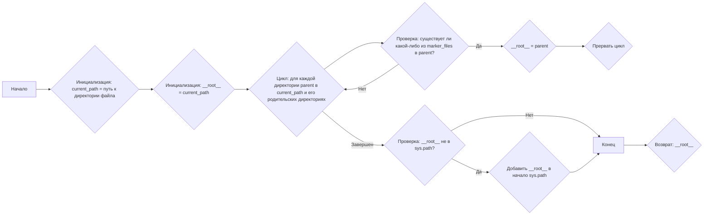
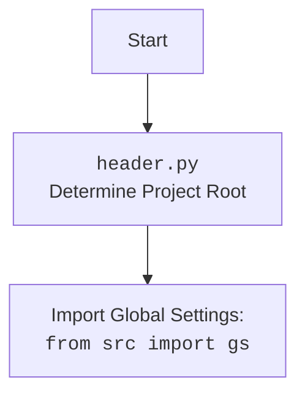

## АНАЛИЗ КОДА

### 1. <алгоритм>

**Блок-схема:**


**Примеры:**

1.  **Начало:** Скрипт начинает выполнение.
2.  **Инициализация `current_path`**: `current_path` устанавливается в путь к директории, содержащей файл `header.py`. Например, если `header.py` находится в `/home/user/project/src/webdriver/playwright`, `current_path` будет `/home/user/project/src/webdriver/playwright`.
3.  **Инициализация `__root__`**:  `__root__` первоначально устанавливается в значение `current_path`, то есть `/home/user/project/src/webdriver/playwright` на примере выше.
4.  **Цикл по родительским директориям:**
    *   Проверяется директория `/home/user/project/src/webdriver/playwright`. Проверяется наличие файлов `__root__` или `.git`.
    *   Если ни один маркер не найден, переходим к родительской директории `/home/user/project/src/webdriver`. Проверяется наличие файлов `__root__` или `.git`.
    *   Цикл продолжается, пока не будет найден маркер, например в директории `/home/user/project` файл `.git`,  в таком случае __root__ будет `/home/user/project`.
5.  **Проверка `__root__` в `sys.path`**: Проверяется, присутствует ли путь к корневой директории `/home/user/project` в списке путей поиска модулей (`sys.path`).
6.  **Добавление `__root__` в `sys.path`**: Если путь не найден, он добавляется в начало списка (`sys.path`).
7.  **Конец**: функция возвращает значение переменной `__root__`.

### 2. <mermaid>

```mermaid
flowchart TD
    Start[Начало] --> SetPath[<code>set_project_root</code><br>Определение корневой директории];
    SetPath --> FindPath[Поиск родительской директории с маркером <code>__root__</code> или <code>.git</code>];
    FindPath --> CheckSysPath[Проверка: <code>__root__</code> в <code>sys.path</code>?];
    CheckSysPath -- Нет --> AddSysPath[Добавить <code>__root__</code> в <code>sys.path</code>];
    CheckSysPath -- Да --> End[Конец];
    AddSysPath --> End;
    End --> ReturnPath[Возврат: <code>__root__</code>];
    
    ReturnPath --> SetRoot[Установка: <code>__root__</code> = результат <code>set_project_root()</code>]
    
    SetRoot --> EndProgram[Конец программы]

  classDef code fill:#f9f,stroke:#333,stroke-width:2px
    class SetPath,FindPath,CheckSysPath,AddSysPath,ReturnPath code
```

**Объяснение зависимостей:**

*   `pathlib`:  `from pathlib import Path` - используется для работы с путями файлов и каталогов. `Path`  позволяет создать объект, представляющий путь, и удобно с ним взаимодействовать, например, получать родительские каталоги или проверять существование файлов.
*   `sys`: `import sys` -  используется для добавления корневой директории проекта в список путей поиска модулей (`sys.path`).  Это позволяет импортировать модули из корневой директории проекта без указания относительного пути.
* `packaging.version`: `from packaging.version import Version` - Используется для работы с версиями. В данном случае не используется, но импортируется.
* `json`: `import json` -  Используется для работы с форматом JSON. В данном случае не используется, но импортируется.

**mermaid для `header.py`:**



### 3. <объяснение>

**Импорты:**

*   `sys`: Этот модуль предоставляет доступ к некоторым переменным и функциям, взаимодействующим с интерпретатором Python. Здесь он используется для управления списком путей поиска модулей (`sys.path`), добавляя к нему корневую директорию проекта.
*   `json`: Этот модуль используется для работы с JSON-данными. В данном коде он импортирован, но не используется. Скорее всего, это часть шаблонного импорта, который используется и в других файлах, или был добавлен на этапе разработки.
*   `packaging.version`: Этот модуль используется для управления версиями. В данном коде он импортирован, но не используется. Скорее всего, это часть шаблонного импорта, который используется и в других файлах, или был добавлен на этапе разработки.
*   `pathlib`: Этот модуль предоставляет класс `Path` для работы с файловыми путями в кроссплатформенном виде. Он делает код более читаемым и удобным для работы с путями.

**Классы:**

*   В данном коде классы не используются.

**Функции:**

*   `set_project_root(marker_files: tuple = ('__root__', '.git')) -> Path`:
    *   **Аргументы**:
        *   `marker_files`: `tuple` - кортеж, содержащий имена файлов или папок, которые могут быть использованы для идентификации корневой директории проекта. Значение по умолчанию - `('__root__', '.git')`.
    *   **Возвращаемое значение**:
        *   `Path`: Объект `Path`, представляющий путь к корневой директории проекта.
    *   **Назначение**: Функция определяет корневую директорию проекта, начиная с директории, в которой находится файл `header.py`, и двигаясь вверх по дереву каталогов до тех пор, пока не будет найден один из `marker_files`.
        *   Сначала определяется текущая директория `current_path`, из которой вызывается этот скрипт.
        *   Затем, цикл `for parent in [current_path] + list(current_path.parents)` перебирает текущую директорию и все ее родительские директории.
        *   Внутри цикла проверяется, существует ли какой-либо маркер `(parent / marker).exists() for marker in marker_files` в текущей директории.
        *   Если маркер найден, то путь этой директории сохраняется как корневая директория, цикл прерывается и функция возвращает этот путь.
        *   Если маркер не найден, то в `__root__` остаётся `current_path` или родительская директория.
        *   В конце, если путь к `__root__` не добавлен в `sys.path` то добавляется.
    *   **Примеры:**
        *   Предположим, что структура проекта такова:
            ```
            /home/user/project/
            ├── .git
            ├── src/
            │   └── webdriver/
            │       └── playwright/
            │           └── header.py
            ```
            При вызове `set_project_root()` из `header.py`, функция найдет файл `.git` в `/home/user/project/` и вернет `Path('/home/user/project/')`. Этот путь будет добавлен в `sys.path`.

**Переменные:**

*   `__root__`: `Path` - глобальная переменная, хранящая путь к корневой директории проекта. Она инициализируется результатом вызова функции `set_project_root()`.

**Потенциальные ошибки и области для улучшения:**

*   **Отсутствие обработки исключений:** Код не обрабатывает случаи, когда ни один из `marker_files` не найден.  В текущей реализации, `__root__` будет равен директории где находится скрипт, если ни один из маркеров не был найден. Это не является ошибкой, но возможно стоит добавить дополнительную проверку или логирование.
*  **Неиспользуемые импорты:** `json` и `packaging.version` импортируются, но не используются. Их стоит удалить для чистоты кода или использовать.
*   **Жёстко закодированные маркеры:**  Возможность передавать `marker_files` в функцию делает её гибче, но значения по умолчанию жестко закодированы.  В будущем, возможно, их захочется кастомизировать через переменную окружения или конфигурационный файл.

**Цепочка взаимосвязей:**

1.  Файл `header.py` является частью модуля `src.webdriver.playwright` внутри проекта.
2.  Функция `set_project_root()` используется для определения корня проекта, который потом используется другими модулями для определения путей к файлам проекта.
3.  Переменная `__root__` используется другими модулями в проекте для поиска ресурсов и конфигурации проекта.

**Взаимосвязь с другими частями проекта:**

*   Определение корневой директории проекта нужно для правильной работы `gs` (global settings), которые используются по всему проекту.
*   Этот файл выступает как точка входа для определения общей структуры проекта и его настройки для других частей проекта.