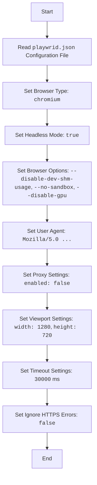

## АНАЛИЗ КОДА: `hypotez/src/webdriver/playwright/playwrid.json`

### 1. <алгоритм>

JSON-файл `playwrid.json` представляет собой конфигурационный файл для Playwright, автоматизированного инструмента для тестирования веб-приложений. Алгоритм его работы заключается в последовательном чтении и интерпретации этих настроек библиотекой Playwright при инициализации браузера.

**Блок-схема:**

```
Start --> ReadJson [Чтение JSON файла playwrid.json]
ReadJson -->  BrowserType [Определение типа браузера: "chromium"]
BrowserType --> HeadlessMode [Определение режима без GUI: true]
HeadlessMode --> BrowserOptions [Настройка опций браузера:  "--disable-dev-shm-usage", "--no-sandbox", "--disable-gpu"]
BrowserOptions --> UserAgent [Установка User Agent:  "Mozilla/5.0 ..."]
UserAgent --> ProxyConfig [Настройка прокси: enabled: false, server: "http://...", username: "user", password: "password"]
ProxyConfig --> ViewportConfig [Настройка размеров окна: width: 1280, height: 720]
ViewportConfig --> TimeoutConfig [Установка тайм-аута: 30000]
TimeoutConfig --> IgnoreHttpsErrors [Настройка игнорирования HTTPS-ошибок: false]
IgnoreHttpsErrors --> End [Конец]
```

**Примеры для блоков:**

*   **`ReadJson`**: Файл `playwrid.json` загружается и парсится в структуру данных.
*   **`BrowserType`**: Playwright использует `browser_type` ("chromium") для создания браузерного инстанса Chromium.
*   **`HeadlessMode`**: Браузер будет запущен в фоновом режиме (без UI), так как `headless` установлен в `true`.
*   **`BrowserOptions`**: Дополнительные опции применяются к запуску браузера, такие как отключение общего использования памяти (`--disable-dev-shm-usage`), отключение песочницы (`--no-sandbox`) и отключение аппаратного ускорения графики (`--disable-gpu`).
*   **`UserAgent`**: Playwright будет отправлять HTTP-запросы с указанным `user_agent`, имитируя браузер Windows.
*   **`ProxyConfig`**: Поскольку `enabled` установлено в `false`, прокси-сервер не используется. Если бы `enabled` был `true`, использовались бы параметры `server`, `username` и `password`.
*   **`ViewportConfig`**: Размер браузерного окна будет установлен на `1280x720` пикселей.
*   **`TimeoutConfig`**: Для всех операций в Playwright устанавливается тайм-аут в `30000` миллисекунд (30 секунд).
*   **`IgnoreHttpsErrors`**: Проверка HTTPS-сертификатов включена, поскольку установлено `false`.

### 2. <mermaid>



**Объяснение зависимостей (импорты) для mermaid:**

*   В данном коде (`playwrid.json`) нет импортов. Это файл конфигурации, который напрямую не использует Python-код и его зависимости. Настройки, указанные в `playwrid.json`, используются библиотекой `Playwright`, которая является внешней зависимостью, устанавливаемой и импортируемой отдельно в проекте.

### 3. <объяснение>

**Импорты:**

*   В файле `playwrid.json` отсутствуют импорты. Он представляет собой файл конфигурации, а не скрипт на Python. Он не зависит от других частей проекта в плане импорта.

**Классы:**

*   В данном файле классы отсутствуют. Это JSON-файл конфигурации.

**Функции:**

*   В данном файле функции отсутствуют. Это JSON-файл конфигурации.

**Переменные:**

*   **`browser_type`**: Строка, определяющая тип браузера для запуска Playwright (в данном случае `"chromium"`).
*   **`headless`**: Булевое значение, определяющее, запускать ли браузер в режиме без графического интерфейса (в данном случае `true`).
*   **`options`**: Массив строк, содержащий дополнительные опции для запуска браузера. Эти опции помогают избежать ошибок в Docker-контейнерах.
*   **`user_agent`**: Строка, устанавливающая User-Agent для браузера.
*   **`proxy`**: Объект, содержащий настройки прокси-сервера.
    *   `enabled`: Булевое значение, указывающее, использовать ли прокси (в данном случае `false`).
    *   `server`: Строка, содержащая адрес прокси-сервера.
    *   `username`: Строка, содержащая имя пользователя для прокси.
    *   `password`: Строка, содержащая пароль для прокси.
*   **`viewport`**: Объект, содержащий настройки размеров браузерного окна.
    *   `width`: Ширина окна в пикселях (в данном случае `1280`).
    *   `height`: Высота окна в пикселях (в данном случае `720`).
*   **`timeout`**: Целое число, устанавливающее тайм-аут для операций Playwright в миллисекундах (в данном случае `30000`).
*   **`ignore_https_errors`**: Булевое значение, определяющее, игнорировать ли ошибки HTTPS-сертификатов (в данном случае `false`).

**Взаимосвязи с другими частями проекта:**

*   Файл `playwrid.json` используется классом/модулем Playwright, который запускается из других частей проекта (например, `src/webdriver/playwright/playwright_manager.py` или другие модули в директории `webdriver`). Этот файл предоставляет конфигурационные параметры для управления браузером.

**Потенциальные ошибки или области для улучшения:**

*   **Отсутствие гибкости**: Настройки прокси захардкожены в файле. Возможно, было бы лучше использовать переменные окружения или другой механизм конфигурации для более динамичного управления.
*   **Жестко заданные размеры окна**: Могут возникнуть проблемы с версткой на разных экранах, если не задавать размеры динамически.
*   **User agent**:  User Agent может быть устаревшим, поэтому стоит рассмотреть возможность его обновления.

**Общая сводка:**

JSON-файл `playwrid.json` обеспечивает конфигурационные параметры для запуска браузера с использованием Playwright. Настройки определяют тип браузера, режим headless, параметры запуска, User-Agent, прокси (если требуется), размеры окна, тайм-ауты и игнорирование ошибок HTTPS. Этот файл служит для настройки Playwright и обеспечения воспроизводимости и надежности автоматизации тестирования веб-приложений.