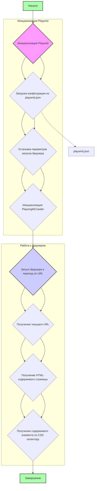

## ИНСТРУКЦИЯ:

Анализируй предоставленный код подробно и объясни его функциональность. Ответ должен включать три раздела:  

1.  **<алгоритм>**: Опиши рабочий процесс в виде пошаговой блок-схемы, включая примеры для каждого логического блока, и проиллюстрируй поток данных между функциями, классами или методами.  
2.  **<mermaid>**: Напиши код для диаграммы в формате `mermaid`, проанализируй и объясни все зависимости, 
    которые импортируются при создании диаграммы. 
    **ВАЖНО!** Убедитесь, что все имена переменных, используемые в диаграмме `mermaid`, 
    имеют осмысленные и описательные имена. Имена переменных вроде `A`, `B`, `C`, и т.д., не допускаются!  
    
    **Дополнительно**: Если в коде есть импорт `import header`, добавьте блок `mermaid` flowchart, объясняющий `header.py`:\
    ```mermaid
    flowchart TD
        Start --> Header[<code>header.py</code><br> Determine Project Root]
    
        Header --> import[Import Global Settings: <br><code>from src import gs</code>] 
    ```

3.  **<объяснение>**: Предоставьте подробные объяснения:  
   - **Импорты**: Их назначение и взаимосвязь с другими пакетами `src.`.  
   - **Классы**: Их роль, атрибуты, методы и взаимодействие с другими компонентами проекта.  
   - **Функции**: Их аргументы, возвращаемые значения, назначение и примеры.  
   - **Переменные**: Их типы и использование.  
   - Выделите потенциальные ошибки или области для улучшения.  

Дополнительно, постройте цепочку взаимосвязей с другими частями проекта (если применимо).  

Это обеспечивает всесторонний и структурированный анализ кода.
## Формат ответа: `.md` (markdown)
**КОНЕЦ ИНСТРУКЦИИ**
## <алгоритм>



1.  **Начало:** Программа начинает выполнение с блока `if __name__ == "__main__":`.
2.  **Инициализация `Playwrid`:** Создается экземпляр класса `Playwrid` с передачей списка опций браузера.
3.  **Загрузка конфигурации:** Из файла `playwrid.json` загружается конфигурация в виде `SimpleNamespace` и сохраняется в атрибуте `config`.
4.  **Установка параметров запуска браузера:**  Метод `_set_launch_options` формирует словарь с параметрами запуска браузера, включая `headless` и `args`. Если переданы `user_agent` или `options`  при создании экземпляра класса, они добавляются к параметрам запуска.
5.  **Инициализация `PlaywrightCrawler`:** Вызывается конструктор родительского класса `PlaywrightCrawler` с установленными параметрами.
6.  **Запуск браузера и переход по URL:** Метод `start` запускает браузер и переходит по заданному URL. Сохраняет контекст  crawling_context в self.context.
7.  **Получение текущего URL:** Метод `current_url` возвращает текущий URL открытой страницы.
8.  **Получение HTML-содержимого страницы:** Метод `get_page_content` возвращает HTML-содержимое текущей страницы.
9.  **Получение содержимого элемента по CSS селектору:** Метод `get_element_content` возвращает HTML-содержимое элемента, найденного по CSS-селектору.
10. **Завершение:** Программа заканчивает выполнение после обработки полученных данных (вывод в консоль).

## <mermaid>

```mermaid
flowchart TD
    Start --> PlaywridInitialization[<code>Playwrid</code> Class Initialization];
    
    PlaywridInitialization --> LoadConfig[Load Config: <code>playwrid.json</code>];
    LoadConfig --> SetLaunchOptions[Set Launch Options: <code>_set_launch_options</code>];
    SetLaunchOptions --> InitializeCrawler[Initialize <code>PlaywrightCrawler</code>];
    InitializeCrawler --> StartNavigation[Start Navigation: <code>start(url)</code>];
    
    StartNavigation --> GetCurrentUrl[Get Current URL: <code>current_url</code>];
    GetCurrentUrl --> GetPageContent[Get Page Content: <code>get_page_content</code>];
    GetPageContent --> GetElementContent[Get Element Content: <code>get_element_content(selector)</code>];
     GetElementContent --> End[End];

    
    classDef configStyle fill:#f0f0f0,stroke:#333,stroke-width:1px;
    class LoadConfig, SetLaunchOptions, InitializeCrawler configStyle;
    
     
    style Start fill:#afa,stroke:#333,stroke-width:2px
    style End fill:#afa,stroke:#333,stroke-width:2px
    
    linkStyle 0,4,5,6,7,8, stroke:#333,stroke-width:2px;
    
```

```mermaid
    flowchart TD
        Start --> Header[<code>header.py</code><br> Determine Project Root]
    
        Header --> import[Import Global Settings: <br><code>from src import gs</code>] 
    ```

**Описание зависимостей:**

*   **`Start`:**  Начало выполнения программы.
*   **`PlaywridInitialization`:** Инициализация класса `Playwrid` при создании его экземпляра.
*   **`LoadConfig`:** Загружает настройки из файла `playwrid.json` с помощью `j_loads_ns`.
*   **`SetLaunchOptions`:**  Формирует словарь с параметрами для запуска Playwright браузера, включая возможность добавления `user_agent` и дополнительных опций.
*    **`InitializeCrawler`:** Инициализирует экземпляр класса `PlaywrightCrawler`, используя  сформированные параметры запуска браузера.
*    **`StartNavigation`:** Запускает браузер, переходит по переданному URL и сохраняет контекст.
*    **`GetCurrentUrl`:** Возвращает текущий URL браузера.
*   **`GetPageContent`:** Возвращает HTML-содержимое текущей страницы.
*   **`GetElementContent`:** Возвращает HTML-содержимое элемента, найденного по CSS-селектору.
*   **`End`:** Завершение выполнения программы.

## <объяснение>

**Импорты:**

*   `pathlib.Path`: Используется для работы с путями к файлам и директориям, обеспечивает кроссплатформенность.
*   `typing.Optional, Dict, Any, List`: Используются для статической типизации, что повышает читаемость и обнаруживает ошибки на ранних этапах.
    *   `Optional` указывает, что переменная может иметь значение `None`.
    *   `Dict`  словарь (ключ-значение).
    *   `Any` позволяет использовать переменные любого типа.
    *   `List` список значений.
*   `types.SimpleNamespace`: Позволяет создавать объекты с произвольными атрибутами, что удобно для хранения настроек.
*   `crawlee.playwright_crawler.PlaywrightCrawler, PlaywrightCrawlingContext`: Импортирует базовый класс PlaywrightCrawler из библиотеки Crawlee для сбора данных с веб-страниц и контекст для работы с текущим сеансом браузера.
*   `header`: Импортирует модуль `header`, вероятно, для определения корневого каталога проекта. (см. `mermaid` flowchart)
*   `src.gs`: Импортирует глобальные настройки из модуля `gs` в пакете `src`, которые могут включать общие пути и параметры конфигурации.
*   `src.utils.jjson.j_loads_ns`: Импортирует функцию `j_loads_ns` из модуля `jjson` для загрузки JSON-конфигурации в объект SimpleNamespace.
*   `src.logger.logger`: Импортирует логгер из модуля `logger` для ведения журнала событий.

**Классы:**

*   **`Playwrid(PlaywrightCrawler)`:**
    *   **Роль:** Это подкласс `PlaywrightCrawler`, который предоставляет дополнительные методы для взаимодействия с браузером. Он инкапсулирует логику для запуска Playwright с кастомными настройками.
    *   **Атрибуты:**
        *   `driver_name` (str): Имя драйвера (по умолчанию 'playwrid').
        *   `base_path` (Path):  Путь к директории `playwright`.
        *   `config` (SimpleNamespace): Объект, содержащий конфигурацию, загруженную из `playwrid.json`.
        *    `context` (Optional[PlaywrightCrawlingContext]):  Контекст текущей сессии браузера.
    *   **Методы:**
        *   `__init__(self, user_agent: Optional[str] = None, options: Optional[List[str]] = None, *args, **kwargs)`: Конструктор класса. Принимает настройки, а также опции запуска браузера.
        *   `_set_launch_options(self, user_agent: Optional[str] = None, options: Optional[List[str]] = None) -> Dict[str, Any]`: Формирует словарь с параметрами запуска Playwright.
        *   `start(self, url: str) -> None`: Запускает браузер и переходит по указанному URL.
        *    `current_url(self) -> Optional[str]`: Возвращает текущий URL открытой страницы.
        *   `get_page_content(self) -> Optional[str]`: Возвращает HTML-содержимое текущей страницы.
        *   `get_element_content(self, selector: str) -> Optional[str]`: Возвращает HTML-содержимое элемента, найденного по CSS-селектору.

**Функции:**

*   `__init__`:
    *   **Аргументы:**
        *   `user_agent` (Optional[str]):  Строка user-agent для браузера.
        *   `options` (Optional[List[str]]): Список дополнительных опций запуска браузера.
        *   `*args`, `**kwargs`: Переменное число позиционных и именованных аргументов для родительского класса.
    *   **Назначение:** Инициализирует класс, загружает настройки, задает параметры запуска браузера и вызывает конструктор родительского класса `PlaywrightCrawler`.
    *   **Пример:** `browser = Playwrid(user_agent="CustomUserAgent", options=["--no-sandbox"])`
*   `_set_launch_options`:
    *   **Аргументы:**
        *   `user_agent` (Optional[str]): Строка user-agent.
        *    `options` (Optional[List[str]]): Дополнительные опции запуска браузера.
    *   **Возвращает:** `Dict[str, Any]`: Словарь с параметрами запуска Playwright.
    *   **Назначение:** Формирует словарь с параметрами запуска, включая `headless`, `args` и `user_agent`.
    *   **Пример:** `launch_options = self._set_launch_options(user_agent="MyUserAgent", options=["--disable-gpu"])`
*   `start`:
    *   **Аргументы:**
        *   `url` (str): URL для перехода.
    *   **Возвращает:** `None`.
    *   **Назначение:** Запускает браузер и переходит по заданному URL, сохраняет контекст.
    *   **Пример:** `browser.start("https://www.example.com")`
*    `current_url`:
    *  **Аргументы:** нет
    *  **Возвращает:** `Optional[str]`: Текущий URL открытой страницы или `None`.
    *   **Назначение:** Возвращает текущий URL страницы, если браузер был запущен и страница загружена.
    *   **Пример:** `url = browser.current_url`
*    `get_page_content`:
    *  **Аргументы:** нет
    *   **Возвращает:** `Optional[str]`: HTML-содержимое текущей страницы или `None`.
    *   **Назначение:** Возвращает HTML-код текущей страницы.
    *   **Пример:** `html = browser.get_page_content()`
*   `get_element_content`:
    *   **Аргументы:**
        *   `selector` (str): CSS-селектор элемента.
    *   **Возвращает:** `Optional[str]`: HTML-содержимое элемента или `None`.
    *   **Назначение:** Возвращает HTML-содержимое элемента по CSS-селектору.
    *   **Пример:** `content = browser.get_element_content("h1")`

**Переменные:**

*   `driver_name` (str): Имя драйвера.
*   `base_path` (Path):  Базовый путь к директории `playwright`.
*   `config` (SimpleNamespace): Объект с настройками, загруженными из `playwrid.json`.
*   `launch_options` (Dict[str, Any]): Словарь с параметрами запуска браузера.
*   `user_agent` (Optional[str]): Строка user-agent.
*   `options` (Optional[List[str]]): Список дополнительных опций запуска браузера.
*   `url` (str): URL для навигации.
*    `context` (Optional[PlaywrightCrawlingContext]): Контекст текущего сеанса браузера.
*    `html_content` (Optional[str]): HTML контент веб-страницы.
*    `element_content` (Optional[str]): HTML контент элемента веб-страницы.
*    `element` (Any): Найденный элемент на странице.

**Потенциальные ошибки и улучшения:**

*   **Обработка ошибок:** В методе `start` есть общая обработка исключений (`except Exception as ex:`). Стоит добавить более конкретную обработку исключений для разных типов ошибок.
*   **Конфигурация:** В коде есть проверка наличия атрибутов в `self.config` через `hasattr`. Это может быть улучшено, если использовать более явную структуру конфигурации с валидацией.
*    **Типизация:** Добавить аннотации типов для всех переменных, где это возможно.
*   **Логирование:**  Улучшить логирование, добавив уровни логгирования для разных типов событий (например, дебаг, предупреждение, ошибка).
*  **Неявные зависимости:** Зависимость от существования файла `playwrid.json`. Необходимо добавить обработку случая отсутствия файла.

**Взаимосвязи с другими частями проекта:**

*   **`src.gs`:** Используется для получения базового пути к директории `webdriver/playwright`.
*   **`src.utils.jjson`:** Используется для загрузки конфигурации из `playwrid.json`.
*   **`src.logger`:** Используется для логирования событий.
*   **`header`:** Используется для определения корневого каталога проекта.
*  **`crawlee`:** `Playwrid` является подклассом `PlaywrightCrawler` и расширяет его функциональность, добавляя специфические методы для получения контента.

Этот код является частью системы веб-скрапинга, которая использует Playwright. Он инкапсулирует логику запуска браузера с кастомными настройками и предоставляет методы для извлечения данных с веб-страниц.