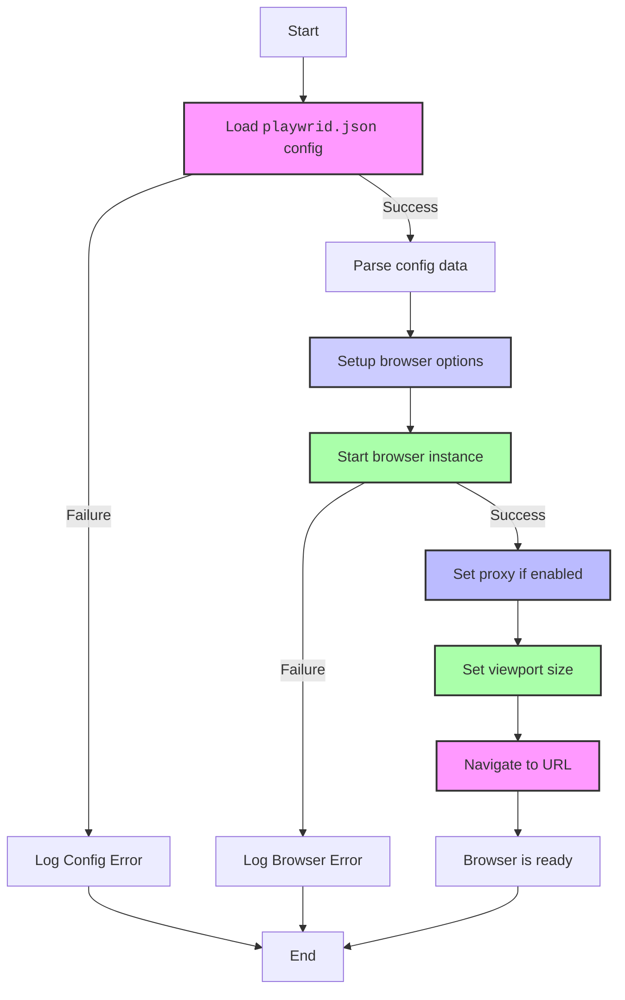

## ИНСТРУКЦИЯ:

Анализируй предоставленный код подробно и объясни его функциональность. Ответ должен включать три раздела:

1. **<алгоритм>**: Опиши рабочий процесс в виде пошаговой блок-схемы, включая примеры для каждого логического блока, и проиллюстрируй поток данных между функциями, классами или методами.
2. **<mermaid>**: Напиши код для диаграммы в формате `mermaid`, проанализируй и объясни все зависимости,
    которые импортируются при создании диаграммы.
    **ВАЖНО!** Убедитесь, что все имена переменных, используемые в диаграмме `mermaid`,
    имеют осмысленные и описательные имена. Имена переменных вроде `A`, `B`, `C`, и т.д., не допускаются!

    **Дополнительно**: Если в коде есть импорт `import header`, добавьте блок `mermaid` flowchart, объясняющий `header.py`:
    ```mermaid
    flowchart TD
        Start --> Header[<code>header.py</code><br> Determine Project Root]

        Header --> import[Import Global Settings: <br><code>from src import gs</code>]
    ```

3. **<объяснение>**: Предоставьте подробные объяснения:
   - **Импорты**: Их назначение и взаимосвязь с другими пакетами `src.`.
   - **Классы**: Их роль, атрибуты, методы и взаимодействие с другими компонентами проекта.
   - **Функции**: Их аргументы, возвращаемые значения, назначение и примеры.
   - **Переменные**: Их типы и использование.
   - Выделите потенциальные ошибки или области для улучшения.

Дополнительно, постройте цепочку взаимосвязей с другими частями проекта (если применимо).

Это обеспечивает всесторонний и структурированный анализ кода.
## Формат ответа: `.md` (markdown)
**КОНЕЦ ИНСТРУКЦИИ**

## Анализ кода

### 1. <алгоритм>

1.  **Инициализация `Playwrid`**:
    *   Пользователь создает экземпляр класса `Playwrid`.
    *   Конструктор класса загружает конфигурацию из `playwrid.json`.
    *   В конструкторе могут быть переданы дополнительные опции, которые будут объединены с настройками из файла.
    *   Если файл `playwrid.json` отсутствует или содержит ошибки, генерируется исключение.

        ```python
        # Пример:
        browser = Playwrid(options=["--headless"]) # инициализация с пользовательской опцией
        ```

2.  **Настройка параметров браузера**:
    *   Извлекаются параметры браузера: тип браузера, режим headless, дополнительные аргументы командной строки, user-agent, настройки прокси, размеры окна, таймаут, игнорирование ошибок HTTPS.

3.  **Запуск браузера (`start`)**:
    *   Метод `start` принимает URL в качестве аргумента.
    *   На основе настроек Playwright запускается браузер.
    *   Если прокси включен, устанавливается прокси.
    *   Если есть настройки viewport, задается размер окна.
    *   Браузер переходит по указанному URL.
    *   Логируется успешный запуск браузера и переход на сайт.

        ```python
        # Пример:
        browser.start("https://www.example.com")
        ```

4.  **Логирование**:
    *   В процессе инициализации и запуска браузера используются методы `logger` для записи информации, ошибок и предупреждений.

5.  **Обработка ошибок**:
    *   В случае ошибок при загрузке файла конфигурации, инициализации Playwright или запуска браузера, выводятся сообщения об ошибке в лог.
    *   Если файл конфигурации отсутствует или имеет неверный формат, возникнет исключение.

### 2. <mermaid>



**Объяснение зависимостей `mermaid`:**

В данном `mermaid` коде нет явных импортов, поскольку это не код Python, а описание блок-схемы. Однако, в контексте работы модуля `src.webdriver.playwright`, диаграмма показывает:
- **Поток управления** начинается с инициализации и последовательно переходит к загрузке конфигурации.
- **Условные переходы**: Обработка ошибок конфигурации и ошибок браузера.
- **Последовательность действий**: Загрузка настроек, запуск браузера, настройка прокси, установка размеров окна и навигация по URL.
- **Структура работы** модуля, который обрабатывает конфигурационные файлы и параметры, а затем запускает браузер.

### 3. <объяснение>

**Импорты**:

В предоставленном описании нет явных импортов, но упоминается использование `logger` из `src.logger`.

-   `src.logger`:  Этот модуль, вероятно, отвечает за логирование событий. Он может включать методы для записи информационных сообщений, предупреждений и ошибок в файл или консоль. Используется для отслеживания процесса инициализации и работы модуля `Playwrid`.

**Классы**:

-   `Playwrid`:
    *   **Роль**: Главный класс модуля, предоставляющий функциональность для запуска браузера Playwright с настройками из `playwrid.json`.
    *   **Атрибуты**:
        *   `config`:  Словарь, содержащий загруженную конфигурацию из `playwrid.json`.
    *   **Методы**:
        *   `__init__(self, options=None)`:  Конструктор класса. Загружает конфигурацию из `playwrid.json` и объединяет её с пользовательскими опциями.
        *   `start(self, url)`: Метод для запуска браузера и перехода на заданный URL.

**Функции**:

В данном описании нет отдельных функций вне методов класса `Playwrid`.

**Переменные**:

-   `browser_type`: Тип браузера (строка).
-   `headless`: Флаг запуска браузера в режиме без GUI (логическое значение).
-   `options`: Список дополнительных параметров командной строки для браузера.
-   `user_agent`: Строка, представляющая user-agent для браузера.
-   `proxy`:  Словарь с настройками прокси (адрес, логин, пароль и флаг активации).
-   `viewport`: Словарь с размерами окна браузера (ширина и высота).
-   `timeout`: Максимальное время ожидания для операций браузера (в миллисекундах, число).
-   `ignore_https_errors`: Флаг для игнорирования ошибок HTTPS (логическое значение).
- `url`: URL для навигации браузера.

**Потенциальные ошибки и области для улучшения**:

1.  **Отсутствие валидации конфигурации**: В коде нет явной валидации данных в `playwrid.json`. Необходимо добавить проверки типов данных и допустимых значений.
2.  **Обработка исключений**: В описании не показан явный try-except для обработки ошибок чтения `playwrid.json` и запуска браузера.
3.  **Гибкость настроек**: Возможность расширить настройки прокси (например, поддержка SOCKS).
4.  **Недостаток документации**: Необходимо добавить документацию к методам класса `Playwrid` и параметрам конфигурации.

**Цепочка взаимосвязей с другими частями проекта**:

-   `src.logger`: `Playwrid` использует `logger` для логирования, устанавливая связь с модулем логирования.
-   `playwrid.json`: Конфигурационный файл связывает модуль с внешними настройками.
-   Зависимости от `playwright` и `crawlee`: Модуль зависит от этих библиотек для управления браузером и веб-скрейпинга.
-   `src.header`: Если в коде будет `import header`, появится связь с `header.py`, который, вероятно, определяет корневую директорию проекта.

В целом, данный модуль предоставляет удобный интерфейс для управления браузером Playwright, но требует улучшения в плане валидации и обработки ошибок.