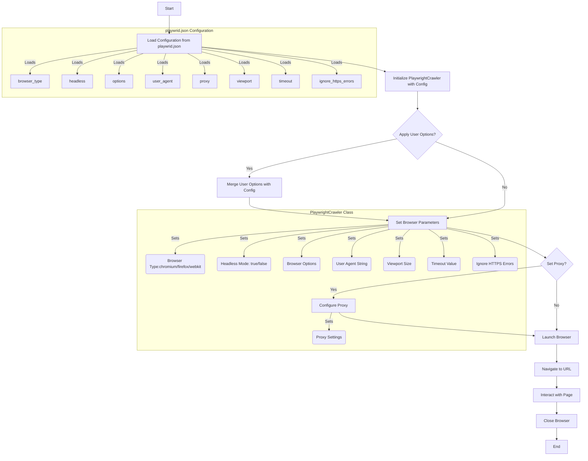

## ИНСТРУКЦИЯ:

Анализируй предоставленный код подробно и объясни его функциональность. Ответ должен включать три раздела:  

1. **<алгоритм>**: Опиши рабочий процесс в виде пошаговой блок-схемы, включая примеры для каждого логического блока, и проиллюстрируй поток данных между функциями, классами или методами.  
2. **<mermaid>**: Напиши код для диаграммы в формате `mermaid`, проанализируй и объясни все зависимости, 
    которые импортируются при создании диаграммы. 
    **ВАЖНО!** Убедитесь, что все имена переменных, используемые в диаграмме `mermaid`, 
    имеют осмысленные и описательные имена. Имена переменных вроде `A`, `B`, `C`, и т.д., не допускаются!  
    
    **Дополнительно**: Если в коде есть импорт `import header`, добавьте блок `mermaid` flowchart, объясняющий `header.py`:\
    ```mermaid
    flowchart TD
        Start --> Header[<code>header.py</code><br> Determine Project Root]
    
        Header --> import[Import Global Settings: <br><code>from src import gs</code>] 
    ```

3. **<объяснение>**: Предоставьте подробные объяснения:  
   - **Импорты**: Их назначение и взаимосвязь с другими пакетами `src.`.  
   - **Классы**: Их роль, атрибуты, методы и взаимодействие с другими компонентами проекта.  
   - **Функции**: Их аргументы, возвращаемые значения, назначение и примеры.  
   - **Переменные**: Их типы и использование.  
   - Выделите потенциальные ошибки или области для улучшения.  

Дополнительно, постройте цепочку взаимосвязей с другими частями проекта (если применимо).  

Это обеспечивает всесторонний и структурированный анализ кода.
## Формат ответа: `.md` (markdown)
**КОНЕЦ ИНСТРУКЦИИ**
```
## <алгоритм>

1. **Инициализация:**
   - Начинается с импорта необходимых библиотек и модулей (`Playwright`, `Crawlee`, `src.logger`, `src.config`).
   - Загружается конфигурация из файла `playwrid.json`.
   - Инициализируется объект `PlaywrightCrawler` с использованием загруженной конфигурации.
   - При инициализации `Playwrid` можно передать пользовательские `options`, которые будут добавлены к конфигурации.
   - Пример: `browser = Playwrid(options=["--headless"])`.

2. **Настройка браузера:**
   - На основе конфигурации устанавливаются параметры браузера, такие как тип браузера (`chromium`, `firefox`, `webkit`), режим `headless`, опции командной строки, user-agent, настройки прокси, размер окна (`viewport`), таймаут и игнорирование ошибок HTTPS.
   - Если прокси включен в конфигурации, браузер настраивается для использования указанного прокси-сервера.
   - Если в конфигурации указан `user_agent`, то он будет использован для браузерных запросов.
   - Пример: `browser.start("https://www.example.com")` использует настроенный браузер.

3. **Запуск браузера:**
   -  Метод `start()` запускает браузер с установленными настройками.
   - Переходит по указанной ссылке.
   - В процессе запуска и работы браузера ведется подробное логирование ошибок, предупреждений и общей информации.
   - Пример: `browser.start("https://www.example.com")`

4. **Использование:**
   - После запуска браузера, можно взаимодействовать со страницей, используя методы Playwright.
   - Результаты взаимодействия и данные могут быть обработаны в соответствии с бизнес-логикой приложения.
   - Пример: после запуска, можно вызвать методы Playwright для парсинга страницы.

5. **Закрытие браузера:**
   -  После завершения работы браузер закрывается.

## <mermaid>


**Анализ зависимостей `mermaid`:**

Диаграмма `mermaid` описывает процесс инициализации и использования класса `PlaywrightCrawler`. Основные зависимости и их роли:

1.  **`Start`**: Начало процесса.
2.  **`LoadConfig`**: Загрузка конфигурационных параметров из файла `playwrid.json`.
3.  **`InitCrawler`**: Инициализация класса `PlaywrightCrawler` с загруженной конфигурацией.
4.  **`ApplyUserOptions`**: Проверка, были ли переданы пользовательские опции.
5.  **`MergeOptions`**: Объединение пользовательских опций с параметрами конфигурации.
6.  **`SetBrowserParams`**: Установка параметров браузера на основе конфигурации и пользовательских опций.
7.  **`SetProxy`**: Проверка, включена ли настройка прокси.
8.  **`ConfigureProxy`**: Настройка параметров прокси.
9.  **`LaunchBrowser`**: Запуск браузера.
10. **`NavigateToURL`**: Переход по указанному URL.
11. **`InteractWithPage`**: Взаимодействие со страницей.
12. **`CloseBrowser`**: Закрытие браузера.
13. **`End`**: Завершение процесса.
14.  **`playwrid.json Configuration` (подграф)**: Описывает параметры, загружаемые из `playwrid.json`.
15. **`PlaywrightCrawler Class` (подграф)**: Описывает параметры, которые настраиваются внутри класса `PlaywrightCrawler`.

## <объяснение>

**Импорты:**

*   `from playwright.sync_api import sync_playwright`: Импортирует синхронный API библиотеки Playwright, которая используется для управления браузером. Это позволяет запускать браузер, переходить по страницам, взаимодействовать с элементами и т.д.

*   `from crawlee import PlaywrightCrawler`: Импортирует класс `PlaywrightCrawler` из библиотеки Crawlee, который обеспечивает структуру для создания веб-скрейперов с использованием Playwright. Этот класс предоставляет удобные методы для управления браузером и очередью запросов.

*   `from src.logger import logger`: Импортирует объект `logger` из модуля `src.logger`. Этот объект используется для логирования различных событий, включая ошибки и предупреждения, что помогает в отладке и мониторинге работы скрейпера.

*   `from src.config import config`: Импортирует объект `config` из модуля `src.config`. Этот объект используется для загрузки и хранения конфигурационных параметров, таких как настройки браузера, прокси, user-agent и др.

*   `from typing import List, Dict, Any`: Импортирует типы `List`, `Dict`, `Any` для аннотации типов, что улучшает читаемость и проверку кода.

**Классы:**

*   **`Playwrid`**:
    *   **Роль**: Класс `Playwrid` является оберткой вокруг `PlaywrightCrawler`, предоставляющей кастомизированную реализацию для управления браузером. Он автоматически загружает настройки из файла `playwrid.json` и обеспечивает возможность передачи пользовательских опций при инициализации.
    *   **Атрибуты**:
        *   `self.config` (Dict[str, Any]): Содержит загруженную конфигурацию из файла `playwrid.json`.
        *   `self.crawler` (PlaywrightCrawler): Экземпляр `PlaywrightCrawler`, настроенный на основе конфигурации.
    *   **Методы**:
        *   `__init__(self, options: List[str] = None)`:
            *   Аргументы:
                *   `options` (List[str], optional): Список пользовательских опций командной строки для браузера. По умолчанию `None`.
            *   Назначение: Конструктор класса. Загружает конфигурацию, обрабатывает пользовательские опции, инициализирует и настраивает `PlaywrightCrawler`.
            *   Пример: `Playwrid(options=["--headless"])`.
        *   `start(self, url: str)`:
            *   Аргументы:
                *   `url` (str): URL для открытия в браузере.
            *   Назначение: Запускает браузер и переходит на указанную страницу.
            *   Пример: `browser.start("https://www.example.com")`.

**Функции:**

*   `__init__`: Конструктор класса `Playwrid`. Выполняет начальную настройку, загружает конфигурацию, применяет пользовательские опции и инициализирует `PlaywrightCrawler`.
*   `start`: Метод класса `Playwrid`. Запускает браузер и переходит на указанный URL.

**Переменные:**

*   `config` (из `src.config`): Словарь, содержащий конфигурационные параметры из `playwrid.json`.
*   `logger` (из `src.logger`): Объект для логирования сообщений.
*   `options` (в `__init__`): Список пользовательских опций командной строки для браузера.
*   `url` (в `start`): URL для открытия в браузере.
*   `browser_type` (из `config`): Тип браузера (`chromium`, `firefox`, `webkit`).
*   `headless` (из `config`): Булево значение, определяющее, запускать браузер в безголовом режиме или нет.
*   `browser_options` (из `config`): Список дополнительных опций командной строки для браузера.
*   `user_agent` (из `config`): Строка user-agent, используемая браузером.
*   `proxy_settings` (из `config`): Настройки прокси-сервера, включая адрес, имя пользователя и пароль.
*   `viewport` (из `config`): Размеры окна браузера.
*   `timeout` (из `config`): Максимальное время ожидания для операций.
*   `ignore_https_errors` (из `config`): Булево значение, указывающее, игнорировать ошибки HTTPS.
*    `merged_options` (в `__init__`): Список объединенных пользовательских опций и опций из конфигурации.

**Потенциальные ошибки и области для улучшения:**

*   **Отсутствие проверки типов конфигурации**:  Необходимо добавить проверку типов для значений, загруженных из `playwrid.json`, чтобы гарантировать, что все значения имеют ожидаемый тип и формат. Это поможет избежать ошибок в рантайме.
*   **Обработка ошибок при чтении конфигурации**:  Необходимо добавить более надежную обработку исключений при чтении файла `playwrid.json`. Сейчас просто выводится сообщение об ошибке. Возможно, стоит использовать значения по умолчанию, если файл не найден или поврежден.
*   **Асинхронность**:  При использовании Playwright есть возможность использовать асинхронный API, что может повысить производительность. Можно рассмотреть переход к асинхронному API для более эффективной работы.
*  **Модульность:** В классе `Playwrid` стоит разбить логику на отдельные методы для повышения читаемости и поддерживаемости. Например, метод `configure_browser` для настройки параметров браузера, `configure_proxy` для настройки прокси и т.д.

**Цепочка взаимосвязей:**

1.  **`src.config`**: Загружает настройки из `playwrid.json` и предоставляет их классу `Playwrid`.
2.  **`src.logger`**: Используется для записи сообщений об ошибках и информационных сообщений в процессе работы `Playwrid`.
3.  **`playwright.sync_api`**: Предоставляет API для управления браузером, используемый внутри `PlaywrightCrawler` и в методе `start`.
4.  **`crawlee.PlaywrightCrawler`**: Является базовым классом для создания веб-скрейпера, управляется классом `Playwrid`.

Эта структура обеспечивает модульность и возможность повторного использования компонентов.