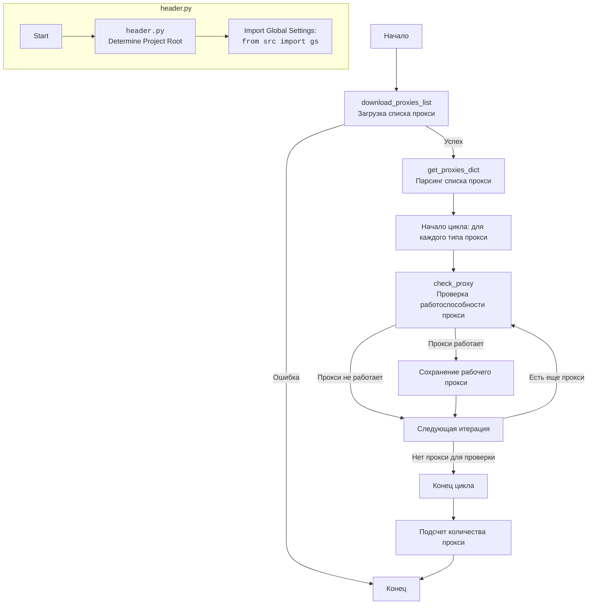

## ИНСТРУКЦИЯ:

Анализируй предоставленный код подробно и объясни его функциональность. Ответ должен включать три раздела:

1.  **<алгоритм>**: Опиши рабочий процесс в виде пошаговой блок-схемы, включая примеры для каждого логического блока, и проиллюстрируй поток данных между функциями, классами или методами.
2.  **<mermaid>**: Напиши код для диаграммы в формате `mermaid`, проанализируй и объясни все зависимости,
    которые импортируются при создании диаграммы.
    **ВАЖНО!** Убедитесь, что все имена переменных, используемые в диаграмме `mermaid`,
    имеют осмысленные и описательные имена. Имена переменных вроде `A`, `B`, `C`, и т.д., не допускаются!

    **Дополнительно**: Если в коде есть импорт `import header`, добавьте блок `mermaid` flowchart, объясняющий `header.py`:
    ```mermaid
    flowchart TD
        Start --> Header[<code>header.py</code><br> Determine Project Root]

        Header --> import[Import Global Settings: <br><code>from src import gs</code>]
    ```

3.  **<объяснение>**: Предоставьте подробные объяснения:
    *   **Импорты**: Их назначение и взаимосвязь с другими пакетами `src.`.
    *   **Классы**: Их роль, атрибуты, методы и взаимодействие с другими компонентами проекта.
    *   **Функции**: Их аргументы, возвращаемые значения, назначение и примеры.
    *   **Переменные**: Их типы и использование.
    *   Выделите потенциальные ошибки или области для улучшения.

Дополнительно, постройте цепочку взаимосвязей с другими частями проекта (если применимо).

Это обеспечивает всесторонний и структурированный анализ кода.
## Формат ответа: `.md` (markdown)
**КОНЕЦ ИНСТРУКЦИИ**

## <алгоритм>
1.  **`download_proxies_list(url, save_path)`**
    *   **Вход**: URL для скачивания списка прокси (`url`), путь для сохранения файла (`save_path`).
    *   **Пример входа**: `url = 'https://some-url.com/proxies.txt', save_path = Path('path/to/proxies.txt')`.
    *   **Действие**:
        1.  Отправляет GET-запрос по URL.
        2.  Проверяет статус ответа HTTP (вызывает исключение, если ошибка).
        3.  Сохраняет полученный файл в указанное место, если запрос успешен.
        4.  Логирует успех или ошибку.
    *   **Выход**: `True` если файл скачан успешно, иначе `False`.

2.  **`get_proxies_dict(file_path)`**
    *   **Вход**: Путь к файлу со списком прокси (`file_path`).
    *    **Пример входа**: `file_path = Path('path/to/proxies.txt')`.
    *   **Действие**:
        1.  Вызывает функцию `download_proxies_list()` для загрузки свежего списка прокси.
        2.  Инициализирует словарь `proxies` для хранения прокси по типам ('http', 'socks4', 'socks5').
        3.  Читает файл построчно, парсит каждую строку на соответствие формату `(http|socks4|socks5)://host:port` с помощью регулярного выражения.
        4.  Если строка соответствует формату, извлекает протокол, хост, и порт и добавляет в соответствующий список в словаре `proxies`.
        5.  Логирует ошибки при чтении файла или парсинге.
    *   **Выход**: Словарь `proxies` с прокси, сгруппированными по типам.
        *   **Пример выхода**:
            ```python
            {
               'http': [{'protocol': 'http', 'host': '192.168.1.1', 'port': '8080'}, ...],
               'socks4': [{'protocol': 'socks4', 'host': '192.168.1.2', 'port': '9050'}, ...],
               'socks5': [{'protocol': 'socks5', 'host': '192.168.1.3', 'port': '1080'}, ...]
           }
            ```

3.  **`check_proxy(proxy)`**
    *   **Вход**: Словарь с данными прокси (`proxy`), содержащий `protocol`, `host` и `port`.
     *   **Пример входа**: `proxy = {'protocol': 'http', 'host': '192.168.1.1', 'port': '8080'}`.
    *   **Действие**:
        1.  Формирует строку прокси для запроса `protocol://host:port`.
        2.  Отправляет GET-запрос к `https://httpbin.org/ip` через указанный прокси.
        3.  Проверяет статус ответа (200 - успех).
        4.  Логирует результат проверки (успех, неудача, ошибка соединения).
    *   **Выход**: `True`, если прокси работает, иначе `False`.

4. **`if __name__ == '__main__':`**
    * **Действие:**
        1.  Вызывается функция `download_proxies_list()`, если загрузка прокси прошла успешно, то вызывается функция `parse_proxies()`.
        2.  Суммирует количество всех прокси из словаря и логирует результат.

## <mermaid>


**Анализ зависимостей:**
*   **`header.py`**: Модуль, который определяет корень проекта и импортирует глобальные настройки, используется для определения путей к файлам в проекте.
*   `re`: Модуль для работы с регулярными выражениями. Используется в `get_proxies_dict` для парсинга строк.
*   `requests`: Модуль для отправки HTTP-запросов. Используется в `download_proxies_list` для скачивания файла и в `check_proxy` для проверки прокси.
*   `requests.exceptions.ProxyError` и `requests.exceptions.RequestException`: Обработка исключений, связанных с прокси и общими ошибками запросов.
*   `pathlib.Path`: Модуль для работы с путями в файловой системе. Используется для указания путей к файлам прокси.
*   `typing.Any`, `typing.Dict`, `typing.List`, `typing.Optional`: Модули для аннотации типов переменных и функций.
*   `src.gs`: Модуль глобальных настроек. Используется для доступа к пути `src`.
*   `src.utils.printer.pprint`: Модуль для красивого вывода данных.
*   `src.logger.logger.logger`: Модуль для логирования событий.

## <объяснение>
**Импорты:**
*   `re`: Модуль регулярных выражений используется для разбора строк прокси из файла, позволяет эффективно извлекать данные.
*   `requests`:  Модуль для выполнения HTTP запросов, используется для загрузки списка прокси и проверки их работоспособности. Он является ключевым элементом для взаимодействия с внешними ресурсами по HTTP протоколу.
*  `requests.exceptions.ProxyError` `requests.exceptions.RequestException`: Специализированные исключения из модуля `requests`, позволяющие более точно обрабатывать ошибки, связанные с прокси и сетевыми запросами.
*   `pathlib.Path`: Модуль для работы с путями в файловой системе, обеспечивает кроссплатформенную работу и упрощает манипуляции с путями.
*   `typing`: Модуль для аннотации типов, делает код более читаемым и надежным.
*   `header`: Модуль для определения корня проекта, используется для доступа к `gs`.
*   `src.gs`:  Модуль глобальных настроек, используется для доступа к общим переменным, в том числе к `gs.path.src`.
*   `src.utils.printer.pprint`:  Модуль для форматированного вывода данных,  предоставляет более читаемый формат данных.
*   `src.logger.logger.logger`:  Модуль для логирования событий, позволяющий отслеживать работу программы и облегчает отладку.

**Переменные:**
*   `url`: `str` -  содержит URL для загрузки файла со списком прокси.
*   `proxies_list_path`: `Path` -  содержит путь к файлу, куда будет сохранен список прокси.

**Функции:**

1.  **`download_proxies_list(url: str = url, save_path: Path = proxies_list_path) -> bool`**:
    *   **Аргументы**: `url` - URL для загрузки файла (по умолчанию из глобальной переменной), `save_path` - путь для сохранения файла (по умолчанию из глобальной переменной).
    *   **Возвращаемое значение**: `bool` - `True` если загрузка прошла успешно, иначе `False`.
    *   **Назначение**: Загружает файл по указанному URL и сохраняет его в заданный путь.  
     *   **Пример**:
        ```python
        if download_proxies_list():
            print("Файл прокси успешно загружен.")
        else:
            print("Ошибка загрузки файла прокси.")
        ```
        *   **Пример**: `download_proxies_list(url="http://example.com/proxies.txt", save_path=Path("/tmp/proxies.txt"))` - загрузка по указанному URL и сохранение по указанному пути.

2.  **`get_proxies_dict(file_path: Path = proxies_list_path) -> Dict[str, List[Dict[str, Any]]]`**:
    *   **Аргументы**: `file_path` - путь к файлу со списком прокси (по умолчанию из глобальной переменной).
    *   **Возвращаемое значение**: `Dict[str, List[Dict[str, Any]]]` - словарь, где ключи - типы прокси ('http', 'socks4', 'socks5'), а значения - списки словарей с данными прокси (protocol, host, port).
    *   **Назначение**: Парсит файл с прокси-адресами и распределяет их по категориям.  Вызывает функцию `download_proxies_list()` для загрузки свежего списка перед парсингом.
    *   **Пример**:
        ```python
        proxies_data = get_proxies_dict()
        if proxies_data:
            print(f"Найдено http прокси: {len(proxies_data['http'])}")
            print(f"Найдено socks4 прокси: {len(proxies_data['socks4'])}")
            print(f"Найдено socks5 прокси: {len(proxies_data['socks5'])}")
        else:
            print("Не удалось получить данные прокси.")
        ```

3.  **`check_proxy(proxy: dict) -> bool`**:
    *   **Аргументы**: `proxy` - словарь с данными прокси (host, port, protocol).
    *   **Возвращаемое значение**: `bool` - `True`, если прокси работает, иначе `False`.
    *   **Назначение**: Проверяет работоспособность прокси-сервера, отправляя запрос через него.
     *   **Пример**:
        ```python
        proxy_example = {'protocol': 'http', 'host': '192.168.1.1', 'port': '8080'}
        if check_proxy(proxy_example):
            print(f"Прокси {proxy_example['host']}:{proxy_example['port']} работает.")
        else:
            print(f"Прокси {proxy_example['host']}:{proxy_example['port']} не работает.")
        ```
**Классы**:

*   В данном коде нет классов.

**Переменные:**
* `url: str` URL адрес для скачивания списка прокси.
* `proxies_list_path: Path` путь к файлу, куда сохраняется список прокси.
* `proxies: Dict[str, List[Dict[str, Any]]]`: словарь для хранения прокси сгруппированных по типам.

**Потенциальные ошибки и области для улучшения:**
*   Отсутствует обработка случаев когда файл прокси уже существует, можно добавить проверку и не загружать файл повторно.
*   Можно добавить более гибкие настройки для `check_proxy`, например возможность настраивать URL для проверки прокси и время ожидания ответа.
*   Обработка исключений в блоке try-except может быть более детальной.
*   Можно добавить функцию для выбора случайного прокси из списка, что часто полезно в практическом применении.
*   При парсинге прокси не проверяется валидность `host` и `port`, можно добавить проверку на корректность IP и допустимость порта.
*   В `if __name__ == '__main__'` переменная `parsed_proxies` использует название функции `parse_proxies()`, но должна использовать название `get_proxies_dict()`

**Взаимосвязь с другими частями проекта:**
*   Этот модуль зависит от `header.py`, `src.gs` для определения путей и общих настроек проекта, `src.logger` для логирования, `src.utils.printer` для форматированного вывода.
*   Модуль `proxy.py` предоставляет функциональность для работы с прокси, которую могут использовать другие части проекта, например, модули для веб-скрапинга или тестирования.

Этот анализ дает полное понимание работы модуля `proxy.py`, его зависимостей, функциональности и возможностей.