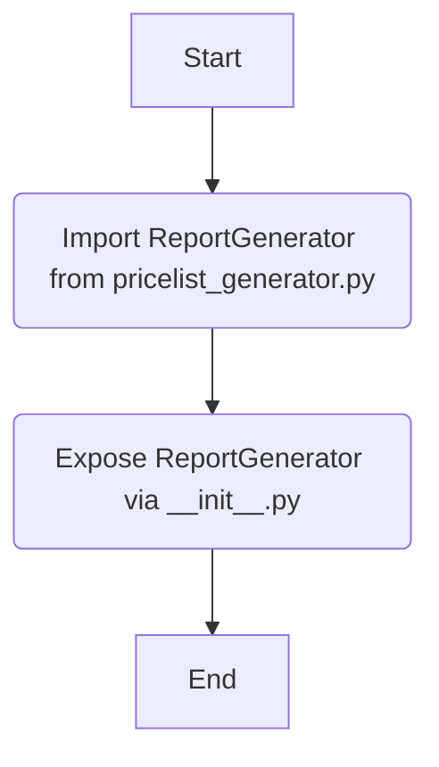

## Анализ кода `hypotez/src/endpoints/emil/report_generator/__init__.py`

### 1. <алгоритм>

Этот файл `__init__.py` служит для инициализации пакета `src.endpoints.kazarinov.pricelist_generator`. Он импортирует класс `ReportGenerator` из модуля `pricelist_generator.py`.  Это позволяет использовать `ReportGenerator` напрямую через пакет `src.endpoints.kazarinov.pricelist_generator`.

**Пример блок-схемы:**

1.  Начало: Пользователь вызывает функциональность, связанную с `src.endpoints.kazarinov.pricelist_generator`.
2.  Импорт: `__init__.py` импортирует `ReportGenerator` из `pricelist_generator.py`.
3.  Использование: Пользователь создает экземпляр `ReportGenerator` и использует его методы.

### 2. <mermaid>

**Объяснение диаграммы:**

-   `Start`: Начало процесса инициализации пакета.
-   `Import ReportGenerator from pricelist_generator.py`: Импорт класса `ReportGenerator` из модуля `pricelist_generator.py`.
-   `Expose ReportGenerator via __init__.py`: Класс `ReportGenerator` становится доступным через пакет `src.endpoints.kazarinov.pricelist_generator`.
-   `End`: Завершение процесса инициализации пакета.

### 3. <объяснение>

**Импорты:**

-   `.pricelist_generator import ReportGenerator`: Импортирует класс `ReportGenerator` из модуля `pricelist_generator.py`, находящегося в той же директории. Это позволяет использовать `ReportGenerator` при работе с пакетом.

**Классы:**

-   `ReportGenerator`: Класс, предназначенный для генерации отчетов. Он вероятно содержит методы для создания, форматирования и экспорта отчетов. Подробности о его функциональности можно найти в файле `pricelist_generator.py`.

**Функции:**

-   В данном файле функции отсутствуют. Основная цель этого файла - импорт и экспорт класса `ReportGenerator` для удобства использования в других модулях.

**Переменные:**

-   В данном файле переменные отсутствуют.

**Потенциальные ошибки и области для улучшения:**

-   Отсутствие документации о назначении пакета и класса `ReportGenerator` в `__init__.py`.
-   Необходимо добавить обработку возможных исключений при импорте модуля.

**Взаимосвязи с другими частями проекта:**

-   Этот пакет, вероятно, используется в других частях проекта, где требуется генерация отчетов, связанных с прайс-листами. Например, его могут использовать веб-эндпоинты для генерации отчетов по запросу пользователя или для автоматической генерации отчетов по расписанию.