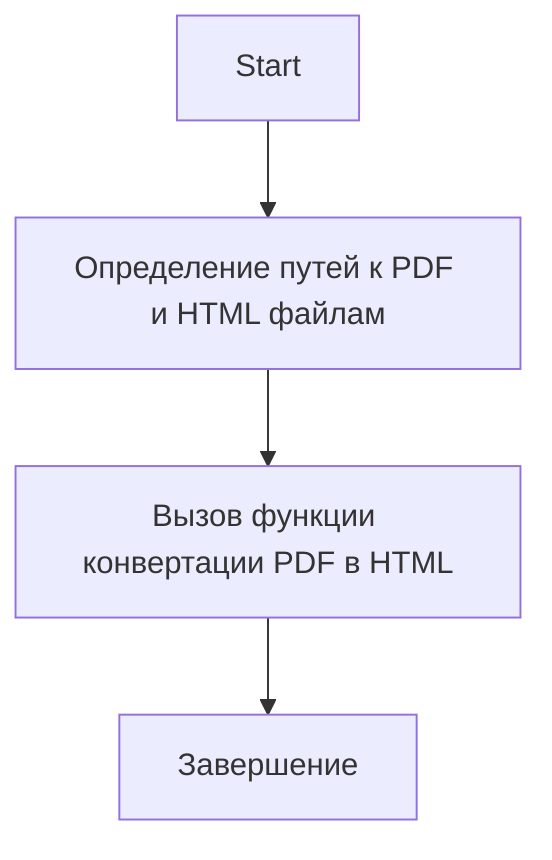
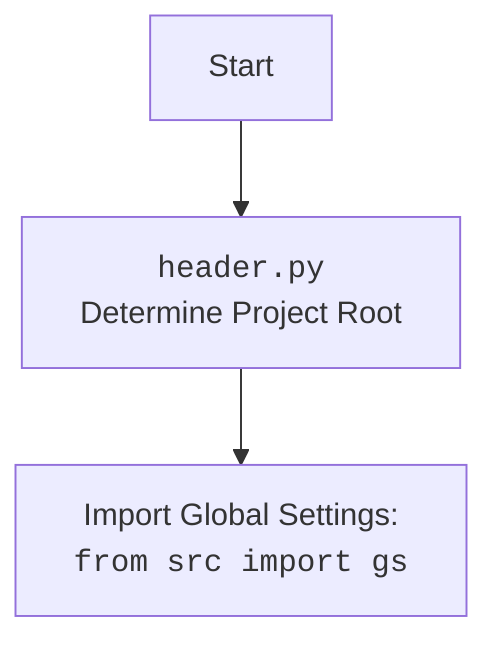

## Анализ кода `pdf2html.py`

### 1. <алгоритм>

1.  **Инициализация**:
    *   Указывается путь к PDF-файлу (`pdf_file`) и HTML-файлу (`html_file`).
2.  **Конвертация**:
    *   Вызывается функция `PDFUtils.pdf_to_html(pdf_file, html_file)` для конвертации PDF в HTML.
3.  **Завершение**:
    *   Результат конвертации сохраняется в указанный HTML-файл.

### 2. <mermaid>



**Объяснение зависимостей:**

*   `src.utils.pdf.PDFUtils`: Содержит утилиты для работы с PDF, включая функцию `pdf_to_html`.

**Дополнительно**: Если в коде есть импорт `import header`, добавьте блок `mermaid` flowchart, объясняющий `header.py`:



### 3. <объяснение>

**Импорты:**

*   `import header`: Импортирует модуль `header`, который, вероятно, определяет корень проекта.
*   `from src import gs`: Импортирует глобальные настройки `gs` из пакета `src`.
*   `from src.utils.pdf import PDFUtils`: Импортирует класс `PDFUtils` из модуля `pdf`, который содержит функцию `pdf_to_html` для конвертации PDF в HTML.

**Функции:**

*   `pdf2html(pdf_file, html_file)`:
    *   Аргументы:
        *   `pdf_file`: Путь к PDF-файлу.
        *   `html_file`: Путь к HTML-файлу, в который будет сохранен результат конвертации.
    *   Возвращаемое значение: Отсутствует (None).
    *   Назначение: Вызывает функцию `PDFUtils.pdf_to_html` для конвертации PDF в HTML.
    *   Пример:

        ```python
        pdf_file = gs.path.root / 'assets' / 'materials' / '101_BASIC_Computer_Games_Mar75.pdf'
        html_file = gs.path.root / 'assets' / 'materials' / '101_BASIC_Computer_Games_Mar75.html'
        pdf2html(pdf_file, html_file)
        ```

**Переменные:**

*   `pdf_file`: Переменная типа `pathlib.Path`, содержащая путь к PDF-файлу.
*   `html_file`: Переменная типа `pathlib.Path`, содержащая путь к HTML-файлу.

**Потенциальные ошибки и области для улучшения:**

*   Отсутствует обработка исключений. В случае ошибки при конвертации PDF в HTML, программа завершится аварийно.
*   Отсутствует логирование. Было бы полезно добавить логирование для отслеживания процесса конвертации и выявления ошибок.

```python
import header
from src import gs
from src.utils.pdf import PDFUtils
from src.logger.logger import logger  # Добавлен импорт logger

def pdf2html(pdf_file, html_file):
    """Конвертирует PDF в HTML с обработкой ошибок и логированием."""
    try:
        PDFUtils.pdf_to_html(pdf_file, html_file)
        logger.info(f'PDF успешно конвертирован в HTML: {html_file}')  # Добавлено логирование
    except Exception as e:
        logger.error(f'Ошибка при конвертации PDF в HTML: {e}', exc_info=True)  # Добавлено логирование ошибки

pdf_file = gs.path.root / 'assets' / 'materials' / '101_BASIC_Computer_Games_Mar75.pdf'
html_file = gs.path.root / 'assets' / 'materials' / '101_BASIC_Computer_Games_Mar75.html'

pdf2html(pdf_file, html_file)
```

**Взаимосвязи с другими частями проекта:**

*   Файл использует `gs` (глобальные настройки) для определения путей к файлам. Это позволяет легко конфигурировать пути к файлам в одном месте.
*   Функция `PDFUtils.pdf_to_html` выполняет основную работу по конвертации PDF в HTML. Этот класс может использоваться и в других частях проекта, где требуется конвертация PDF в HTML.