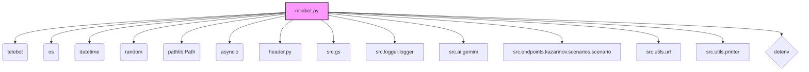
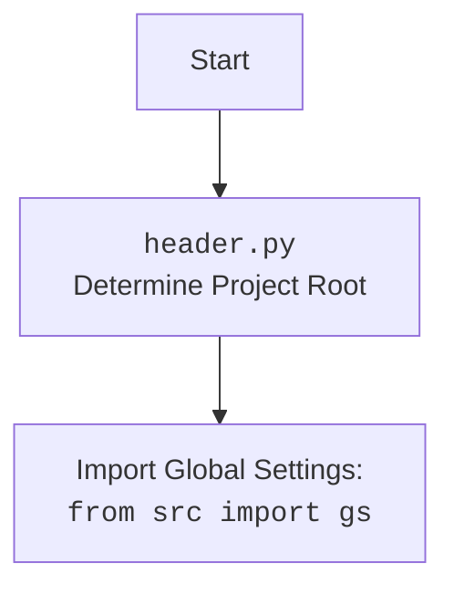

# Проект `hypotez`
# Роль `code explainer`
## Анализ кода `minibot.py`

### 1. <алгоритм>

**Обзор работы `minibot.py`**

`minibot.py` - это телеграм-бот, разработанный для обработки запросов, связанных с анализом URL-адресов `one-tab.com` и взаимодействием с Google Gemini AI для ответов на вопросы.

**Блок-схема:**

```mermaid
graph TD
    A[Начало: Запуск бота] --> B{Инициализация: Конфигурация и обработчики};
    B -- Загрузка конфига из .env или gs --> C{Обработка входящих сообщений};
    C -- Команда /start --> D[Отправка приветственного сообщения];
    C -- Команда /help --> E[Отправка справки];
    C -- Команда /info --> F[Отправка информации о боте];
    C -- Команда /time --> G[Отправка текущего времени];
    C -- Команда /photo --> H{Отправка случайной фотографии};
    H -- Фотографии есть --> I[Отправка фото];
    H -- Фотографий нет --> J[Отправка сообщения об отсутствии фото];
    C -- Голосовое сообщение --> K[Обработка голосового сообщения];
    C -- Документ --> L[Обработка документа];
    C -- Текст --> M{Анализ текста};
    M -- Текст "?" --> N[Отправка user_flowchart];
    M -- Текст URL --> O{Обработка URL};
    O -- URL корректный --> P{Извлечение данных OneTab};
    P -- Данные извлечены --> Q{Запуск сценария};
    Q -- Сценарий выполнен --> R[Отправка ответа];
    P -- Ошибка извлечения --> S[Отправка сообщения об ошибке OneTab];
    O -- URL некорректный --> T[Отправка сообщения о некорректном URL];
    M -- Текст "--next" --> U{Обработка команды --next};
    U -- Вопрос получен --> V[Отправка вопроса и ответа];
    U -- Ошибка получения --> W[Отправка сообщения об ошибке];
    M -- Неизвестная команда --> X[Отправка сообщения о неизвестной команде];
    C -- Ошибка --> Y[Логирование ошибки и отправка сообщения об ошибке];
    Q -- Ошибка сценария --> Y
```

**Примеры для каждого логического блока:**

*   **Начало:** Бот запускается и ждет входящие сообщения.
*   **Команды:**
    *   `/start` - Бот отвечает приветствием.
    *   `/help` - Бот предоставляет список доступных команд.
    *   `/photo` - Бот отправляет случайное фото из указанной директории.
*   **Обработка текста:**
    *   `?` - Бот отправляет схему `user_flowchart.png`.
    *   `https://one-tab.com/...` - Бот извлекает данные со страницы OneTab и запускает сценарий.
    *   `--next` - Бот задает случайный вопрос и отправляет ответ от модели Gemini.
    *   Другой текст - Бот отправляет текст в модель Gemini и отправляет ответ.
*   **Обработка ошибок:** При возникновении ошибки бот логирует её и отправляет сообщение об ошибке пользователю.

### 2. <mermaid>

#### Диаграмма зависимостей модулей:



**Объяснение зависимостей:**

*   `telebot`: Используется для создания и управления Telegram-ботом.
*   `os`: Используется для работы с операционной системой, например, для доступа к переменным окружения.
*   `datetime`: Используется для получения текущего времени (в команде `/time`).
*   `random`: Используется для выбора случайных элементов (например, фотографии или вопроса).
*   `pathlib.Path`: Используется для работы с путями к файлам и директориям.
*   `asyncio`: Используется для асинхронного выполнения сценариев.
*   `header.py`: Определяет корневую директорию проекта.
*   `src.gs`: Содержит глобальные настройки и учетные данные.
*   `src.logger.logger`: Модуль для логирования событий и ошибок.
*   `src.ai.gemini`: Класс для взаимодействия с Google Gemini AI.
*   `src.endpoints.kazarinov.scenarios.scenario`: Модуль, содержащий логику сценариев для обработки URL OneTab.
*   `src.utils.url`: Модуль, содержащий утилиты для работы с URL.
*   `src.utils.printer`: Модуль, содержащий утилиты для форматированного вывода.
*   `dotenv`: Используется для загрузки переменных окружения из файла `.env`.

#### Header Flowchart



### 3. <объяснение>

#### Импорты:

*   `telebot`: Python-библиотека для создания Telegram-ботов.
*   `os`: Предоставляет функции для взаимодействия с операционной системой, например, для получения переменных окружения.
*   `datetime`: Предоставляет классы для работы с датой и временем.
*   `random`: Предоставляет функции для генерации случайных чисел и выбора случайных элементов.
*   `pathlib.Path`: Предоставляет способ представления путей к файлам и каталогам.
*   `asyncio`: Библиотека для написания конкурентного кода с использованием синтаксиса async/await.
*   `header`: Пользовательский модуль для определения корневой директории проекта.
*   `src.gs`: Пользовательский модуль, содержащий глобальные настройки, такие как пути и учетные данные.
*   `src.logger.logger`: Пользовательский модуль для логирования событий и ошибок.
*   `src.ai.gemini`: Пользовательский модуль для взаимодействия с Google Gemini AI.
*   `src.endpoints.kazarinov.scenarios.scenario`: Пользовательский модуль, содержащий классы и функции для выполнения сценариев, связанных с OneTab.
*   `src.utils.url`: Пользовательский модуль, содержащий утилиты для работы с URL.
*   `src.utils.printer`: Пользовательский модуль, содержащий утилиты для форматированного вывода.
*   `dotenv`: Используется для загрузки переменных окружения из файла `.env`.

#### Классы:

*   `BotHandler`:
    *   **Роль**: Обрабатывает входящие сообщения от Telegram-бота.
    *   **Атрибуты**:
        *   `base_dir`: Базовая директория для хранения ресурсов бота.
        *   `questions_list`: Список вопросов для обработки команды `--next`.
        *   `model`: Экземпляр класса `GoogleGenerativeAI` для взаимодействия с моделью Gemini.
    *   **Методы**:
        *   `__init__`: Инициализирует обработчик, загружает список вопросов и создает экземпляр `GoogleGenerativeAI`.
        *   `handle_message`: Обрабатывает входящие текстовые сообщения, определяет тип сообщения (URL, команда, текст) и вызывает соответствующие методы.
        *   `_send_user_flowchart`: Отправляет пользователю схему `user_flowchart.png`.
        *   `_handle_url`: Обрабатывает URL, извлекает данные из OneTab, запускает сценарий и отправляет результат пользователю.
        *   `_handle_next_command`: Обрабатывает команду `--next`, выбирает случайный вопрос, отправляет его в модель Gemini и отправляет ответ пользователю.
        *   `help_command`: Отправляет пользователю сообщение со списком доступных команд.
        *   `send_pdf`: Отправляет пользователю PDF-файл.
        *   `handle_voice`: Обрабатывает голосовые сообщения, распознает текст и отправляет его пользователю.
        *   `handle_document`: Обрабатывает документы, сохраняет их во временную директорию и отправляет сообщение пользователю.
        *   `_transcribe_voice`: Заглушка для транскрибирования голосовых сообщений.
    *   **Взаимодействие**: Взаимодействует с классом `GoogleGenerativeAI`, модулями `src.endpoints.kazarinov.scenarios.scenario`, `src.utils.url`, `src.logger.logger` и библиотекой `telebot`.
*   `Config`:
    *   **Роль**: Содержит настройки бота, такие как токен, ID канала и пути к ресурсам.
    *   **Атрибуты**:
        *   `BOT_TOKEN`: Токен Telegram-бота.
        *   `CHANNEL_ID`: ID канала Telegram.
        *   `PHOTO_DIR`: Директория с фотографиями для команды `/photo`.
        *   `COMMAND_INFO`: Информация о боте.
        *   `UNKNOWN_COMMAND_MESSAGE`: Сообщение для неизвестных команд.
        *   `START_MESSAGE`: Приветственное сообщение.
        *   `HELP_MESSAGE`: Справка по командам.
    *   **Методы**: Отсутствуют.
    *   **Взаимодействие**: Используется для конфигурации бота и предоставления доступа к настройкам.

#### Функции:

*   `command_start(message)`: Обрабатывает команду `/start`, отправляет приветственное сообщение.
*   `command_help(message)`: Обрабатывает команду `/help`, вызывает метод `help_command` класса `BotHandler`.
*   `command_info(message)`: Обрабатывает команду `/info`, отправляет информацию о боте.
*   `command_time(message)`: Обрабатывает команду `/time`, отправляет текущее время.
*   `command_photo(message)`: Обрабатывает команду `/photo`, отправляет случайную фотографию из указанной директории.
*   `handle_voice_message(message)`: Обрабатывает голосовые сообщения, вызывает метод `handle_voice` класса `BotHandler`.
*   `handle_document_message(message)`: Обрабатывает документы, вызывает метод `handle_document` класса `BotHandler`.
*   `handle_text_message(message)`: Обрабатывает текстовые сообщения, вызывает метод `handle_message` класса `BotHandler`.
*   `handle_unknown_command(message)`: Обрабатывает неизвестные команды, отправляет сообщение об этом.
*   `main()`: Главная функция, запускает бота и обрабатывает ошибки.

#### Переменные:

*   `ENDPOINT`: Константа, определяющая endpoint.
*   `USE_ENV`: Булева переменная, определяющая, откуда брать ключи (из `.env` или из базы данных).
*   `MODE`: Строковая переменная, определяющая режим работы (PRODUCTION или DEV).
*   `config`: Экземпляр класса `Config`, содержащий настройки бота.
*   `handler`: Экземпляр класса `BotHandler`, обрабатывающий входящие сообщения.
*   `bot`: Экземпляр класса `telebot.TeleBot`, представляющий Telegram-бота.

#### Потенциальные ошибки и области для улучшения:

*   Отсутствует реализация транскрибирования голосовых сообщений (`_transcribe_voice`).
*   Обработка ошибок в некоторых функциях может быть улучшена (например, более конкретные сообщения об ошибках).
*   Код можно разбить на более мелкие функции для повышения читаемости и удобства поддержки.
*   Жестко заданные строки (например, сообщения об ошибках) можно вынести в отдельный файл конфигурации или использовать механизм интернационализации.

#### Цепочка взаимосвязей с другими частями проекта:

1.  `minibot.py` использует `header.py` для определения корневой директории проекта.
2.  `minibot.py` использует `src.gs` для доступа к глобальным настройкам и учетным данным.
3.  `minibot.py` использует `src.logger.logger` для логирования событий и ошибок.
4.  `minibot.py` использует `src.ai.gemini` для взаимодействия с Google Gemini AI.
5.  `minibot.py` использует `src.endpoints.kazarinov.scenarios.scenario` для выполнения сценариев, связанных с OneTab.
6.  `minibot.py` использует `src.utils.url` для работы с URL.
7.  `minibot.py` использует `src.utils.printer` для форматированного вывода.

В целом, `minibot.py` является модулем, который связывает различные части проекта `hypotez` для предоставления функциональности Telegram-бота.