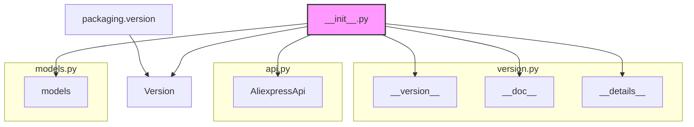

### <алгоритм>

1.  **Импорт модулей**:
    *   Импортируются модули `packaging.version`, `.version`, `.api` и `.models`.
        *   Пример: `from packaging.version import Version`
2.  **Экспорт API**:
    *   Модуль `.api` предоставляет класс `AliexpressApi`, который используется для взаимодействия с API Aliexpress.
        *   Пример: `from .api import AliexpressApi`
3.  **Модели данных**:
    *   Модуль `.models` содержит классы для представления структур данных, используемых API.
        *   Пример: `from . import models`
4.  **Информация о версии**:
    *   Модуль `.version` содержит информацию о версии API.
        *   Пример: `from .version import __version__, __doc__, __details__`

### <mermaid>

### <объяснение>

#### Импорты:

*   `packaging.version`: Используется для работы с версиями пакетов.
    *   `Version`: Класс для представления и сравнения версий.
*   `.version`: Локальный модуль, содержащий информацию о версии, документацию и детали реализации текущего API.
    *   `__version__`: Строка, представляющая номер версии API.
    *   `__doc__`: Строка, содержащая документацию модуля.
    *   `__details__`: Строка, содержащая детали реализации модуля.
*   `.api`: Локальный модуль, содержащий класс `AliexpressApi` для взаимодействия с API Aliexpress.
    *   `AliexpressApi`: Класс, предоставляющий методы для выполнения запросов к API Aliexpress.
*   `.models`: Локальный модуль, содержащий классы моделей данных, используемых в API.

#### Переменные:

*   `__version__`: Строка, представляющая номер версии API.
*   `__doc__`: Строка, содержащая документацию модуля.
*   `__details__`: Строка, содержащая детали реализации модуля.
*   `AliexpressApi`: Класс, предоставляющий методы для взаимодействия с API Aliexpress.
*   `models`: Модуль, содержащий классы моделей данных, используемых в API.

#### Цепочка взаимосвязей:

1.  `__init__.py` импортирует необходимые модули (`packaging.version`, `.version`, `.api` и `.models`).
2.  `packaging.version` используется для работы с версиями пакетов.
3.  `.version` предоставляет информацию о версии, документацию и детали реализации текущего API.
4.  `.api` предоставляет класс `AliexpressApi` для взаимодействия с API Aliexpress.
5.  `.models` содержит классы для представления структур данных, используемых API.

#### Потенциальные улучшения:

*   Добавить обработку исключений для возможных ошибок при импорте модулей.
*   Добавить комментарии к коду для улучшения читаемости и понимания.
*   Добавить тесты для проверки правильности работы API.