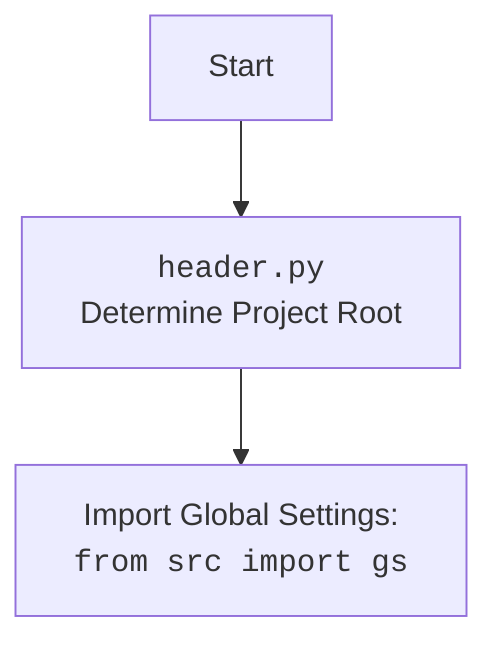

### **Анализ кода `prepare_all_camapaigns.py`**

#### **1. <алгоритм>**:
1. **Запуск скрипта**: Начинается выполнение скрипта `prepare_all_camapaigns.py`.
2. **Импорт модуля `header`**: Выполняется импорт модуля `header`, который, вероятно, содержит общие настройки и определения для проекта.
3. **Импорт модуля `process_all_campaigns`**: Импортируется функция `process_all_campaigns` из модуля `src.suppliers.aliexpress.campaign`.
4. **Вызов функции `process_all_campaigns()`**: Функция `process_all_campaigns()` вызывается для обработки всех рекламных кампаний AliExpress.
5. **Завершение скрипта**: После выполнения `process_all_campaigns()` скрипт завершается.

#### **2. <mermaid>**:

```mermaid
flowchart TD
    Start --> ImportHeader[Import Module: <br><code>import header</code>]
    ImportHeader --> ProcessCampaigns[Call Function: <br><code>process_all_campaigns()</code>]
    ProcessCampaigns --> End
```



**Объяснение зависимостей `mermaid`**:
- `import header`: Импортируется модуль `header`, который, вероятно, содержит общие настройки и определения для проекта.
- `process_all_campaigns()`: Вызывается функция `process_all_campaigns` из модуля `src.suppliers.aliexpress.campaign` для обработки рекламных кампаний.

#### **3. <объяснение>**:

**Импорты**:
- `import header`: Импортирует модуль `header`, который, вероятно, определяет корень проекта и настраивает глобальные параметры.
- `from src.suppliers.aliexpress.campaign import process_all_campaigns`: Импортирует функцию `process_all_campaigns` из модуля `src.suppliers.aliexpress.campaign`, предназначенную для обработки рекламных кампаний AliExpress.

**Функции**:
- `process_all_campaigns()`:
    - **Аргументы**: Отсутствуют.
    - **Возвращаемое значение**: Неизвестно (требуется анализ кода `process_all_campaigns` для определения).
    - **Назначение**: Обрабатывает все рекламные кампании AliExpress.
    - **Пример**: `process_all_campaigns()`

**Переменные**:
- Отсутствуют глобальные переменные в данном скрипте.

**Потенциальные ошибки и области для улучшения**:
- Недостаточно информации о работе функции `process_all_campaigns`. Рекомендуется добавить комментарии и документацию для этой функции, чтобы понять её логику и возможные ошибки.
- Отсутствует обработка исключений. Следует добавить блоки `try...except` для обработки возможных ошибок во время выполнения скрипта.

**Взаимосвязи с другими частями проекта**:
- Скрипт зависит от модуля `header`, который, вероятно, предоставляет общие настройки для всего проекта.
- Скрипт использует функцию `process_all_campaigns` из модуля `src.suppliers.aliexpress.campaign`, что указывает на связь с функциональностью обработки рекламных кампаний AliExpress.