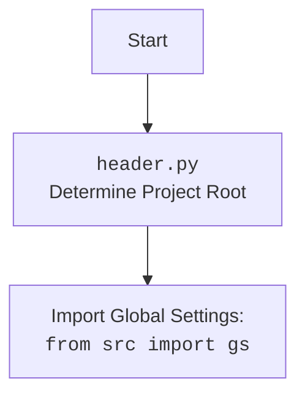

## \\file /src/suppliers/aliexpress/gui/campaign.py

### **<алгоритм>**

1.  **Инициализация CampaignEditor**:
    *   Создается экземпляр класса `CampaignEditor`, который является виджетом PyQt6.
    *   Сохраняется ссылка на экземпляр `MainApp` (если передан).
    *   Вызываются методы `setup_ui()` и `setup_connections()` для настройки интерфейса и соединений.

2.  **Настройка UI (setup\_ui)**:
    *   Устанавливается заголовок окна ("Campaign Editor") и размер окна (1800x800).
    *   Создается `QScrollArea` для обеспечения прокрутки контента, если он не помещается в окне.
    *   В `QScrollArea` добавляется `QWidget`, в котором размещаются все элементы интерфейса.
    *   Создается `QGridLayout` для размещения элементов интерфейса.
    *   Определяются компоненты UI:
        *   Кнопка "Open JSON File" (`open_button`) для открытия файла кампании. При нажатии вызывает метод `open_file()`.
        *   Метка `file_name_label` для отображения имени выбранного файла.
        *   Кнопка "Prepare Campaign" (`prepare_button`) для запуска подготовки кампании. При нажатии вызывает метод `prepare_campaign()`.
    *   Компоненты добавляются в `QGridLayout`.
    *   `QScrollArea` добавляется в основной `QVBoxLayout` виджета.

3.  **Открытие файла (open\_file)**:
    *   Открывается диалоговое окно выбора файла (`QFileDialog.getOpenFileName`) для выбора JSON-файла.
    *   Если файл выбран, вызывается метод `load_file()` с путем к выбранному файлу.

4.  **Загрузка файла (load\_file)**:
    *   Считывает данные из JSON файла, используя `j_loads_ns()` из `src.utils.jjson`, и сохраняет их в атрибуте `data` типа `SimpleNamespace`.
    *   Сохраняет путь к текущему файлу кампании в `self.current_campaign_file`.
    *   Обновляет текст метки `file_name_label` с именем файла.
    *   Вызывает метод `create_widgets()` для создания виджетов на основе данных из файла.
    *   Создает экземпляр `AliCampaignEditor`, передавая путь к файлу кампании.
    *   В случае ошибки отображает сообщение об ошибке с помощью `QMessageBox.critical()`.

5.  **Создание виджетов (create\_widgets)**:
    *   Получает `layout` из `self.layout`.
    *   Удаляет все предыдущие виджеты из `layout`, кроме кнопок "Open JSON File", "Prepare Campaign" и метки имени файла.
    *   Создает `QLineEdit` для редактирования:
        *   Заголовка (`title_input`)
        *   Описания (`description_input`)
        *   Имени промо-акции (`promotion_name_input`)
    *   Для каждого поля добавляются соответствующие метки (`QLabel`) и поля ввода (`QLineEdit`) в `layout`.

6.  **Подготовка кампании (prepare\_campaign)**:
    *   Вызывается асинхронно при нажатии на кнопку "Prepare Campaign".
    *   Если `self.editor` существует, вызывает асинхронный метод `prepare()` у экземпляра `AliCampaignEditor`.
    *   При успешной подготовке кампании отображает сообщение об успехе с помощью `QMessageBox.information()`.
    *   В случае ошибки отображает сообщение об ошибке с помощью `QMessageBox.critical()`.

### **<mermaid>**

```mermaid
flowchart TD
    subgraph CampaignEditor
        A[__init__] --> B(setup_ui)
        A --> C(setup_connections)
        B --> D{Create UI Components}
        D --> E(open_button)
        D --> F(file_name_label)
        D --> G(prepare_button)
        E --> H(open_file)
        H --> I{Open JSON File Dialog}
        I -- File Selected --> J(load_file)
        I -- No File Selected --> K(Return)
        J --> L{Load JSON Data with j_loads_ns}
        L --> M(create_widgets)
        J --> N(AliCampaignEditor)
        M --> O{Remove Previous Widgets}
        O --> P{Create Input Fields}
        P --> Q(title_input)
        P --> R(description_input)
        P --> S(promotion_name_input)
        G --> T(prepare_campaign)
        T --> U{Call editor.prepare() async}
        U -- Success --> V(Show Success Message)
        U -- Failure --> W(Show Error Message)
    end
```

**Объяснение зависимостей:**

*   `QtWidgets`, `QtGui`, `QtCore` из `PyQt6`: Используются для создания графического интерфейса пользователя.
*   `QEventLoop`, `asyncSlot` из `qasync`: Используются для интеграции асинхронного кода с циклом событий PyQt.
*   `j_loads_ns`, `j_dumps` из `src.utils.jjson`: Используются для загрузки данных из JSON-файлов и сохранения данных в JSON-файлы.
*   `AliCampaignEditor` из `src.suppliers.aliexpress.campaign`: Используется для подготовки кампании AliExpress.
*   `set_fixed_size` из `styles`: Используется для установки фиксированного размера виджетов.
*   `header`: Определяет корень проекта.



### **<объяснение>**

**Импорты:**

*   `header`: Используется для определения корня проекта.
*   `asyncio`: Используется для поддержки асинхронных операций.
*   `sys`: Предоставляет доступ к некоторым переменным и функциям, взаимодействующим с интерпретатором Python.
*   `Path` из `pathlib`: Используется для представления путей к файлам и каталогам.
*   `SimpleNamespace` из `types`: Используется для создания объектов, к атрибутам которых можно обращаться как к атрибутам объекта.
*   `QtWidgets`, `QtGui`, `QtCore` из `PyQt6`: Используются для создания графического интерфейса пользователя.
*   `QEventLoop`, `asyncSlot` из `qasync`: Используются для интеграции асинхронного кода с циклом событий PyQt.
*   `j_loads_ns`, `j_dumps` из `src.utils.jjson`: Используются для загрузки данных из JSON-файлов и сохранения данных в JSON-файлы.  `j_loads_ns` загружает JSON и преобразует его в `SimpleNamespace`.
*   `AliCampaignEditor` из `src.suppliers.aliexpress.campaign`: Используется для подготовки кампании AliExpress.
*   `set_fixed_size` из `styles`: Используется для установки фиксированного размера виджетов.

**Классы:**

*   `CampaignEditor(QtWidgets.QWidget)`:
    *   Роль: Главный виджет для редактирования кампаний AliExpress.
    *   Атрибуты:
        *   `data: SimpleNamespace`: Хранит данные кампании, загруженные из JSON-файла.
        *   `current_campaign_file: str`: Хранит путь к текущему файлу кампании.
        *   `editor: AliCampaignEditor`: Экземпляр редактора кампаний.
        *   `main_app`: Ссылка на экземпляр `MainApp`.
        *   `scroll_area`: Область прокрутки для виджетов кампании.
        *   `scroll_content_widget`: Виджет содержимого для прокрутки.
        *   `layout`: Макет сетки для организации виджетов.
        *   `open_button`: Кнопка для открытия файла JSON.
        *   `file_name_label`: Метка для отображения имени файла.
        *   `prepare_button`: Кнопка для подготовки кампании.
        *   `title_input`: Поле ввода для заголовка кампании.
        *   `description_input`: Поле ввода для описания кампании.
        *   `promotion_name_input`: Поле ввода для названия промо-акции.
    *   Методы:
        *   `__init__(self, parent=None, main_app=None)`: Инициализирует виджет, настраивает UI и соединения.
        *   `setup_ui(self)`: Создает и настраивает элементы интерфейса.
        *   `setup_connections(self)`: Устанавливает связи между сигналами и слотами.
        *   `open_file(self)`: Открывает диалоговое окно выбора файла.
        *   `load_file(self, campaign_file)`: Загружает данные из JSON-файла и создает виджеты.
        *   `create_widgets(self, data)`: Создает виджеты на основе данных из JSON-файла.
        *   `prepare_campaign(self)`: Асинхронно подготавливает кампанию.

**Функции:**

*   `setup_ui(self)`:
    *   Аргументы: `self` (экземпляр класса `CampaignEditor`).
    *   Возвращаемое значение: Нет.
    *   Назначение: Настраивает пользовательский интерфейс виджета, создавая кнопки, метки, поля ввода и другие элементы.
*   `setup_connections(self)`:
    *   Аргументы: `self` (экземпляр класса `CampaignEditor`).
    *   Возвращаемое значение: Нет.
    *   Назначение: Устанавливает связи между сигналами и слотами для обработки действий пользователя.  В текущей версии функция `pass`.
*   `open_file(self)`:
    *   Аргументы: `self` (экземпляр класса `CampaignEditor`).
    *   Возвращаемое значение: Нет.
    *   Назначение: Открывает диалоговое окно выбора файла, позволяя пользователю выбрать JSON-файл с данными кампании.  Вызывает `self.load_file` для загрузки содержимого выбранного файла.
*   `load_file(self, campaign_file)`:
    *   Аргументы:
        *   `self` (экземпляр класса `CampaignEditor`).
        *   `campaign_file` (str): Путь к JSON-файлу.
    *   Возвращаемое значение: Нет.
    *   Назначение: Загружает данные из JSON-файла, используя `j_loads_ns`, и отображает их в виджете.
*   `create_widgets(self, data)`:
    *   Аргументы:
        *   `self` (экземпляр класса `CampaignEditor`).
        *   `data` (`SimpleNamespace`): Данные кампании.
    *   Возвращаемое значение: Нет.
    *   Назначение: Создает виджеты для отображения и редактирования данных кампании.
*   `prepare_campaign(self)`:
    *   Аргументы: `self` (экземпляр класса `CampaignEditor`).
    *   Возвращаемое значение: Нет.
    *   Назначение: Асинхронно подготавливает кампанию с использованием `AliCampaignEditor`.

**Переменные:**

*   `data`: `SimpleNamespace`, хранит данные кампании, загруженные из JSON-файла.
*   `current_campaign_file`: `str`, хранит путь к текущему файлу кампании.
*   `editor`: `AliCampaignEditor`, экземпляр редактора кампаний.
*   `main_app`: Ссылка на экземпляр `MainApp`.

**Возможные ошибки и области для улучшения:**

*   Обработка ошибок: В блоке `try...except` метода `load_file` отображается только сообщение об ошибке.  Желательно добавить логирование ошибки с использованием `logger.error` для более детального анализа.
*   Валидация данных: Не предусмотрена валидация данных, загруженных из JSON-файла.  Следует добавить проверку типов и значений полей, чтобы избежать ошибок при подготовке кампании.
*   Обработка отсутствия `AliCampaignEditor`: В методе `prepare_campaign` происходит вызов `self.editor.prepare()`, но не проверяется, существует ли `self.editor`.  Следует добавить проверку на `None`.
*   Использование `set_fixed_size`: Использование `set_fixed_size` может привести к проблемам с адаптивностью интерфейса.  Следует рассмотреть возможность использования макетов и политик размеров для более гибкого управления размерами виджетов.
*   `setup_connections`: Функция `setup_connections` пустая. Необходимо реализовать подключение сигналов к слотам, если это требуется.

**Взаимосвязи с другими частями проекта:**

*   `src.utils.jjson`: Используется для загрузки и сохранения данных в формате JSON.
*   `src.suppliers.aliexpress.campaign`: Используется для подготовки кампании AliExpress.
*   `styles`: Используется для стилизации виджетов.

```python
# Пример использования logger.error
try:
    self.data = j_loads_ns(campaign_file)
    self.current_campaign_file = campaign_file
    self.file_name_label.setText(f"File: {self.current_campaign_file}")
    self.create_widgets(self.data)
    self.editor = AliCampaignEditor(campaign_file=campaign_file)
except Exception as ex:
    logger.error(f'Failed to load JSON file: {ex}', exc_info=True) # Добавлено логирование ошибки
    QtWidgets.QMessageBox.critical(self, "Error", f"Failed to load JSON file: {ex}")