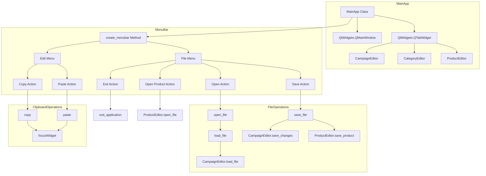
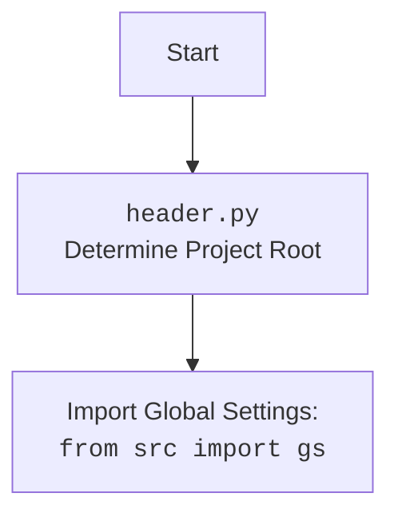

## Анализ кода `hypotez/src/suppliers/aliexpress/gui/main.py`

### 1. <алгоритм>

Этот код представляет собой основное окно графического интерфейса (GUI) для управления рекламными кампаниями, товарами и категориями. Он использует библиотеку PyQt6 для создания интерфейса и qasync для интеграции с asyncio, что позволяет выполнять асинхронные операции.

**Блок-схема:**

1.  **Инициализация приложения:**

    *   Создается экземпляр `QtWidgets.QApplication`.
    *   Создается и устанавливается `QEventLoop` для интеграции с `asyncio`.
    *   Создается экземпляр `MainApp`, который является главным окном приложения.
    *   Окно отображается на экране.
2.  **Инициализация `MainApp`:**

    *   Создается главное окно (`QtWidgets.QMainWindow`).
    *   Устанавливается заголовок окна и его размеры.
    *   Создается виджет вкладок (`QtWidgets.QTabWidget`).
    *   Создаются вкладки: "JSON Editor", "Campaign Editor", "Product Editor".
    *   Для каждой вкладки создается соответствующий редактор: `CampaignEditor`, `CategoryEditor`, `ProductEditor`.
    *   Создается меню (`create_menubar`).
3.  **Создание меню (`create_menubar`):**

    *   Создается строка меню (`QtWidgets.QMenuBar`).
    *   Создаются пункты меню "File" и "Edit".
    *   В меню "File" добавляются действия: "Open", "Save", "Exit", "Open Product File".
    *   Действия "Open" и "Save" привязаны к методам `open_file` и `save_file` соответственно.
    *   Действие "Exit" привязано к методу `exit_application`.
    *   Действие "Open Product File" привязано к методу `product_editor_app.open_file`.
    *   В меню "Edit" добавляются действия: "Copy", "Paste".
    *   Действия "Copy" и "Paste" привязаны к методам `copy` и `paste` соответственно.
4.  **Обработка действий меню:**

    *   **`open_file`:** Открывает диалоговое окно выбора файла, позволяет выбрать JSON-файл и загружает его содержимое с помощью `load_file`.
    *   **`save_file`:** Сохраняет изменения в зависимости от выбранной вкладки. Для вкладки "JSON Editor" вызывает `self.promotion_app.save_changes()`, для вкладки "Product Editor" вызывает `self.product_editor_app.save_product()`.
    *   **`exit_application`:** Закрывает приложение.
    *   **`copy`:** Копирует выделенный текст в буфер обмена, если в фокусе находится текстовый виджет (QLineEdit, QTextEdit, QPlainTextEdit).
    *   **`paste`:** Вставляет текст из буфера обмена, если в фокусе находится текстовый виджет.
5.  **Загрузка файла (`load_file`):**

    *   Вызывает метод `load_file` соответствующего редактора (в данном случае, `self.promotion_app.load_file`) для загрузки JSON-файла.
    *   Обрабатывает исключения, возникающие при загрузке файла, и отображает сообщение об ошибке.
6.  **Запуск приложения:**

    *   Запускается основной цикл событий (`loop.run_forever()`), который обрабатывает события GUI и асинхронные операции.

### 2. <mermaid>

**Объяснение зависимостей:**

*   `MainApp` является основным классом приложения, который наследуется от `QtWidgets.QMainWindow`.
*   `MainApp` содержит виджет вкладок `QtWidgets.QTabWidget`, который управляет отображением различных редакторов.
*   `MainApp` создает экземпляры редакторов: `CampaignEditor`, `CategoryEditor`, `ProductEditor`.
*   `MainApp` вызывает метод `create_menubar` для создания меню.
*   Меню "File" содержит действия "Open", "Save", "Exit", "Open Product File", которые привязаны к соответствующим методам `MainApp` и `ProductEditor`.
*   Меню "Edit" содержит действия "Copy" и "Paste", которые привязаны к методам `copy` и `paste` класса `MainApp`.
*   Метод `open_file` вызывает метод `load_file` для загрузки JSON-файла.
*   Метод `save_file` вызывает методы `save_changes` (из `CampaignEditor`) и `save_product` (из `ProductEditor`) для сохранения изменений.
*   Методы `copy` и `paste` используют `focusWidget` для определения виджета, находящегося в фокусе, и выполнения операций копирования и вставки.
*   `ProductEditor.open_file` вызывается напрямую из `MainApp`.

### 3. <объяснение>

**Импорты:**

*   `header`: Предположительно, определяет корень проекта и настраивает пути.
*   `asyncio`: Используется для асинхронного программирования.
*   `sys`: Предоставляет доступ к некоторым переменным и функциям, взаимодействующим с интерпретатором Python.
*   `PyQt6`: Библиотека для создания графического интерфейса.  Используются модули:
    *   `QtWidgets`: Содержит классы для создания элементов интерфейса, таких как окна, кнопки, вкладки и т.д.
    *   `QtGui`: Содержит классы для работы с графикой, шрифтами, изображениями и т.д.
    *   `QtCore`: Содержит основные классы, такие как сигналы и слоты, таймеры и т.д.
*   `qasync`: Интегрирует `asyncio` с циклом событий `PyQt`.
*   `pathlib.Path`: Предоставляет объектно-ориентированный способ работы с путями к файлам и каталогам.
*   `src.utils.jjson`: Модуль, предоставляющий функции `j_loads_ns` и `j_dumps` для работы с JSON-файлами. `j_loads_ns` вероятно, загружает JSON из файла, а `j_dumps` записывает в файл. Использование этих функций вместо стандартных `json.load` и `json.dump` может быть связано с дополнительными обработками, такими как обработка пространства имен.
*   `product`:  Предположительно, содержит класс `ProductEditor` для редактирования информации о товарах.
*   `campaign`: Предположительно, содержит класс `CampaignEditor` для редактирования рекламных кампаний.
*   `category`: Предположительно, содержит класс `CategoryEditor` для редактирования категорий товаров.
*   `src.suppliers.aliexpress.campaign`:  Содержит класс `AliCampaignEditor`, специфичный для редактирования кампаний AliExpress.
*   `styles`: Предположительно, содержит функции для стилизации элементов интерфейса, например, `set_fixed_size`.

**Классы:**

*   `MainApp`:
    *   Роль: Главное окно приложения.
    *   Атрибуты:
        *   `tab_widget`: Виджет вкладок (`QtWidgets.QTabWidget`), содержащий вкладки для разных редакторов.
        *   `promotion_app`: Экземпляр `CampaignEditor` для редактирования рекламных кампаний.
        *   `campaign_editor_app`: Экземпляр `CategoryEditor` для редактирования категорий товаров.
        *   `product_editor_app`: Экземпляр `ProductEditor` для редактирования информации о товарах.
    *   Методы:
        *   `__init__`: Инициализирует главное окно, создает вкладки и добавляет на них соответствующие редакторы.
        *   `create_menubar`: Создает меню с пунктами "File" и "Edit".
        *   `open_file`: Открывает диалоговое окно выбора файла и загружает выбранный JSON-файл.
        *   `save_file`: Сохраняет изменения в зависимости от выбранной вкладки.
        *   `exit_application`: Закрывает приложение.
        *   `copy`: Копирует выделенный текст в буфер обмена.
        *   `paste`: Вставляет текст из буфера обмена.
        *   `load_file`: Загружает JSON-файл с помощью соответствующего редактора.
    *   Взаимодействие:
        *   Взаимодействует с классами `CampaignEditor`, `CategoryEditor` и `ProductEditor` для отображения и редактирования информации о рекламных кампаниях, категориях товаров и товарах.
        *   Использует методы этих классов для загрузки и сохранения данных.
        *   Обрабатывает действия пользователя, такие как выбор пунктов меню, копирование и вставка текста.

**Функции:**

*   `main`:
    *   Аргументы: Нет.
    *   Возвращаемое значение: Нет.
    *   Назначение: Инициализирует и запускает приложение.
        *   Создает экземпляр `QtWidgets.QApplication`.
        *   Создает и устанавливает `QEventLoop` для интеграции с `asyncio`.
        *   Создает экземпляр `MainApp`.
        *   Отображает главное окно.
        *   Запускает основной цикл событий.

**Переменные:**

*   `app`: Экземпляр `QtWidgets.QApplication`.
*   `loop`: Экземпляр `QEventLoop`.
*   `main_app`: Экземпляр `MainApp`.

**Потенциальные ошибки и области для улучшения:**

*   **Обработка ошибок:** В коде присутствует обработка исключений только в методе `load_file`.  Необходимо добавить обработку исключений в другие методы, чтобы обеспечить более надежную работу приложения.
*   **Разделение ответственности:**  Класс `MainApp` выполняет несколько ролей: управляет главным окном, создает меню, обрабатывает действия пользователя и взаимодействует с редакторами.  Рекомендуется разделить эти роли на отдельные классы или функции, чтобы улучшить структуру кода и упростить его поддержку.
*   **Использование `j_loads_ns`:** В коде используется `j_loads_ns`, но не указано, для чего нужно обрабатывать пространство имен. Необходимо добавить комментарии, объясняющие причину использования этой функции.
*   **Отсутствие логирования:** В коде отсутствует логирование. Необходимо добавить логирование для отслеживания ошибок и других важных событий.

**Цепочка взаимосвязей с другими частями проекта:**

*   `src.suppliers.aliexpress.gui.main.py` зависит от модулей `product.py`, `campaign.py`, `category.py`, `src.suppliers.aliexpress.campaign.py` и `src.utils.jjson.py`.
*   Он также зависит от библиотеки `PyQt6` и модуля `qasync` для создания графического интерфейса и интеграции с `asyncio`.
*   Этот файл является частью GUI приложения для управления рекламными кампаниями AliExpress.