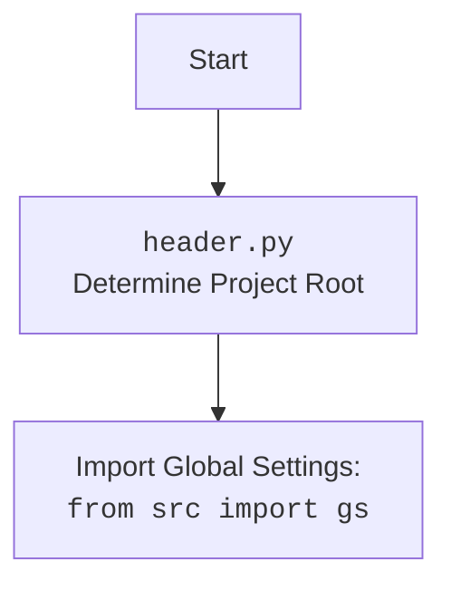

## Анализ кода `hypotez/src/suppliers/aliexpress/gui/product.py`

### 1. <алгоритм>

1.  **Инициализация `ProductEditor`**:
    *   Создается экземпляр класса `ProductEditor`, который является виджетом `QtWidgets.QWidget`.
    *   Сохраняется ссылка на экземпляр `main_app`.
    *   Вызываются методы `setup_ui` и `setup_connections` для настройки интерфейса и соединений.

    ```python
    self.main_app = main_app
    self.setup_ui()
    self.setup_connections()
    ```

2.  **Настройка UI (`setup_ui`)**:
    *   Устанавливается заголовок окна ("Product Editor") и его размеры (1800x800).
    *   Определяются компоненты UI: кнопка "Open JSON File", метка с именем файла, кнопка "Prepare Product".
    *   Кнопка "Open JSON File" подключается к методу `open_file`.
    *   Кнопка "Prepare Product" подключается к асинхронному методу `prepare_product_async`.
    *   Компоненты добавляются в вертикальный макет (`QVBoxLayout`).

    ```python
    self.open_button = QtWidgets.QPushButton("Open JSON File")
    self.open_button.clicked.connect(self.open_file)
    ```

3.  **Открытие файла (`open_file`)**:
    *   Открывается диалоговое окно выбора файла (`QFileDialog`) для выбора JSON-файла.
    *   Если файл выбран, вызывается метод `load_file` с путем к файлу.

    ```python
    file_path, _ = QtWidgets.QFileDialog.getOpenFileName(
        self,
        "Open JSON File",
        "c:/user/documents/repos/hypotez/data/aliexpress/products",
        "JSON files (*.json)"
    )
    if file_path:
        self.load_file(file_path)
    ```

4.  **Загрузка файла (`load_file`)**:
    *   Используется функция `j_loads_ns` для загрузки JSON-файла в пространство имен (`SimpleNamespace`).
    *   Сохраняется путь к файлу.
    *   Устанавливается текст метки имени файла.
    *   Создается экземпляр `AliCampaignEditor` с путем к файлу.
    *   Вызывается метод `create_widgets` для создания виджетов на основе данных из файла.
    *   В случае ошибки отображается диалоговое окно с сообщением об ошибке.

    ```python
    self.data = j_loads_ns(file_path)
    self.editor = AliCampaignEditor(file_path=file_path)
    self.create_widgets(self.data)
    ```

5.  **Создание виджетов (`create_widgets`)**:
    *   Удаляются все предыдущие виджеты, кроме кнопок "Open JSON File" и "Prepare Product", а также метки имени файла.
    *   Создаются метки для отображения заголовка и деталей продукта.
    *   Метки добавляются в макет.

    ```python
    title_label = QtWidgets.QLabel(f"Product Title: {data.title}")
    layout.addWidget(title_label)
    ```

6.  **Асинхронная подготовка продукта (`prepare_product_async`)**:
    *   Вызывается метод `prepare_product` экземпляра `AliCampaignEditor` асинхронно.
    *   В случае успеха отображается диалоговое окно с сообщением об успехе.
    *   В случае ошибки отображается диалоговое окно с сообщением об ошибке.

    ```python
    await self.editor.prepare_product()
    QtWidgets.QMessageBox.information(self, "Success", "Product prepared successfully.")
    ```

### 2. <mermaid>

```mermaid
flowchart TD
    A[ProductEditor:__init__] --> B{setup_ui()}
    B --> C{setup_connections()}
    C --> D[open_file()]
    D --> E{QFileDialog.getOpenFileName()}
    E -- Выбран файл --> F[load_file(file_path)]
    E -- Файл не выбран --> G[return]
    F --> H{j_loads_ns(file_path)}
    H --> I[AliCampaignEditor:__init__(file_path)]
    I --> J{create_widgets(self.data)}
    J --> K{layout.itemAt(i).widget().deleteLater()}
    K --> L{QtWidgets.QLabel(f"Product Title: {data.title}")}
    L --> M[prepare_product_async()]
    M --> N{self.editor.prepare_product()}
    N -- Успех --> O{QtWidgets.QMessageBox.information}
    N -- Ошибка --> P{QtWidgets.QMessageBox.critical}
```

**Объяснение `mermaid`:**

*   `ProductEditor:__init__`: Инициализация класса `ProductEditor`.
*   `setup_ui()`: Настройка пользовательского интерфейса.
*   `setup_connections()`: Установка связей между сигналами и слотами.
*   `open_file()`: Открывает диалоговое окно для выбора файла.
*   `QFileDialog.getOpenFileName()`: Отображает диалоговое окно выбора файла.
*   `load_file(file_path)`: Загружает выбранный JSON-файл.
*   `j_loads_ns(file_path)`: Загружает JSON-данные из файла, используя `j_loads_ns`.
*   `AliCampaignEditor:__init__(file_path)`: Создает экземпляр редактора кампании AliExpress.
*   `create_widgets(self.data)`: Создает виджеты для отображения данных продукта.
*   `layout.itemAt(i).widget().deleteLater()`: Удаляет старые виджеты из макета.
*   `QtWidgets.QLabel(f"Product Title: {data.title}")`: Создает метку для отображения заголовка продукта.
*   `prepare_product_async()`: Асинхронно подготавливает продукт.
*   `self.editor.prepare_product()`: Вызывает метод подготовки продукта в редакторе кампании.
*   `QtWidgets.QMessageBox.information`: Отображает сообщение об успехе.
*   `QtWidgets.QMessageBox.critical`: Отображает сообщение об ошибке.



### 3. <объяснение>

**Импорты:**

*   `header`: Предположительно, содержит общие функции или настройки проекта. Необходимо добавить `mermaid` flowchart, объясняющий `header.py`.
*   `sys`: Предоставляет доступ к некоторым переменным и функциям, взаимодействующим с интерпретатором Python.
*   `pathlib.Path`: Предоставляет способ работы с файловыми путями в объектно-ориентированном стиле.
*   `types.SimpleNamespace`: Простой класс для создания объектов, к атрибутам которых можно обращаться как к атрибутам объекта.
*   `PyQt6.QtWidgets`: Содержит классы для создания графического интерфейса, такие как виджеты, макеты и диалоговые окна.
*   `PyQt6.QtGui`: Содержит классы для работы с графикой, такие как изображения, шрифты и цвета.
*   `PyQt6.QtCore`: Содержит основные классы, такие как сигналы и слоты, таймеры и потоки.
*   `src.utils.jjson.j_loads_ns`: Функция для загрузки JSON-файлов в пространство имен (`SimpleNamespace`).
*   `src.utils.jjson.j_dumps`: Функция для преобразования Python-объектов в JSON-строку.
*   `src.suppliers.aliexpress.campaign.AliCampaignEditor`: Класс для редактирования кампаний AliExpress.

**Классы:**

*   `ProductEditor(QtWidgets.QWidget)`:
    *   Роль: Предоставляет виджет для редактирования информации о продукте.
    *   Атрибуты:
        *   `data`: `SimpleNamespace`, содержащий данные о продукте, загруженные из JSON-файла.
        *   `language`: `str`, язык продукта (по умолчанию 'EN').
        *   `currency`: `str`, валюта продукта (по умолчанию 'USD').
        *   `file_path`: `str`, путь к загруженному JSON-файлу.
        *   `editor`: `AliCampaignEditor`, экземпляр редактора кампании AliExpress.
        *   `main_app`: Ссылка на главный экземпляр приложения.
    *   Методы:
        *   `__init__(self, parent=None, main_app=None)`: Инициализирует виджет, настраивает UI и соединения.
        *   `setup_ui(self)`: Настраивает пользовательский интерфейс виджета.
        *   `setup_connections(self)`: Устанавливает связи между сигналами и слотами.
        *   `open_file(self)`: Открывает диалоговое окно выбора файла для загрузки JSON-файла.
        *   `load_file(self, file_path)`: Загружает JSON-файл и создает виджеты на основе данных.
        *   `create_widgets(self, data)`: Создает виджеты для отображения данных продукта.
        *   `prepare_product_async(self)`: Асинхронно подготавливает продукт с помощью `AliCampaignEditor`.
    *   Взаимодействие:
        *   Использует `AliCampaignEditor` для подготовки продукта.
        *   Использует `QtWidgets` для создания графического интерфейса.
        *   Использует `j_loads_ns` для загрузки данных из JSON-файла.

**Функции:**

*   `__init__(self, parent=None, main_app=None)`:
    *   Аргументы:
        *   `parent`: Родительский виджет (по умолчанию `None`).
        *   `main_app`: Экземпляр главного приложения.
    *   Назначение: Инициализирует виджет `ProductEditor`, настраивает UI и соединения.
    *   Пример:
        ```python
        editor = ProductEditor(parent=self, main_app=self.main_app)
        ```
*   `setup_ui(self)`:
    *   Аргументы: `self` (экземпляр класса).
    *   Назначение: Настраивает пользовательский интерфейс виджета, создает кнопки, метки и макет.
    *   Пример:
        ```python
        self.setup_ui()
        ```
*   `open_file(self)`:
    *   Аргументы: `self` (экземпляр класса).
    *   Назначение: Открывает диалоговое окно выбора файла для загрузки JSON-файла.
    *   Пример:
        ```python
        self.open_button.clicked.connect(self.open_file)
        ```
*   `load_file(self, file_path)`:
    *   Аргументы:
        *   `file_path`: Путь к JSON-файлу.
    *   Назначение: Загружает JSON-файл, создает экземпляр `AliCampaignEditor` и вызывает `create_widgets`.
    *   Пример:
        ```python
        self.load_file("path/to/product.json")
        ```
*   `create_widgets(self, data)`:
    *   Аргументы:
        *   `data`: `SimpleNamespace`, содержащий данные о продукте.
    *   Назначение: Создает виджеты для отображения данных продукта (заголовок, детали).
    *   Пример:
        ```python
        self.create_widgets(self.data)
        ```
*   `prepare_product_async(self)`:
    *   Аргументы: `self` (экземпляр класса).
    *   Назначение: Асинхронно подготавливает продукт с помощью `AliCampaignEditor`.
    *   Пример:
        ```python
        await self.prepare_product_async()
        ```

**Переменные:**

*   `data`: `SimpleNamespace`, содержащий данные о продукте, загруженные из JSON-файла.
*   `language`: `str`, язык продукта (по умолчанию 'EN').
*   `currency`: `str`, валюта продукта (по умолчанию 'USD').
*   `file_path`: `str`, путь к загруженному JSON-файлу.
*   `editor`: `AliCampaignEditor`, экземпляр редактора кампании AliExpress.

**Потенциальные ошибки и области для улучшения:**

*   Отсутствует обработка ошибок при удалении виджетов в `create_widgets`.
*   Жестко заданный путь к каталогу в `open_file`: `"c:/user/documents/repos/hypotez/data/aliexpress/products"`.
*   Необходимо добавить логирование с использованием модуля `logger` из `src.logger.logger` для отслеживания ошибок и предупреждений.

**Взаимосвязи с другими частями проекта:**

*   Использует `AliCampaignEditor` из `src.suppliers.aliexpress.campaign` для подготовки продукта.
*   Использует `j_loads_ns` из `src.utils.jjson` для загрузки JSON-файлов.
*   Предположительно использует `header` для общих функций или настроек проекта.
*   Использует `QtWidgets` из `PyQt6` для создания графического интерфейса.