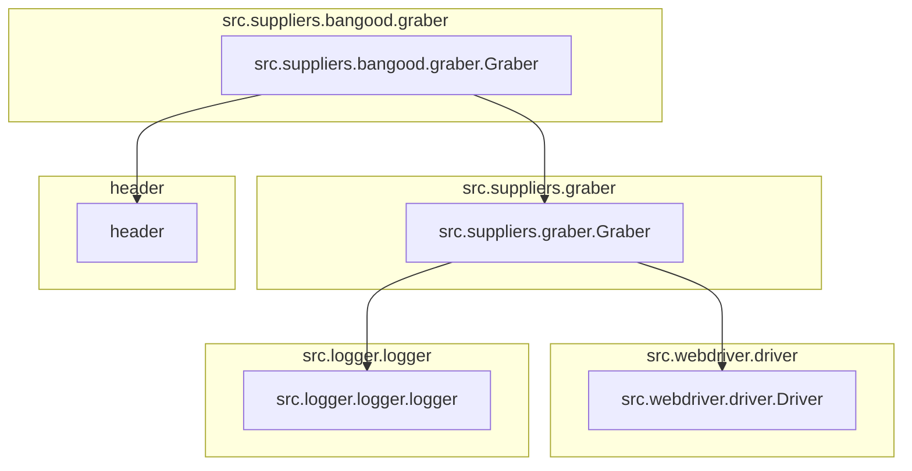
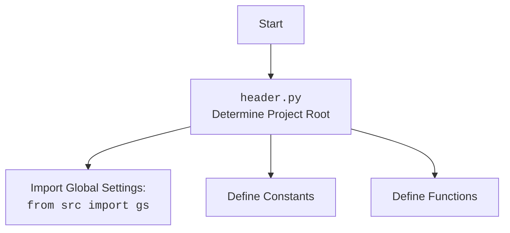

## Анализ кода

### 1. <алгоритм>

1.  **Инициализация**:
    *   Класс `Graber` наследуется от класса `Graber` (переименованного как `Grbr`) из модуля `src.suppliers.graber`.
    *   При инициализации устанавливается префикс поставщика (`supplier_prefix`) как `'bangood'`.
    *   Вызывается конструктор родительского класса `Graber` (`Grbr`) с указанием префикса поставщика, драйвера и индекса языка.
    *   `Context.locator_for_decorator` устанавливается в `None`.

2.  **Декоратор `close_pop_up` (закомментирован)**:
    *   Предполагается декоратор для закрытия всплывающих окон перед выполнением основной логики функции.
    *   Внутри декоратора:
        *   Пытается выполнить локатор для закрытия всплывающего окна (закомментировано).
        *   Обрабатывает исключение `ExecuteLocatorException`, логируя ошибку.
        *   Вызывает и возвращает результат основной функции.

3.  **Методы класса `Graber`**:
    *   Не содержит явно определенных методов, кроме `__init__`.

**Поток данных**:

*   При создании экземпляра класса `Graber` происходит инициализация с передачей экземпляра `Driver`, индекса языка и установкой префикса поставщика.
*   Если бы декоратор `close_pop_up` был активен, он бы выполнялся перед каждой функцией, к которой он применен, пытаясь закрыть всплывающее окно.

### 2. <mermaid>

**Объяснение зависимостей:**

*   `src.suppliers.bangood.graber.Graber`: Класс `Graber` из текущего модуля.
*   `src.suppliers.graber.Graber`: Родительский класс `Graber` из модуля `src.suppliers.graber`.
*   `src.webdriver.driver.Driver`: Класс `Driver` для управления веб-драйвером.
*   `src.logger.logger.logger`: Объект `logger` для логирования.
*   `header`: Модуль `header`, который может содержать общие настройки и функции.

**Дополнительный блок mermaid для header.py:**

### 3. <объяснение>

**Импорты**:

*   `typing.Any`: Используется для аннотации типов, когда тип переменной может быть любым.
*   `header`: Импортируется для использования общих настроек и функций. Расположение `header.py` не указано, но обычно такие файлы содержат объявления констант, путей или общих функций, используемых в проекте.
*   `src.suppliers.graber.Graber as Grbr, Context, close_pop_up`: Импортирует класс `Graber` (переименованный в `Grbr`), класс `Context` и функцию `close_pop_up` из модуля `src.suppliers.graber`.
    *   `Graber` (`Grbr`) - родительский класс для текущего класса `Graber`, содержит общую логику для сбора данных с веб-страниц.
    *   `Context` - класс, вероятно, используется для хранения контекста выполнения, например, текущего драйвера и локаторов.
    *   `close_pop_up` - функция, предназначенная для закрытия всплывающих окон.
*   `src.webdriver.driver.Driver`: Импортирует класс `Driver` из модуля `src.webdriver.driver`. Этот класс используется для управления веб-драйвером, например, Chrome или Firefox.
*   `src.logger.logger.logger`: Импортирует объект `logger` из модуля `src.logger.logger`. Используется для логирования информации о работе программы, ошибок и отладочной информации.

**Классы**:

*   `Graber`:
    *   Роль: Класс для сбора данных со страниц товаров `bangood.com`. Наследуется от класса `Graber` (`Grbr`) из модуля `src.suppliers.graber`.
    *   Атрибуты:
        *   `supplier_prefix (str)`: Префикс поставщика, установлен в `'bangood'`.
    *   Методы:
        *   `__init__(self, driver: Driver, lang_index: int)`: Конструктор класса. Инициализирует экземпляр класса, устанавливает префикс поставщика, вызывает конструктор родительского класса и устанавливает `Context.locator_for_decorator` в `None`.

**Функции**:

*   `close_pop_up(value: Any = None)` (закомментирована):
    *   Аргументы:
        *   `value (Any, optional)`: Дополнительное значение для декоратора. По умолчанию `None`.
    *   Возвращаемое значение:
        *   `Callable`: Декоратор, который оборачивает функцию.
    *   Назначение:
        *   Предполагается, что это декоратор для закрытия всплывающих окон перед выполнением основной логики функции.

**Переменные**:

*   `supplier_prefix (str)`: Префикс поставщика, установлен в `'bangood'`.
*   `Context.locator_for_decorator`: Устанавливается в `None`. Вероятно, используется для указания локатора, который должен быть выполнен декоратором `@close_pop_up`.

**Потенциальные ошибки и области для улучшения**:

*   Декоратор `close_pop_up` закомментирован, что может указывать на то, что он не используется или находится в разработке.
*   Отсутствуют методы для сбора данных со страниц товаров. Класс `Graber` должен содержать методы для извлечения информации о товарах, такие как название, цена, описание и т.д.
*   Необходимо реализовать логику закрытия всплывающих окон, если она требуется.

**Взаимосвязи с другими частями проекта**:

*   Класс `Graber` наследуется от класса `Graber` (`Grbr`) из модуля `src.suppliers.graber`, что позволяет использовать общую логику для сбора данных с веб-страниц.
*   Использует класс `Driver` из модуля `src.webdriver.driver` для управления веб-драйвером.
*   Использует объект `logger` из модуля `src.logger.logger` для логирования информации о работе программы.
*   Использует модуль `header` для общих настроек и функций.