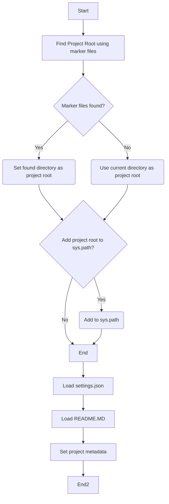
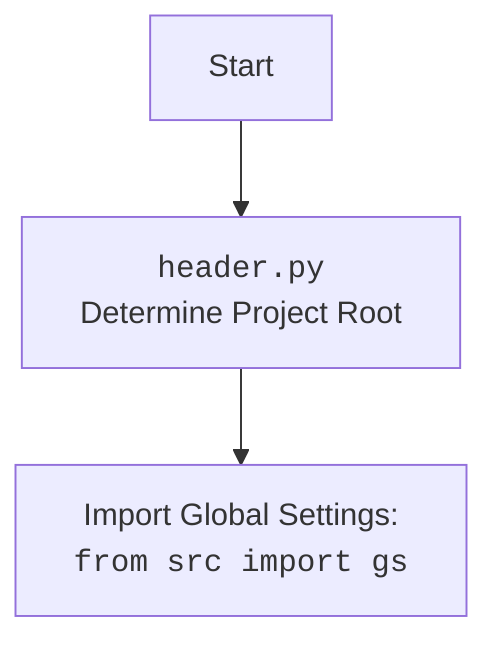

# Анализ кода `hypotez/src/suppliers/chat_gpt/scenarios/header.py`

## Алгоритм

1.  **`set_project_root(marker_files)`**:
    *   Начинает поиск корневой директории проекта с директории, в которой находится текущий файл.
    *   Проверяет наличие одного из файлов-маркеров (`__root__` или `.git`) в текущей директории и ее родительских директориях.
    *   Если один из маркеров найден, устанавливает текущую родительскую директорию в качестве корневой.
    *   Добавляет корневую директорию в `sys.path`, если ее там еще нет.
    *   Возвращает путь к корневой директории.

    ```python
    # Пример:
    root_path = set_project_root()
    print(root_path)  # Выводит путь к корневой директории проекта
    ```

2.  **Определение `__root__`**:
    *   Вызывает функцию `set_project_root()` для определения корневой директории проекта.
    *   Сохраняет возвращенный путь в переменной `__root__`.

    ```python
    # Пример:
    __root__ = set_project_root()
    print(__root__)  # Выводит путь к корневой директории проекта
    ```

3.  **Импорт `gs`**:
    *   Импортирует модуль `gs` из пакета `src`.

    ```python
    # Пример:
    from src import gs
    # gs.path.root теперь содержит путь к корневой директории
    ```

4.  **Чтение `settings.json`**:
    *   Пытается прочитать файл `settings.json` из директории `src` в корневой директории проекта.
    *   Загружает содержимое файла в переменную `settings` как словарь.
    *   Обрабатывает исключения `FileNotFoundError` и `json.JSONDecodeError`, если файл не найден или имеет неверный формат JSON.

    ```python
    # Пример:
    try:
        with open(gs.path.root / 'src' / 'settings.json', 'r') as settings_file:
            settings = json.load(settings_file)
            print(settings)  # Выводит словарь с настройками
    except (FileNotFoundError, json.JSONDecodeError):
        print("Не удалось загрузить настройки из settings.json")
    ```

5.  **Чтение `README.MD`**:
    *   Пытается прочитать файл `README.MD` из директории `src` в корневой директории проекта.
    *   Сохраняет содержимое файла в переменной `doc_str`.
    *   Обрабатывает исключения `FileNotFoundError` и `json.JSONDecodeError`, если файл не найден.

    ```python
    # Пример:
    try:
        with open(gs.path.root / 'src' / 'README.MD', 'r') as settings_file:
            doc_str = settings_file.read()
            print(doc_str[:100])  # Выводит первые 100 символов из README.MD
    except (FileNotFoundError, json.JSONDecodeError):
        print("Не удалось загрузить README.MD")
    ```

6.  **Определение метаданных проекта**:
    *   Извлекает метаданные проекта (имя, версия, документация, автор, авторские права и сообщение о кофе) из словаря `settings`, если он был успешно загружен.
    *   Если `settings` не был загружен, устанавливает значения по умолчанию.

    ```python
    # Пример:
    __project_name__ = settings.get("project_name", 'hypotez') if settings else 'hypotez'
    print(__project_name__)  # Выводит имя проекта
    ```

## mermaid



**Объяснение зависимостей `mermaid`**:

*   `flowchart TD`: Определяет тип диаграммы как блок-схему, где `TD` означает "Top-Down" (сверху вниз).
*   `Start`, `FindRoot`, `CheckMarkers`, `SetRoot`, `UseCurrent`, `AddToSysPath`, `AddPath`, `End`, `LoadSettings`, `LoadReadme`, `SetMetadata`, `End2`: Узлы диаграммы, представляющие шаги или решения в процессе.
*   `-->`: Стрелки, указывающие направление потока управления между узлами.
*   `CheckMarkers{Marker files found?}`: Ромб, представляющий условный переход.
*   `AddToSysPath{Add project root to sys.path?}`: Ромб, представляющий условный переход.



## Объяснение

**Импорты**:

*   `sys`: Используется для работы с системными параметрами и функциями, такими как `sys.path` для изменения путей поиска модулей.
*   `json`: Используется для работы с данными в формате JSON, например, для чтения файла `settings.json`.
*   `packaging.version.Version`: Используется для сравнения версий.
*   `pathlib.Path`: Используется для представления путей к файлам и директориям и манипулирования ими.
*   `src.gs`: `gs` (предположительно "global settings") содержит глобальные настройки проекта, включая пути к корневой директории.

**Функции**:

*   `set_project_root(marker_files: tuple[str, ...]=('__root__', '.git')) -> Path`:
    *   **Аргументы**:
        *   `marker_files` (tuple): Кортеж имен файлов или директорий, которые используются для определения корневой директории проекта. По умолчанию `('__root__', '.git')`.
    *   **Возвращаемое значение**:
        *   `Path`: Путь к корневой директории проекта.
    *   **Назначение**:
        *   Функция ищет корневую директорию проекта, начиная с директории, в которой находится текущий файл. Она поднимается вверх по дереву директорий и останавливается, когда находит директорию, содержащую один из файлов-маркеров.
        *   После нахождения корневой директории добавляет ее в `sys.path`, чтобы можно было импортировать модули из этой директории.

**Переменные**:

*   `__root__`: Путь к корневой директории проекта.
*   `settings`: Словарь, содержащий настройки проекта, загруженные из файла `settings.json`.
*   `doc_str`: Строка, содержащая содержимое файла `README.MD`.
*   `__project_name__`: Имя проекта, полученное из `settings.json` или значение по умолчанию `'hypotez'`.
*   `__version__`: Версия проекта, полученная из `settings.json` или пустая строка.
*   `__doc__`: Содержимое файла `README.MD`, используемое в качестве документации проекта.
*   `__author__`: Автор проекта, полученный из `settings.json` или пустая строка.
*   `__copyright__`: Информация об авторских правах проекта, полученная из `settings.json` или пустая строка.
*   `__cofee__`: Сообщение с предложением угостить разработчика кофе, полученное из `settings.json` или сообщение по умолчанию.

**Потенциальные ошибки и области для улучшения**:

*   Обработка ошибок чтения файлов `settings.json` и `README.MD` выполняется с использованием `...`. Следует добавить логирование ошибок с помощью `logger.error` для упрощения отладки.
*   В блоках `try...except` отсутствуют информативные сообщения об ошибках. Рекомендуется добавить логирование с указанием конкретной ошибки и контекста.
*   Вместо прямого указания путей к файлам `settings.json` и `README.MD` лучше использовать переменные из `gs.path`, чтобы обеспечить большую гибкость и согласованность.
*   В коде многократно используется `settings.get`. Можно создать функцию для упрощения доступа к настройкам с обработкой значений по умолчанию.

**Взаимосвязи с другими частями проекта**:

*   Этот модуль (`header.py`) является важной частью проекта, поскольку он определяет корневую директорию проекта и загружает основные настройки.
*   Он используется другими модулями для доступа к файлам настроек, документации и метаданным проекта.
*   Модуль зависит от `src.gs`, который, вероятно, предоставляет доступ к глобальным настройкам и путям проекта.

```python
# Пример улучшения обработки ошибок:
import json
from pathlib import Path

from src import gs
from src.logger.logger import logger  # Подключаем logger

settings: dict = None
try:
    with open(gs.path.root / 'src' / 'settings.json', 'r') as settings_file:
        settings = json.load(settings_file)
except FileNotFoundError as e:
    logger.error(f"Файл settings.json не найден: {e}", exc_info=True)
except json.JSONDecodeError as e:
    logger.error(f"Ошибка декодирования JSON в файле settings.json: {e}", exc_info=True)

doc_str: str = None
try:
    with open(gs.path.root / 'src' / 'README.MD', 'r') as settings_file:
        doc_str = settings_file.read()
except FileNotFoundError as e:
    logger.error(f"Файл README.MD не найден: {e}", exc_info=True)
except Exception as e:
    logger.error(f"Ошибка при чтении файла README.MD: {e}", exc_info=True)