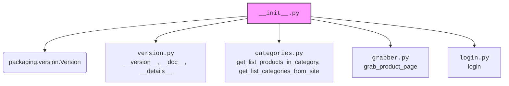

## Анализ кода `hypotez/src/suppliers/hb/scenarios/__init__.py`

### 1. <алгоритм>

Этот код является инициализационным файлом (`__init__.py`) для пакета `src.suppliers.hb.scenarios`.  Он импортирует различные модули и переменные, которые определяют функциональность этого пакета.  Вот пошаговая блок-схема его работы:

1.  **Начало**: Файл `__init__.py` начинает выполнение.
2.  **Импорт `packaging.version.Version`**: Импортируется класс `Version` из модуля `packaging.version`.
3.  **Импорт из `version.py`**: Импортируются переменные `__version__`, `__doc__` и `__details__` из модуля `version.py`.
4.  **Импорт из `categories.py`**: Импортируются функции `get_list_products_in_category` и `get_list_categories_from_site` из модуля `categories.py`.
5.  **Импорт из `grabber.py`**: Импортируется функция `grab_product_page` из модуля `grabber.py`.
6.  **Импорт из `login.py`**: Импортируется функция `login` из модуля `login.py`.
7.  **Конец**: Файл `__init__.py` завершает выполнение. Теперь все импортированные модули и переменные доступны для использования в других частях пакета `src.suppliers.hb.scenarios`.

### 2. <mermaid>

**Объяснение зависимостей:**

*   `packaging.version.Version`: Используется для работы с версиями пакетов. Это сторонняя библиотека, необходимая для управления версиями.
*   `version.py`: Определяет версию, документацию и детали пакета `src.suppliers.hb.scenarios`.
*   `categories.py`: Содержит функции для получения списка продуктов в категории и списка категорий с сайта.
*   `grabber.py`: Содержит функцию для сбора информации со страницы продукта.
*   `login.py`: Содержит функцию для выполнения входа в систему.

### 3. <объяснение>

**Импорты:**

*   `packaging.version.Version`: Импортируется класс `Version` из библиотеки `packaging`, который используется для работы с версиями. Это позволяет сравнивать и управлять версиями программного обеспечения.
*   `from .version import __version__, __doc__, __details__`: Импортируются переменные `__version__` (версия пакета), `__doc__` (документация пакета) и `__details__` (детали пакета) из модуля `version.py`, расположенного в том же каталоге.
*   `from .categories import get_list_products_in_category, get_list_categories_from_site`: Импортируются функции `get_list_products_in_category` (получение списка продуктов в категории) и `get_list_categories_from_site` (получение списка категорий с сайта) из модуля `categories.py`.
*   `from .grabber import grab_product_page`: Импортируется функция `grab_product_page` (сбор информации со страницы продукта) из модуля `grabber.py`.
*   `from .login import login`: Импортируется функция `login` (выполнение входа в систему) из модуля `login.py`.

**Роль и назначение:**

Файл `__init__.py` превращает каталог `src/suppliers/hb/scenarios` в Python-пакет.  Он собирает вместе функциональность различных модулей (version, categories, grabber, login) и предоставляет их для использования в других частях проекта.  Это позволяет упростить импорт и использование функций из этих модулей.

**Потенциальные улучшения:**

*   Добавить обработку исключений при импорте модулей, чтобы обеспечить более устойчивую работу пакета.
*   Добавить более подробную документацию к каждой функции и классу.
*   Рассмотреть возможность использования `typing` для статической типизации, чтобы улучшить читаемость и поддерживаемость кода.

**Взаимосвязи с другими частями проекта:**

Этот пакет (`src.suppliers.hb.scenarios`) предоставляет набор функций для работы с поставщиком `hb.co.il`.  Он может использоваться другими частями проекта `hypotez` для получения информации о продуктах, категориях и для выполнения входа в систему на сайте поставщика.  Например, он может использоваться в модулях, отвечающих за сбор данных о ценах и наличии товаров у разных поставщиков.