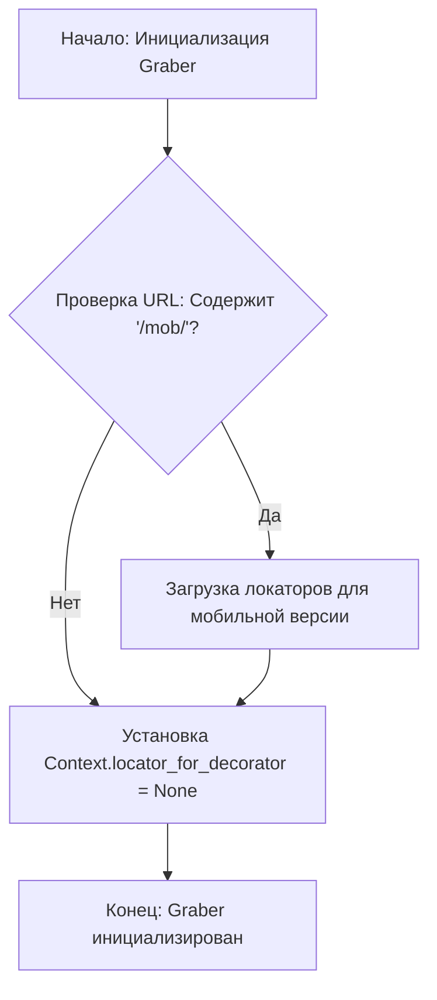
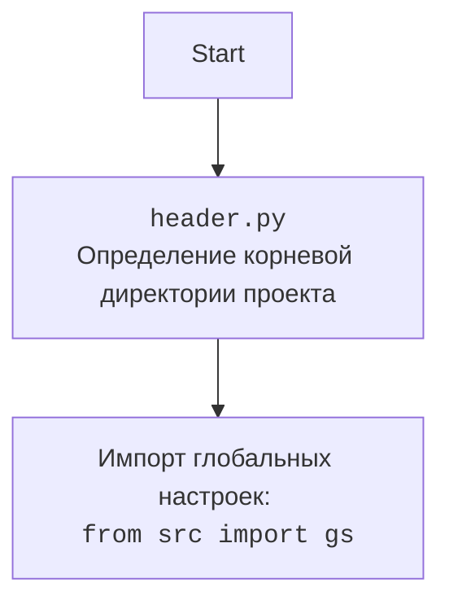

## Алгоритм

1. **Инициализация грабера:**
   - Создается экземпляр класса `Graber`, который наследуется от класса `Grbr`.
   - Устанавливается префикс поставщика как `'ksp'`.
   - Вызывается конструктор родительского класса `Grbr` с указанием префикса поставщика, драйвера и индекса языка.
   - Происходит небольшая задержка в 3 секунды.
   - Проверяется, является ли текущий URL мобильной версией сайта. Если да, то загружаются локаторы для мобильной версии.
   - Устанавливается значение `Context.locator_for_decorator` в `None`.

2. **Обработка мобильной версии сайта (если применимо):**
   - Если текущий URL содержит `/mob/`, загружаются локаторы для мобильной версии сайта из файла `product_mobile_site.json`.
   - Выводится информационное сообщение в лог о том, что установлены локаторы для мобильной версии сайта KSP.

3. **Установка декоратора:**
   - Устанавливается `Context.locator_for_decorator` в `None`. Если установить другое значение, декоратор `@close_pop_up` выполнит определенные действия.



## Mermaid

```mermaid
flowchart TD
    Start --> GraberInit[Graber: Инициализация класса сбора полей товара];
    GraberInit --> SuperInit[super().__init__(): Инициализация родительского класса Graber];
    SuperInit --> CheckMobileURL{Проверка: self.driver.current_url содержит '/mob/'?};
    CheckMobileURL -- Да --> LoadMobileLocators[Загрузка: j_loads_ns(product_mobile_site.json) в self.locator];
    CheckMobileURL -- Нет --> SetDecoratorToNone[Установка: Context.locator_for_decorator = None];
    LoadMobileLocators --> SetDecoratorToNone;
    SetDecoratorToNone --> End[Конец: Инициализация завершена];
```

**Объяснение зависимостей в диаграмме:**

- `GraberInit`: Инициализация класса `Graber`, отвечающего за сбор полей товара.
- `SuperInit`: Вызов метода `__init__` родительского класса `Grbr` (Graber).
- `CheckMobileURL`: Проверка, является ли текущий URL мобильной версией сайта.
- `LoadMobileLocators`: Загрузка JSON-файла с локаторами для мобильной версии сайта. Используется функция `j_loads_ns` из `src.utils.jjson`.
- `SetDecoratorToNone`: Установка значения `Context.locator_for_decorator` в `None`.



## Объяснение

**Импорты:**

- `time`: Используется для временной задержки (`time.sleep(3)`).
- `typing.Any`: Используется для аннотации типов, указывая, что переменная может быть любого типа.
- `header`: Импортируется для определения корневой директории проекта.
- `src.gs`: Импортируются глобальные настройки проекта.
- `src.suppliers.graber.Graber as Grbr, Context, close_pop_up`: Импортируется базовый класс `Graber` (переименованный в `Grbr`) и класс `Context` из модуля `src.suppliers.graber`.
- `src.utils.jjson.j_loads_ns`: Используется для загрузки JSON-файлов с поддержкой namespace.
- `src.logger.logger.logger`: Используется для логирования.

**Классы:**

- `Graber(Grbr)`: Класс для сбора данных со страниц товаров на сайте `ksp.co.il`.
  - `supplier_prefix: str`: Атрибут класса, содержащий префикс поставщика (`'ksp'`).
  - `__init__(self, driver: 'Driver', lang_index: int)`: Конструктор класса.
    - `driver: 'Driver'`: Экземпляр веб-драйвера для взаимодействия с сайтом.
    - `lang_index: int`: Индекс языка.
    - Устанавливает префикс поставщика.
    - Вызывает конструктор родительского класса `Grbr`.
    - Проверяет, является ли текущий URL мобильной версией сайта, и загружает соответствующие локаторы.
    - Устанавливает `Context.locator_for_decorator` в `None`.

**Функции:**

- `__init__(self, driver: 'Driver', lang_index: int)`: Конструктор класса `Graber`.
  - `driver`: Экземпляр веб-драйвера.
  - `lang_index`: Индекс языка.
  - Загружает локаторы в зависимости от версии сайта (мобильная или обычная).
  - Устанавливает `Context.locator_for_decorator` в `None`.

**Переменные:**

- `self.supplier_prefix`: Префикс поставщика (всегда `'ksp'`).
- `self.locator`: Локаторы для элементов страницы.
- `Context.locator_for_decorator`: Локатор для выполнения в декораторе `@close_pop_up`.

**Потенциальные ошибки и области для улучшения:**

- Отсутствует обработка исключений при загрузке локаторов для мобильной версии сайта.
- Жестко заданная задержка `time.sleep(3)` может быть не оптимальной. Лучше использовать более гибкий механизм ожидания загрузки страницы.

**Взаимосвязи с другими частями проекта:**

- Класс `Graber` наследуется от класса `Grbr` из модуля `src.suppliers.graber`, который предоставляет базовую функциональность для сбора данных с сайтов поставщиков.
- Используется модуль `src.utils.jjson` для загрузки JSON-файлов с локаторами.
- Используется модуль `src.logger.logger` для логирования.
- Глобальные настройки хранятся в `src.gs`.