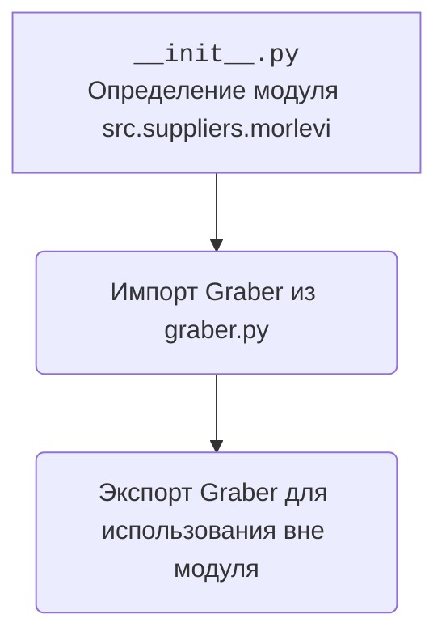

### <алгоритм>

1.  **Импорт класса `Graber`**: Импортируется класс `Graber` из модуля `.graber`.
2.  **Определение модуля**: Файл определяет модуль `src.suppliers.morlevi`.
3.  **Экспорт класса**: Класс `Graber` становится доступным для использования вне модуля `src.suppliers.morlevi`.

### <mermaid>

**Объяснение:**

*   Диаграмма показывает, что файл `__init__.py` определяет модуль `src.suppliers.morlevi`.
*   Из модуля `.graber` импортируется класс `Graber`.
*   После импорта, класс `Graber` экспортируется, делая его доступным для использования в других частях проекта.

### <объяснение>

*   **Импорты**:
    *   `from .graber import Graber`: Импортирует класс `Graber` из модуля `graber.py`, находящегося в той же директории (`.`). Это позволяет использовать функциональность, предоставляемую классом `Graber`.
*   **Классы**:
    *   `Graber`: Предположительно, класс `Graber` отвечает за сбор данных с веб-страниц поставщика Morlevi. Подробная информация о его атрибутах и методах находится в файле `graber.py`.
*   **Функции**:
    *   В данном файле функции отсутствуют. Он служит для определения модуля и импорта/экспорта класса `Graber`.
*   **Переменные**:
    *   В данном файле переменные отсутствуют.

**Дополнительно**:

*   Файл `__init__.py` используется для определения модуля `src.suppliers.morlevi`. Он импортирует класс `Graber` из модуля `graber.py` и делает его доступным для использования в других частях проекта. Это позволяет другим модулям импортировать `Graber` напрямую из `src.suppliers.morlevi`, например: `from src.suppliers.morlevi import Graber`.
*   Данный модуль, вероятно, является частью системы для сбора данных о поставщиках, где каждый поставщик имеет свой подмодуль, содержащий логику для извлечения данных с их веб-сайтов.