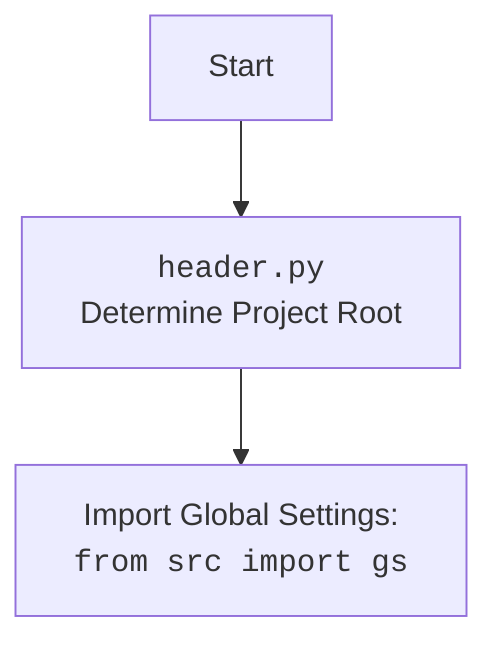

# Проект `hypotez`
# Роль `code explainer`
## АНАЛИЗ КОДА: `hypotez/src/suppliers/wallmart/header.py`

### 1. <алгоритм>

#### Блок-схема работы `header.py`:

1.  **Определение корневой директории проекта (`set_project_root`)**:

    *   Функция `set_project_root` ищет корневую директорию проекта, начиная с директории, в которой расположен файл `header.py`.
    *   Пример: Если `header.py` находится в `/path/to/project/src/suppliers/wallmart/`, функция начнет поиск с этой директории и будет подниматься вверх по дереву директорий.
    *   Поиск останавливается, когда обнаружена директория, содержащая один из файлов-маркеров (например, `__root__` или `.git`).
    *   Если корневая директория найдена, она добавляется в `sys.path`, чтобы обеспечить возможность импорта модулей из этой директории.

2.  **Чтение файла `settings.json`**:

    *   После определения корневой директории, код пытается прочитать файл `settings.json`, который, как предполагается, находится в директории `/src/` корневой директории проекта.
    *   Пример: Если корневая директория `/path/to/project/`, то будет предпринята попытка чтения файла `/path/to/project/src/settings.json`.
    *   Если файл найден и успешно прочитан, его содержимое загружается в переменную `settings`. Если файл не найден или содержит некорректный JSON, переменной `settings` присваивается значение `None`.

3.  **Чтение файла `README.MD`**:

    *   Аналогично `settings.json`, код пытается прочитать файл `README.MD`, который, как предполагается, находится в директории `/src/` корневой директории проекта.
    *   Пример: Если корневая директория `/path/to/project/`, то будет предпринята попытка чтения файла `/path/to/project/src/README.MD`.
    *   Если файл найден и успешно прочитан, его содержимое сохраняется в переменной `doc_str`. Если файл не найден, переменной `doc_str` присваивается значение `None`.

4.  **Определение глобальных переменных проекта**:

    *   На основе содержимого `settings.json` (если он был успешно прочитан) или значений по умолчанию определяются глобальные переменные проекта, такие как:
        *   `__project_name__`: Имя проекта (по умолчанию `'hypotez'`).
        *   `__version__`: Версия проекта (по умолчанию `''`).
        *   `__doc__`: Содержимое файла `README.MD` (если он был успешно прочитан), иначе пустая строка.
        *   `__author__`: Автор проекта (по умолчанию `''`).
        *   `__copyright__`: Информация об авторских правах (по умолчанию `''`).
        *   `__cofee__`: Сообщение с предложением поддержать разработчика (по умолчанию "Treat the developer to a cup of coffee for boosting enthusiasm in development: <https://boosty.to/hypo69>").

#### Поток данных:

1.  Функция `set_project_root` возвращает путь к корневой директории проекта.
2.  Этот путь используется для формирования путей к файлам `settings.json` и `README.MD`.
3.  Содержимое этих файлов (если они существуют) используется для инициализации глобальных переменных проекта.

### 2. <mermaid>

```mermaid
flowchart TD
    Start --> set_project_root_call[Call <code>set_project_root()</code>]
    set_project_root_call --> set_project_root[<code>set_project_root</code><br>Find Project Root]
    set_project_root --> FindMarkerFiles[Search for Marker Files:<br><code>__root__</code>, <code>.git</code>]
    FindMarkerFiles --> SetRootPath[Set Project Root Path]
    SetRootPath --> AddRootToSysPath[Add Root Path to <code>sys.path</code>]
    AddRootToSysPath --> ReturnRootPath[Return Project Root Path]

    ReturnRootPath --> ReadSettings[Read <code>settings.json</code>]
    ReadSettings --> OpenSettings[Open <code>settings.json</code> with encoding='utf-8']
    OpenSettings --> LoadSettings[Load JSON settings]

    LoadSettings -- Success --> ReadMe[Read <code>README.MD</code>]
    ReadSettings -- Fail --> ReadMe[Read <code>README.MD</code>]

    ReadMe --> OpenReadMe[Open <code>README.MD</code> with encoding='utf-8']
    OpenReadMe --> LoadReadMe[Read content from README.MD]
    LoadReadMe -- Success --> DefineGlobals[Define Global Variables]
    LoadReadMe -- Fail --> DefineGlobals[Define Global Variables]

    DefineGlobals --> ProjectName[Set <code>__project_name__</code>]
    DefineGlobals --> Version[Set <code>__version__</code>]
    DefineGlobals --> Doc[Set <code>__doc__</code>]
    DefineGlobals --> Author[Set <code>__author__</code>]
    DefineGlobals --> Copyright[Set <code>__copyright__</code>]
    DefineGlobals --> Coffee[Set <code>__cofee__</code>]
    ProjectName --> End
    Version --> End
    Doc --> End
    Author --> End
    Copyright --> End
    Coffee --> End
```



#### Объяснение зависимостей:

*   `sys`: Используется для работы с системными переменными и функциями, в частности для добавления корневой директории проекта в `sys.path`.
*   `json`: Используется для чтения данных из файла `settings.json`.
*   `packaging.version.Version`: Используется для работы с версиями пакетов.
*   `pathlib.Path`: Используется для работы с путями к файлам и директориям.
*   `src.gs`: Импортирует глобальные настройки проекта. Используется для доступа к путям и другим глобальным переменным.

### 3. <объяснение>

#### Импорты:

*   `sys`: Предоставляет доступ к некоторым переменным и функциям, взаимодействующим с интерпретатором Python. Здесь используется для добавления пути к корневой директории проекта в `sys.path`, что позволяет импортировать модули из этой директории.
*   `json`: Используется для работы с данными в формате JSON. В данном случае, для чтения содержимого файла `settings.json`, который содержит настройки проекта.
*   `packaging.version.Version`: Используется для сравнения и работы с версиями пакетов. В данном случае не используется, но импортирована.
*   `pathlib.Path`: Предоставляет способ представления путей к файлам и директориям в виде объектов. Используется для работы с путями к файлам `settings.json` и `README.MD`.
*   `src.gs`: Импортирует глобальные настройки проекта. Используется для доступа к путям и другим глобальным переменным.

#### Классы:

В данном коде нет определения новых классов.

#### Функции:

*   `set_project_root(marker_files: tuple = ('__root__', '.git')) -> Path`:
    *   Аргументы:
        *   `marker_files`: Кортеж файлов или директорий, которые используются для определения корневой директории проекта. По умолчанию `('__root__', '.git')`.
    *   Возвращаемое значение:
        *   `Path`: Объект `Path`, представляющий путь к корневой директории проекта.
    *   Назначение:
        *   Функция ищет корневую директорию проекта, начиная с директории, в которой расположен файл, и поднимаясь вверх по дереву директорий. Поиск останавливается, когда обнаружена директория, содержащая один из файлов-маркеров. Если корневая директория найдена, она добавляется в `sys.path`.
    *   Пример:
        ```python
        from pathlib import Path
        
        root_path:Path = set_project_root()
        print(f"Root path: {root_path}")
        ```

#### Переменные:

*   `__root__`: Объект `Path`, представляющий путь к корневой директории проекта.
*   `settings`: Словарь, содержащий настройки проекта, прочитанные из файла `settings.json`. Может быть `None`, если файл не найден или содержит некорректный JSON.
*   `doc_str`: Строка, содержащая содержимое файла `README.MD`. Может быть `None`, если файл не найден.
*   `__project_name__`: Имя проекта (строка).
*   `__version__`: Версия проекта (строка).
*   `__doc__`: Документация проекта (строка).
*   `__author__`: Автор проекта (строка).
*   `__copyright__`: Информация об авторских правах (строка).
*   `__cofee__`: Сообщение с предложением поддержать разработчика (строка).

#### Потенциальные ошибки и области для улучшения:

*   Обработка исключений: В блоках `try...except` используется `...` в секции `except`. Необходимо конкретизировать обработку исключений, чтобы логировать ошибки и предпринимать соответствующие действия.
*   Обработка ошибок при чтении файлов: Если `settings.json` или `README.MD` не найдены, переменные `settings` и `doc_str` устанавливаются в `None`. В дальнейшем коде необходимо учитывать, что эти переменные могут быть `None`.
*   Использование `gs.path.root`: Код предполагает, что `gs.path.root` всегда указывает на корневую директорию проекта. Необходимо убедиться, что это действительно так во всех случаях использования.

#### Взаимосвязь с другими частями проекта:

*   Этот модуль (`header.py`) является центральным для определения глобальных переменных проекта. Он используется другими модулями для получения информации о проекте, такой как имя, версия, документация и т.д.
*   Он зависит от модуля `src.gs`, который предоставляет доступ к глобальным настройкам проекта.
*   Он использует файлы `settings.json` и `README.MD` для получения информации о проекте.