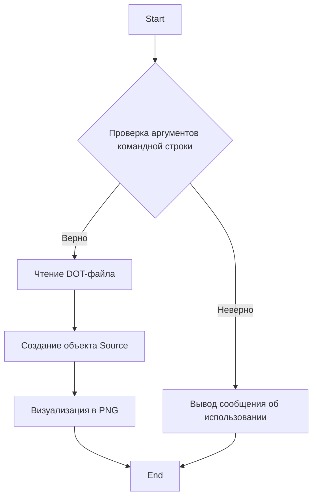
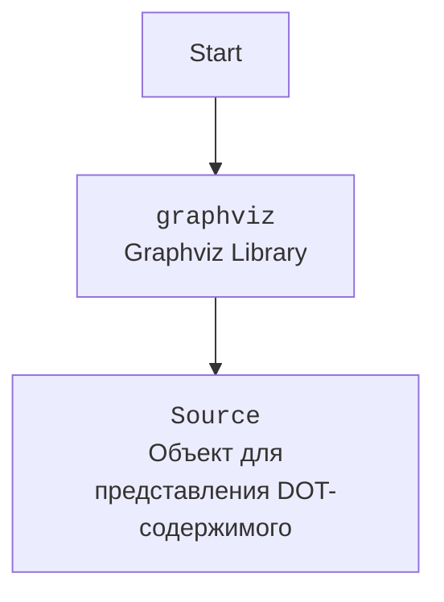

# Анализ кода `hypotez`

## 1. <алгоритм>

Этот скрипт преобразует файлы в формате DOT (Graphviz) в PNG-изображения. Вот пошаговая блок-схема процесса:

1.  **Начало**: Скрипт запускается.
2.  **Чтение аргументов командной строки**:
    *   Проверяется количество аргументов командной строки. Ожидается два аргумента: входной DOT-файл и выходной PNG-файл.
    *   Если количество аргументов не равно 3 (имя скрипта + 2 аргумента), выводится сообщение об использовании, и скрипт завершается с кодом ошибки 1.
    *   Если аргументы верны, извлекаются пути к входному DOT-файлу и выходному PNG-файлу.
        *   Пример:
            ```bash
            python dot2png.py example.dot output.png
            ```
            Здесь `example.dot` - входной файл, `output.png` - выходной файл.
3.  **Чтение DOT-файла**:
    *   Функция `dot2png` открывает DOT-файл для чтения.
    *   Содержимое DOT-файла считывается в строку.
        *   Пример: Если `example.dot` содержит:
            ```dot
            digraph G {
                A -> B;
                B -> C;
                C -> A;
            }
            ```
            Тогда `dot_content` будет содержать эту строку.
4.  **Создание объекта Source**:
    *   Создается объект `graphviz.Source` из содержимого DOT-файла.
        *   Пример: `source = Source(dot_content)`
5.  **Визуализация в PNG**:
    *   Устанавливается формат визуализации на PNG.
    *   Вызывается метод `render` для создания PNG-изображения из DOT-файла.
        *   Пример: `source.render('output.png', cleanup=True)` создаст файл `output.png`.
6.  **Обработка исключений**:
    *   Если DOT-файл не найден, выбрасывается исключение `FileNotFoundError`, сообщение об ошибке выводится в консоль, и скрипт завершается.
    *   Если во время преобразования возникает какая-либо другая ошибка, выбрасывается общее исключение, сообщение об ошибке выводится в консоль, и скрипт завершается.
7.  **Завершение**: PNG-изображение создано, скрипт завершается.

## 2. <mermaid>





**Объяснение зависимостей `mermaid`:**

*   **`graphviz`**: Эта библиотека используется для программного создания и управления графами, созданными с помощью языка DOT. В данном случае, она используется для преобразования DOT-файла в PNG-изображение. `graphviz.Source` используется для представления DOT-содержимого и его последующей визуализации.

## 3. <объяснение>

**Объяснение кода:**

*   **Импорты**:
    *   `sys`: Используется для доступа к аргументам командной строки.
    *   `graphviz`: Используется для преобразования DOT-файлов в изображения.
*   **Функции**:
    *   `dot2png(dot_file: str, png_file: str) -> None`:
        *   **Аргументы**:
            *   `dot_file` (str): Путь к входному DOT-файлу.
            *   `png_file` (str): Путь, по которому будет сохранен выходной PNG-файл.
        *   **Возвращаемое значение**: `None`.
        *   **Назначение**: Преобразует DOT-файл в PNG-изображение.
        *   **Пример**:
            ```python
            dot2png('example.dot', 'output.png')
            ```
            Преобразует `example.dot` в `output.png`.
        *   **Обработка исключений**:
            *   `FileNotFoundError`: Выбрасывается, если DOT-файл не найден.
            *   `Exception`: Выбрасывается при любых других ошибках во время преобразования.
*   **Переменные**:
    *   `dot_file` (str): Путь к входному DOT-файлу.
    *   `png_file` (str): Путь к выходному PNG-файлу.
    *   `dot_content` (str): Содержимое DOT-файла, считанное в строку.
    *   `source` (graphviz.Source): Объект `graphviz.Source`, представляющий DOT-содержимое.
*   **Потенциальные ошибки и области для улучшения**:
    *   Обработка ошибок может быть улучшена с помощью логирования, а не просто вывода в консоль.
    *   Можно добавить проверку наличия библиотеки Graphviz перед выполнением преобразования.
    *   Можно добавить возможность настройки параметров визуализации (например, разрешение, размер шрифта и т.д.).

**Цепочка взаимосвязей с другими частями проекта**:

Этот скрипт является утилитой для преобразования DOT-файлов в PNG-изображения. Он может использоваться в других частях проекта, где необходимо визуализировать графы, описанные в формате DOT. Например, он может использоваться для генерации документации или для визуализации структуры данных.