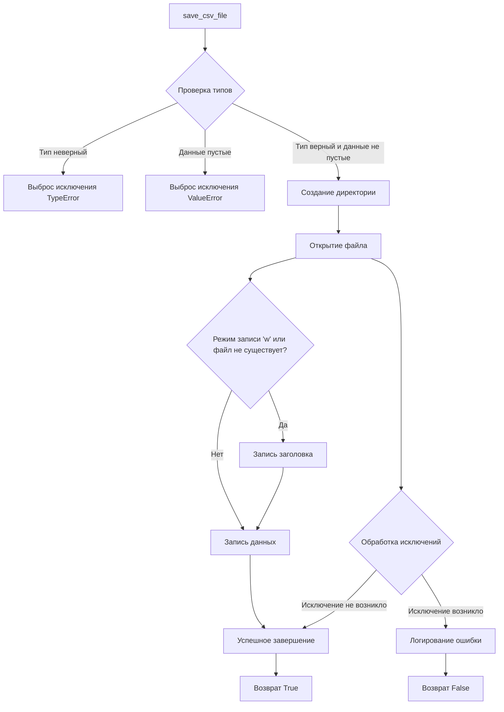
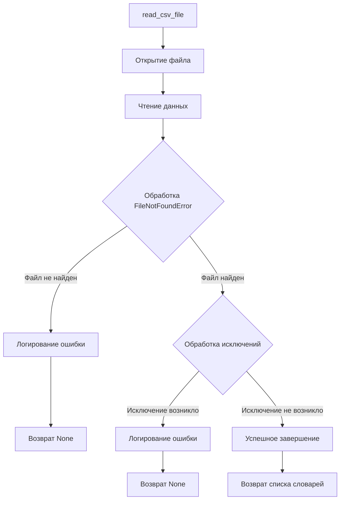
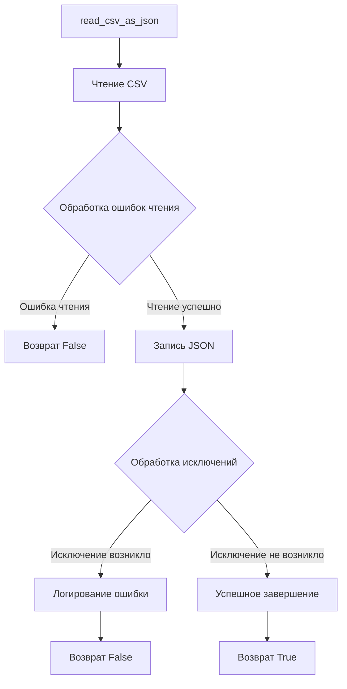
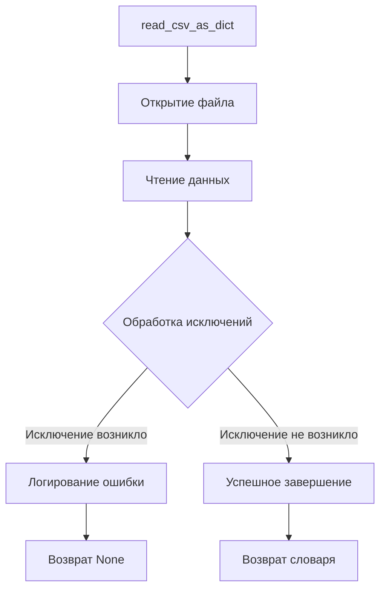
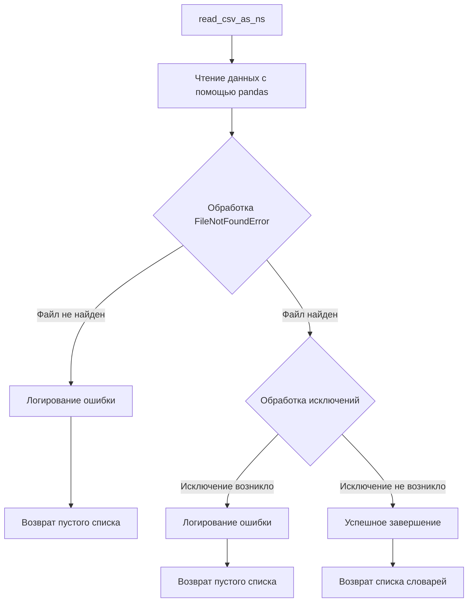

## Анализ кода `hypotez/src/utils/csv.py`

### 1. <алгоритм>

#### `save_csv_file`
1.  **Начало**: Функция принимает `data` (список словарей), `file_path` (путь к файлу), `mode` (режим записи), и `exc_info` (флаг для логирования ошибок).
2.  **Проверка типов**: Проверяет, что `data` является списком и не является пустым. Если нет, вызывает исключение `TypeError` или `ValueError` соответственно.
    *   Пример: Если `data` не является списком, выбрасывается исключение.
3.  **Создание директории**: Создает директорию для файла, если она не существует.
    *   Пример: Если `file_path` - `"path/to/file.csv"`, то создается директория `"path/to"`.
4.  **Открытие файла**: Открывает файл в указанном режиме (`'a'` или `'w'`).
    *   Пример: Если `mode = 'w'`, файл открывается для записи, перезаписывая существующий.
5.  **Запись данных**: Записывает данные в CSV файл, используя `csv.DictWriter`. Если файл новый или открыт в режиме записи, записывает заголовок.
    *   Пример: Записывает данные из словарей в CSV файл, разделяя значения запятыми.
6.  **Обработка исключений**: Если в процессе записи возникает исключение, логирует ошибку и возвращает `False`.
7.  **Успешное завершение**: Если запись прошла успешно, возвращает `True`.

#### `read_csv_file`
1.  **Начало**: Функция принимает `file_path` (путь к файлу) и `exc_info` (флаг для логирования ошибок).
2.  **Открытие файла**: Открывает CSV файл для чтения.
    *   Пример: Открывает файл `"path/to/file.csv"` для чтения.
3.  **Чтение данных**: Читает данные из CSV файла, используя `csv.DictReader`, и преобразует их в список словарей.
    *   Пример: Читает CSV файл, где каждая строка становится словарем.
4.  **Обработка `FileNotFoundError`**: Если файл не найден, логирует ошибку и возвращает `None`.
5.  **Обработка исключений**: Если в процессе чтения возникает исключение, логирует ошибку и возвращает `None`.
6.  **Успешное завершение**: Если чтение прошло успешно, возвращает список словарей.

#### `read_csv_as_json`
1.  **Начало**: Функция принимает `csv_file_path` (путь к CSV файлу), `json_file_path` (путь к JSON файлу) и `exc_info` (флаг для логирования ошибок).
2.  **Чтение CSV**: Читает данные из CSV файла, используя функцию `read_csv_file`.
3.  **Обработка ошибок чтения**: Если чтение CSV файла не удалось (возвращено `None`), возвращает `False`.
4.  **Запись JSON**: Записывает данные в JSON файл с отступом 4 для читаемости.
    *   Пример: Записывает данные из списка словарей в JSON файл.
5.  **Обработка исключений**: Если в процессе записи возникает исключение, логирует ошибку и возвращает `False`.
6.  **Успешное завершение**: Если запись прошла успешно, возвращает `True`.

#### `read_csv_as_dict`
1.  **Начало**: Функция принимает `csv_file` (путь к CSV файлу).
2.  **Открытие файла**: Открывает CSV файл для чтения.
3.  **Чтение данных**: Читает данные из CSV файла, используя `csv.DictReader`, и преобразует их в словарь с ключом `"data"` и значением в виде списка словарей.
    *   Пример: Преобразует CSV данные в формат `{"data": [{}, {}, ...]}`, где каждый элемент списка - словарь.
4.  **Обработка исключений**: Если в процессе чтения возникает исключение, логирует ошибку и возвращает `None`.
5.  **Успешное завершение**: Если чтение прошло успешно, возвращает словарь.

#### `read_csv_as_ns`
1.  **Начало**: Функция принимает `file_path` (путь к CSV файлу).
2.  **Чтение данных**: Читает данные из CSV файла, используя `pandas.read_csv`, и преобразует их в список словарей.
    *   Пример: Использует pandas для чтения CSV файла и преобразования его в список словарей.
3.  **Обработка `FileNotFoundError`**: Если файл не найден, логирует ошибку и возвращает пустой список.
4.  **Обработка исключений**: Если в процессе чтения возникает исключение, логирует ошибку и возвращает пустой список.
5.  **Успешное завершение**: Если чтение прошло успешно, возвращает список словарей.

### 2. <mermaid>











### 3. <объяснение>

#### Импорты:

*   `csv`: Используется для работы с CSV файлами (чтение и запись).
*   `json`: Используется для работы с JSON файлами (запись).
*   `pathlib.Path`: Используется для представления путей к файлам и директориям и работы с ними.
*   `typing.List`, `typing.Dict`, `typing.Union`: Используются для аннотации типов.
*   `pandas as pd`: Используется для работы с данными в формате DataFrame, что упрощает чтение CSV файлов в виде словарей.
*   `src.logger.logger`: Используется для логирования ошибок и другой информации.

#### Функции:

*   `save_csv_file(data: List[Dict[str, str]], file_path: Union[str, Path], mode: str = 'a', exc_info: bool = True) -> bool`:
    *   Аргументы:
        *   `data`: Список словарей, которые нужно сохранить в CSV файл.
        *   `file_path`: Путь к CSV файлу.
        *   `mode`: Режим открытия файла (`'a'` для добавления, `'w'` для перезаписи).
        *   `exc_info`: Флаг, указывающий, нужно ли включать информацию об исключении в логи.
    *   Возвращает: `True`, если файл успешно сохранен, `False` в противном случае.
    *   Назначение: Сохраняет список словарей в CSV файл. Если указан режим `'w'` или файл не существует, записывает заголовок.
    *   Пример:

    ```python
    data = [{'name': 'John', 'age': '30'}, {'name': 'Jane', 'age': '25'}]
    file_path = 'data.csv'
    save_csv_file(data, file_path, mode='w')
    ```

*   `read_csv_file(file_path: Union[str, Path], exc_info: bool = True) -> List[Dict[str, str]] | None`:
    *   Аргументы:
        *   `file_path`: Путь к CSV файлу.
        *   `exc_info`: Флаг, указывающий, нужно ли включать информацию об исключении в логи.
    *   Возвращает: Список словарей, прочитанных из CSV файла, или `None`, если произошла ошибка.
    *   Назначение: Читает CSV файл и возвращает его содержимое в виде списка словарей.
    *   Пример:

    ```python
    file_path = 'data.csv'
    data = read_csv_file(file_path)
    if data:
        print(data)
    ```

*   `read_csv_as_json(csv_file_path: Union[str, Path], json_file_path: Union[str, Path], exc_info: bool = True) -> bool`:
    *   Аргументы:
        *   `csv_file_path`: Путь к CSV файлу.
        *   `json_file_path`: Путь к JSON файлу.
        *   `exc_info`: Флаг, указывающий, нужно ли включать информацию об исключении в логи.
    *   Возвращает: `True`, если CSV файл успешно преобразован в JSON, `False` в противном случае.
    *   Назначение: Преобразует CSV файл в JSON формат и сохраняет его.
    *   Пример:

    ```python
    csv_file_path = 'data.csv'
    json_file_path = 'data.json'
    read_csv_as_json(csv_file_path, json_file_path)
    ```

*   `read_csv_as_dict(csv_file: Union[str, Path]) -> dict | None`:
    *   Аргументы:
        *   `csv_file`: Путь к CSV файлу.
    *   Возвращает: Словарь, содержащий данные из CSV файла, или `None`, если произошла ошибка.
    *   Назначение: Читает CSV файл и возвращает его содержимое в виде словаря с ключом `"data"` и значением в виде списка словарей.
    *   Пример:

    ```python
    csv_file = 'data.csv'
    data = read_csv_as_dict(csv_file)
    if data:
        print(data)
    ```

*   `read_csv_as_ns(file_path: Union[str, Path]) -> List[dict]`:
    *   Аргументы:
        *   `file_path`: Путь к CSV файлу.
    *   Возвращает: Список словарей, прочитанных из CSV файла.
    *   Назначение: Читает CSV файл, используя `pandas`, и возвращает его содержимое в виде списка словарей.
    *   Пример:

    ```python
    file_path = 'data.csv'
    data = read_csv_as_ns(file_path)
    print(data)
    ```

#### Переменные:

*   `data`: Используется для хранения списка словарей, которые нужно сохранить в CSV файл.
*   `file_path`, `csv_file_path`, `json_file_path`, `csv_file`: Используются для хранения путей к файлам.
*   `mode`: Используется для определения режима открытия файла (append или write).
*   `exc_info`: Используется для указания, нужно ли включать информацию об исключении в логи.
*   `writer`, `reader`: Объекты для чтения и записи CSV файлов.
*   `f`, `file`: Файловые объекты.
*   `df`: DataFrame, используемый в `read_csv_as_ns` для чтения CSV с помощью pandas.

#### Потенциальные ошибки и области для улучшения:

*   В функциях `save_csv_file`, `read_csv_file`, `read_csv_as_json` и `read_csv_as_dict` обработка исключений включает логирование ошибки, но не предоставляет конкретную информацию о типе исключения. Было бы полезно логировать тип исключения для более детальной диагностики.
*   Функция `read_csv_as_ns` использует `pandas` для чтения CSV файлов. Это может быть избыточно, если требуется только базовое чтение данных. Если `pandas` не является обязательной зависимостью, можно реализовать чтение CSV с использованием только модуля `csv`.
*   В функции `read_csv_as_ns` при возникновении исключения возвращается пустой список. Возможно, было бы полезнее возвращать `None` или выбрасывать исключение, чтобы вызывающий код мог обработать ошибку.

#### Взаимосвязи с другими частями проекта:

*   Этот модуль использует модуль `src.logger.logger` для логирования ошибок и информации. Это позволяет централизованно управлять логированием в проекте.
*   Функции в этом модуле могут использоваться другими модулями для чтения и записи CSV файлов, а также для преобразования CSV в JSON.