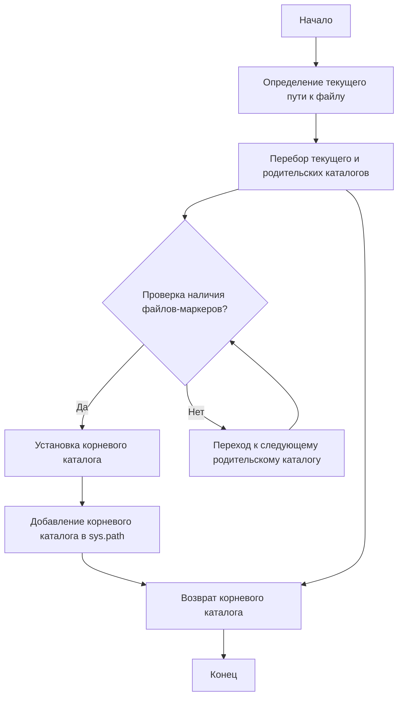
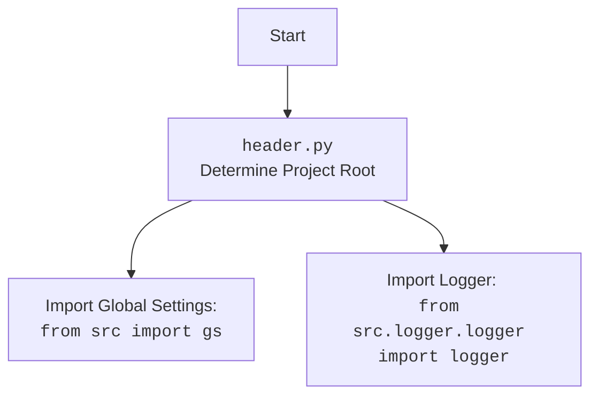

### **Анализ кода `hypotez/src/webdriver/edge/header.py`**

#### 1. **<алгоритм>**:

1.  **Определение `set_project_root`**:
    *   Функция `set_project_root` определяет корневой каталог проекта.
    *   Начинает поиск от родительского каталога текущего файла.
    *   Перебирает текущий каталог и все его родительские каталоги.
    *   Проверяет наличие одного из файлов-маркеров (по умолчанию `'__root__'` или `'.git'`) в каждом каталоге.
        *   Пример: Если текущий файл находится в `/path/to/project/src/webdriver/edge/header.py`, функция сначала проверит `/path/to/project/src/webdriver/edge/`, затем `/path/to/project/src/`, и так далее до `/path/to/project/`.
    *   Если один из маркеров найден, устанавливает этот каталог как корневой и добавляет его в `sys.path`.
    *   Если маркеры не найдены, корневым каталогом остается каталог, где находится скрипт.
    *   Возвращает корневой каталог проекта.

2.  **Установка корневого каталога**:
    *   Вызывает `set_project_root()` для определения корневого каталога проекта.
    *   Сохраняет результат в переменной `__root__`.

#### 2. **<mermaid>**:



**Объяснение зависимостей в `mermaid`**:

*   `Path` из модуля `pathlib`: Используется для работы с путями к файлам и каталогам.

#### 3. **<объяснение>**:

**Импорты**:

*   `sys`: Используется для добавления корневого каталога проекта в `sys.path`, что позволяет импортировать модули из этого каталога.
*   `json`: Не используется в данном коде.
*   `packaging.version.Version`: Не используется в данном коде.
*   `pathlib.Path`: Используется для представления путей к файлам и каталогам, что упрощает операции с файловой системой.

**Функции**:

*   `set_project_root(marker_files: tuple = ('__root__', '.git')) -> Path`:
    *   Аргументы:
        *   `marker_files` (tuple): Кортеж имен файлов или каталогов, которые используются для определения корневого каталога проекта. По умолчанию `('__root__', '.git')`.
    *   Возвращает:
        *   `Path`: Путь к корневому каталогу проекта.
    *   Назначение:
        *   Функция ищет корневой каталог проекта, начиная с каталога, в котором находится текущий файл, и двигаясь вверх по дереву каталогов. Она останавливается, когда находит каталог, содержащий один из файлов-маркеров. Если ни один из маркеров не найден, функция возвращает каталог, в котором находится скрипт.
    *   Пример:

```python
    from pathlib import Path
    
    # Создаем фиктивные файлы и директории для примера
    import os
    
    os.makedirs('test_project/src/webdriver/edge', exist_ok=True)
    Path('test_project/.git').touch()
    
    # Временное изменение текущей директории для тестирования
    current_dir = os.getcwd()
    os.chdir('test_project/src/webdriver/edge')
    
    root_path = set_project_root()
    print(root_path)
    
    # Возвращаемся в исходную директорию
    os.chdir(current_dir)
    
    # Очистка созданных файлов и директорий
    import shutil
    
    shutil.rmtree('test_project')
```

**Переменные**:

*   `__root__`:
    *   Тип: `Path`
    *   Использование: Хранит путь к корневому каталогу проекта.

**Потенциальные ошибки и области для улучшения**:

*   Обработка ошибок: В коде не предусмотрена обработка исключений, которые могут возникнуть при работе с файловой системой.
*   Отсутствие логирования: Отсутствует логирование процесса поиска корневого каталога, что может затруднить отладку.

**Взаимосвязи с другими частями проекта**:

*   Этот модуль используется для определения корневого каталога проекта, что необходимо для правильной работы с путями к файлам и импортом модулей в других частях проекта.

