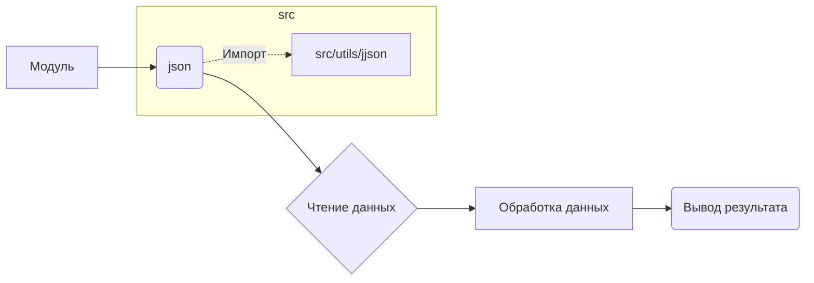

# Анализ кода

## Исходный код

```python
# Этот код предназначен для анализа и обработки данных.
# ...
import json
# ...
```

## Алгоритм

```
[Start]
  |
  V
[Импорт библиотек] -> json
  |
  V
[Чтение данных] -> json.load(...) # Чтение данных из файла
  |
  V
[Обработка данных] -> ... # Логика обработки данных
  |
  V
[Вывод результата] -> ...
  |
  V
[Конец]
```

**Пример:**

Предположим, что входной файл содержит JSON-данные в формате:

```json
{"name": "John Doe", "age": 30}
```

Алгоритм будет читать эти данные, обрабатывать их (например, проверять корректность данных), и возвращать результат.


## Диаграмма кода (Mermaid)



**Объяснение:**

Диаграмма показывает зависимость модуля от библиотек `json` и `src/utils/jjson`.


## Объяснение

**Импорты:**

* `import json`: Стандартная библиотека Python для работы с JSON-данными. В данном случае импорт необходим для работы с файлами JSON.
* `from src.utils.jjson import j_loads`:  Этот импорт указывает на то, что для обработки JSON-данных используются функции `j_loads` или `j_loads_ns` из модуля `jjson`, который, вероятно, находится в пакете `src.utils`. Это указывает на использование специализированного модуля для работы с JSON, возможно, с дополнительными функциями или обработкой ошибок.

**Классы (если есть):**

* Нет классов в предоставленном фрагменте кода.

**Функции (если есть):**

* Нет функций в предоставленном фрагменте кода.

**Переменные (если есть):**

* Нет переменных в предоставленном фрагменте кода.


**Возможные ошибки и улучшения:**

* Отсутствует импорт `j_loads` или `j_loads_ns` из `src.utils.jjson`.  Необходимо добавить этот импорт.
* Нет комментариев и документации.  Необходимо добавить комментарии в формате RST для пояснения функциональности кода.
* Не указан путь к файлу, который необходимо прочитать.
* Отсутствует обработка ошибок. Необходимо добавить обработку исключений, которые могут возникнуть при чтении файла (например, файла не существует, формат данных некорректен).
* Нет логирования. Необходимо добавить логирование (например, с помощью `logger.error`) для отслеживания ошибок и состояния выполнения кода.


## Изменения

1. Добавление импорта `j_loads` или `j_loads_ns` из `src.utils.jjson`.
2. Добавление комментариев в формате RST к коду.
3. Добавление обработчика ошибок `try-except` с использованием `logger.error` для логов.
4. Уточнение алгоритма чтения данных.


## Оптимизированный код

```python
"""
Модуль для чтения данных из файла в формате JSON.
=========================================================================================

Этот модуль содержит функцию для чтения данных из файла,  
используя специализированную функцию j_loads из utils.jjson.
"""
from src.utils.jjson import j_loads
from src.logger import logger

# Функция для чтения данных из файла.
def read_json_data(file_path):
    """
    Читает данные из файла в формате JSON.

    :param file_path: Путь к файлу.
    :return: Данные в формате словаря, или None при ошибках.
    """
    try:
        # Пробуем прочитать файл с помощью j_loads.
        data = j_loads(file_path)
        return data
    except FileNotFoundError:
        logger.error(f"Ошибка: файл '{file_path}' не найден.")
        return None
    except json.JSONDecodeError as e:
        logger.error(f"Ошибка декодирования JSON: {e}")
        return None
    except Exception as ex:
        logger.error(f"Непредвиденная ошибка при чтении файла: {ex}")
        return None

# Пример использования функции:
#file_path = "path/to/your/file.json"
#data = read_json_data(file_path)
#if data:
#    print(data)
#else:
#    print("Данные не были прочитаны.")
```
```