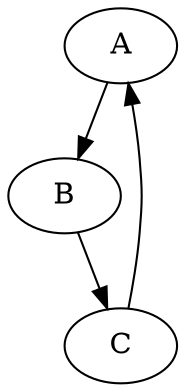

# hypotez/src/utils/convertors/dot.py

## Overview

This module provides a function for converting DOT files to PNG images using the Graphviz library.  It facilitates the rendering of graph visualizations from DOT language descriptions.

## Table of Contents

* [dot2png](#dot2png)
* [Usage](#usage)


## Functions

### `dot2png`

**Description**: Converts a DOT file to a PNG image.

**Parameters**:

* `dot_file` (str): The path to the input DOT file.
* `png_file` (str): The path where the output PNG file will be saved.

**Returns**:
* None.

**Raises**:

* `FileNotFoundError`: If the DOT file does not exist.
* `Exception`: For other errors during conversion.

**Example Usage (in Python):**

```python
dot2png('example.dot', 'output.png')
```

This will convert the DOT file 'example.dot' to a PNG image named 'output.png'.


**Example DOT file content (example.dot):**



**Command-line Usage:**

To run the script from the command line:

```bash
python dot2png.py example.dot output.png
```

This command creates a PNG file named 'output.png' containing the graph defined in 'example.dot'.


## Usage

The script is designed to be run from the command line.  It expects two command-line arguments: the input DOT file path and the output PNG file path.

```
python dot2png.py <input_dot_file> <output_png_file>
```

If incorrect arguments are provided, an informative usage message will be displayed.
```