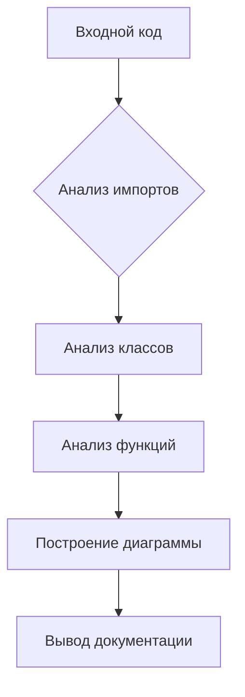

# Документация для instruction_code_explainer_ru.py

## Обзор

Данный файл содержит инструкцию для анализа Python-кода и генерации его документации в формате Markdown. Инструкция описывает шаги, которые необходимо выполнить для подробного анализа кода, включая описание алгоритма, построение диаграммы, объяснение импортов, классов, функций, переменных и потенциальных проблем.

## Алгоритм анализа

1. **Чтение кода:** Программа принимает Python-код в качестве входных данных.
2. **Анализ кода:**  Алгоритм разбивает код на составляющие части: импорты, классы, функции, переменные.
3. **Описание алгоритма:** Для каждой логической части создается пошаговое описание, блок-схема и пример.
4. **Построение диаграммы:** Используется инструмент Mermaid для создания диаграммы, отображающей взаимосвязи между компонентами кода.
5. **Объяснение:**  Инструкция предоставляет подробные комментарии по поводу импортов, классов, функций, переменных, и потенциальных проблем.
6. **Построение взаимосвязей:**  Определяются связи с другими частями проекта (если таковые имеются).
7. **Вывод:**  Формирование полного отчета с описанной информацией в формате Markdown.

**Пример входного кода**:

```python
# Входной код здесь
```

**Пример блок-схемы (для простого случая):**



## Функции

### `analyze_code`

**Описание**: Функция анализирует входной код и генерирует документацию.

**Параметры**:
- `code` (str): Входной Python-код.


**Возвращает**:
- `str`: Сгенерированная документация в формате Markdown.


**Вызывает исключения**:
- `ValueError`: Если входной код некорректен.


## Переменные

**`input_code`**: Хранит входной Python-код.
**`output_markdown`**: Хранит сгенерированную документацию.

## Потенциальные проблемы

* Необходимость поддержки сложных структур кода.
* Возможность ошибок в анализе кода (например, сложных конструкций).


## Связи с другими частями проекта

Эта инструкция предназначена для использования в рамках проекта, который обрабатывает Python-код и создает документацию.  Она тесно связана с модулями, отвечающими за парсинг кода, построение диаграмм (например, используя Mermaid), и обработку результатов.

## Дополнительные рекомендации

* Включение примеров различных типов кода для лучшего понимания.
* Добавление механизма для обработки ошибок в коде и предоставления сообщений об ошибках.
* Поддержка различных стилей документации Markdown.