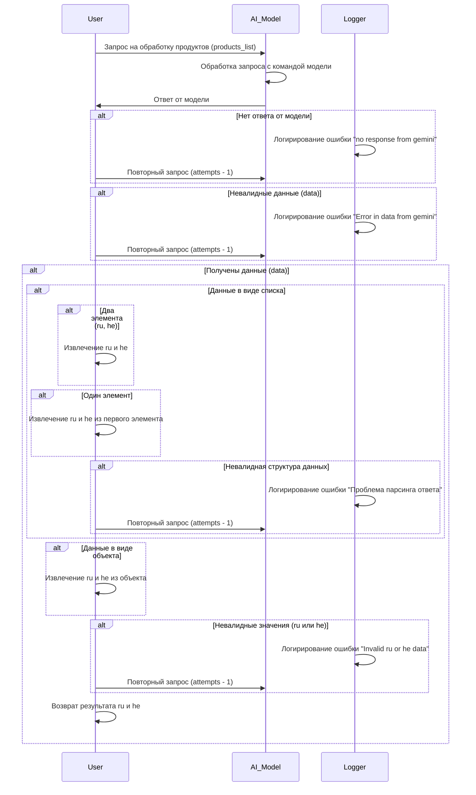

# Сценарии обработки ответов от модели Gemini

## Обзор

Данный документ описывает сценарии обработки ответов от модели Gemini при запросе на обработку списка продуктов.  Он фокусируется на различных сценариях, от успешной обработки до обработки ошибок и повторных запросов.

## Диаграмма состояний

## Обработка ответов

### Сценарий успешной обработки

В случае успешного ответа от модели Gemini и валидных данных, выполняется извлечение необходимых элементов (например, `ru` и `he`).  Продукт возвращается в требуемом формате.

### Обработка ошибок

#### Ошибка отсутствия ответа (no response from gemini)

Если модель Gemini не отвечает на запрос, происходит повторная попытка запроса.  Количество попыток ограничено, а ошибка логируется.

#### Ошибка невалидных данных (Error in data from gemini)

Если полученные от модели данные невалидны, происходит повторная попытка.  Ошибка логируется.

#### Ошибка парсинга ответа

Если полученные данные имеют невалидную структуру (не список или не объект), происходит повторная попытка. Ошибка логируется.

#### Ошибка невалидных значений (Invalid ru or he data)

В случае невалидных значений `ru` или `he`, происходит повторная попытка запроса. Ошибка логируется.

## Логирование

Все ошибки, встречающиеся при обработке ответа, логируются.  Это позволяет отслеживать проблемы и оптимизировать работу системы.

## Возвращаемые значения

В случае успешной обработки, функция возвращает словарь с результатами (ru, he). В случае ошибки, возвращает `None` или исключение.

## Возможные исключения

* `GeminiErrorResponse`: Возникает при ошибках получения ответа от Gemini (например, таймаут, ошибка сети).
* `InvalidDataError`: Возникает при получении невалидных данных от Gemini.
* `DataParsingError`: Возникает при ошибках парсинга полученных данных.
* `InvalidValueEx`: Возникает при невалидных значениях `ru` или `he`.