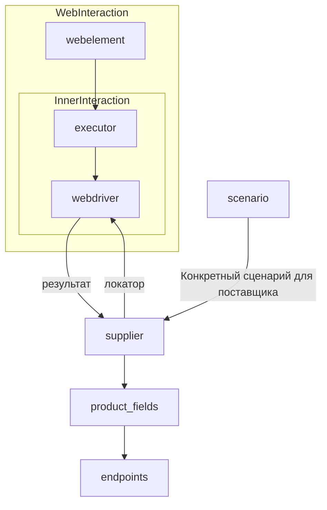

# Модуль `suppliers`

## Обзор

Данный модуль предоставляет базовый класс `Supplier` для взаимодействия с различными поставщиками данных (например, интернет-магазинами). Класс `Supplier` унифицирует работу с разными источниками данных, предоставляя стандартный набор операций для инициализации, авторизации и выполнения рабочих процессов.  Модуль поддерживает различные поставщиков, каждый из которых имеет уникальный префикс. Подробности о префиксах см. в файле [prefixes.md](prefixes.md).

## Классы

### `Supplier`

**Описание**: Базовый класс для всех поставщиков данных. Представляет собой универсальный интерфейс для работы с различными источниками данных.  Он отвечает за инициализацию, конфигурацию, аутентификацию и выполнение рабочих процессов для разных поставщиков (например, `amazon.com`, `walmart.com`). Клиенты могут определить дополнительных поставщиков.

**Атрибуты**:

- `supplier_id` (int): Уникальный идентификатор поставщика.
- `supplier_prefix` (str): Префикс поставщика, например, `'amazon'`, `'aliexpress'`.
- `supplier_settings` (dict): Настройки поставщика, загруженные из JSON-файла.
- `locale` (str): Код локализации (по умолчанию: `'en'`).
- `price_rule` (str): Правила расчёта цены (например, правила НДС).
- `related_modules` (module): Вспомогательные модули для специфических операций поставщика.
- `scenario_files` (list): Список файлов сценариев, которые нужно выполнить.
- `current_scenario` (dict): Сценарий, который выполняется в данный момент.
- `login_data` (dict): Данные для авторизации.
- `locators` (dict): Словарь локаторов веб-элементов.
- `driver` (Driver): Экземпляр WebDriver для взаимодействия с сайтом поставщика.
- `parsing_method` (str): Метод парсинга данных (например, `'webdriver'`, `'api'`, `'xls'`, `'csv'`).


**Методы**:

#### `__init__`

**Конструктор класса `Supplier`.**

```python
def __init__(self, supplier_prefix: str, locale: str = 'en', webdriver: str | Driver | bool = 'default', *attrs, **kwargs):
    """Инициализирует экземпляр Supplier.

    Args:
        supplier_prefix (str): Префикс поставщика.
        locale (str, optional): Код локализации. По умолчанию 'en'.
        webdriver (str | Driver | bool, optional): Тип WebDriver. По умолчанию 'default'.

    Raises:
        DefaultSettingsException: Если настройки по умолчанию не настроены должным образом.
    """
```

#### `_payload`

**Загружает настройки поставщика и инициализирует WebDriver.**

```python
def _payload(self, webdriver: str | Driver | bool, *attrs, **kwargs) -> bool:
    """Загружает настройки, локаторы и инициализирует WebDriver.

    Args:
        webdriver (str | Driver | bool): Тип WebDriver.

    Returns:
        bool: Возвращает `True`, если загрузка прошла успешно.
    """
```

#### `login`

**Обрабатывает авторизацию на сайте поставщика.**

```python
def login(self) -> bool:
    """Авторизует пользователя на сайте поставщика.

    Returns:
        bool: Возвращает `True`, если авторизация прошла успешно.
    """
```

#### `run_scenario_files`

**Выполняет один или несколько файлов сценариев.**

```python
def run_scenario_files(self, scenario_files: str | List[str] = None) -> bool:
    """Выполняет предоставленные файлы сценариев.

    Args:
        scenario_files (str | List[str], optional): Список или путь к файлам сценариев.

    Returns:
        bool: Возвращает `True`, если сценарии были успешно выполнены.
    """
```

#### `run_scenarios`

**Выполняет указанные сценарии.**

```python
def run_scenarios(self, scenarios: dict | list[dict]) -> bool:
    """Выполняет указанные сценарии.

    Args:
        scenarios (dict | list[dict]): Сценарии для выполнения.

    Returns:
        bool: Возвращает `True`, если все сценарии были выполнены успешно.
    """
```

## Список реализованных поставщиков

Список поддерживаемых поставщиков с указанием используемых рабочих процессов:

- [aliexpress](aliexpress) - Реализован с двумя рабочими процессами: `webdriver` и `api`.
- [amazon](amazon) - `webdriver`
- ... (и другие, как в исходном коде)


## Как это работает

(Описание процесса работы, как в исходном коде)



```