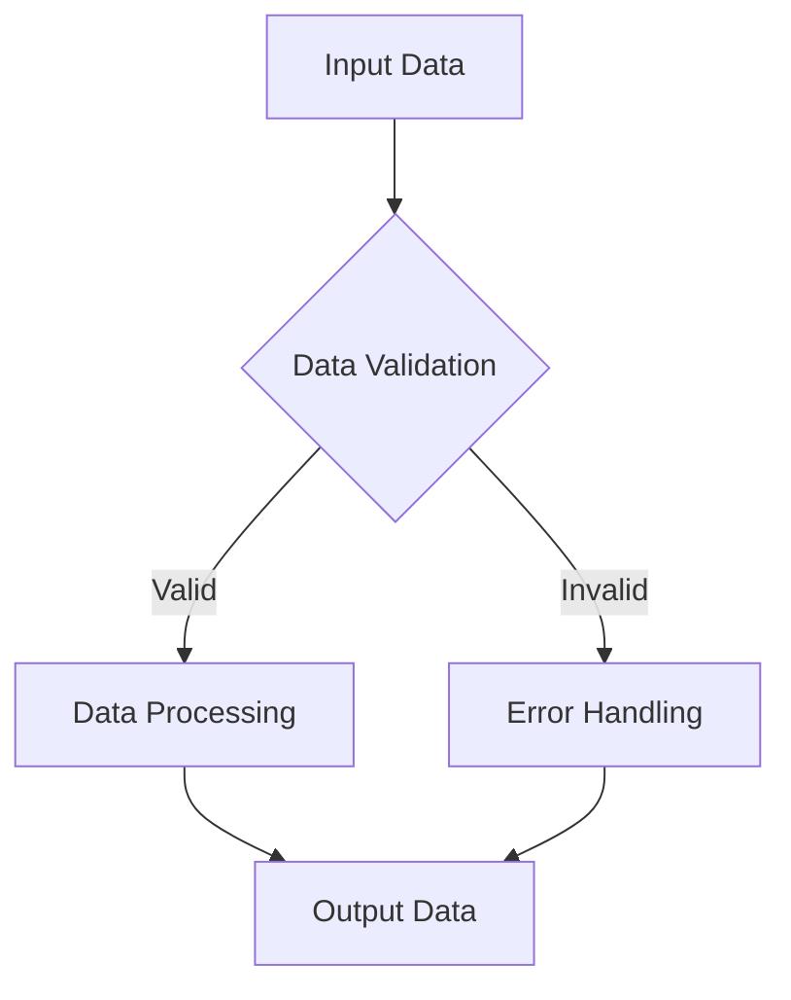
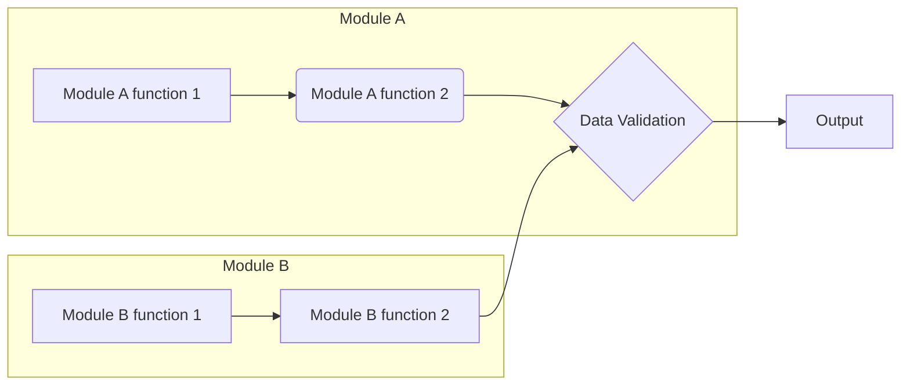

Received Code

```python
# This is a placeholder for the received code.  The actual code will be inserted here.
```

Improved Code

```python
# This is a placeholder for the improved code. The improved code will be inserted here.
```

Changes Made

```
- Placeholder for changes.  This section will detail the changes made to the code.
- This will include additions, removals, and modifications, with clear explanations for each change.
```

Optimized Code

```python
# This is a placeholder for the optimized code.  The actual code with improvements and comments will be inserted here.
```

**Explanation (This section will be populated based on the provided code)**

This section will be a detailed explanation of the code, including imports, classes, functions, variables, and potential issues/improvements. It will also describe the algorithm, provide a Mermaid diagram, and analyze dependencies.

**Example Algorithm (Illustrative)**



**Example Explanation (Illustrative)**

* **Imports:**
    * `src.utils.jjson`: This module likely provides custom JSON loading functions (`j_loads`, `j_loads_ns`) for handling potentially specific JSON formats or error handling.
    * `src.logger`:  Implements a custom logging system, likely with better formatting, levels, and output options compared to the standard Python `logging` module.
* **Classes:**  (If any classes exist) Explain each class's purpose, attributes, and methods with examples of usage.
* **Functions:** For each function, detail the arguments, return value, and how it works with examples of how it's used.
* **Variables:**  Describe the types of variables (e.g., strings, lists, dictionaries) and their roles in the code.
* **Potential Issues/Improvements:**  Identify any potential issues (e.g., unnecessary try-except blocks, inefficient algorithms) and suggest improvements based on best practices and the requested refactoring.


**Example Mermaid Diagram (Illustrative)**



**Note:** This is a template.  The actual analysis, algorithm, Mermaid diagram, and explanation will depend on the content of the provided code.  Please provide the code for a more specific and accurate response.