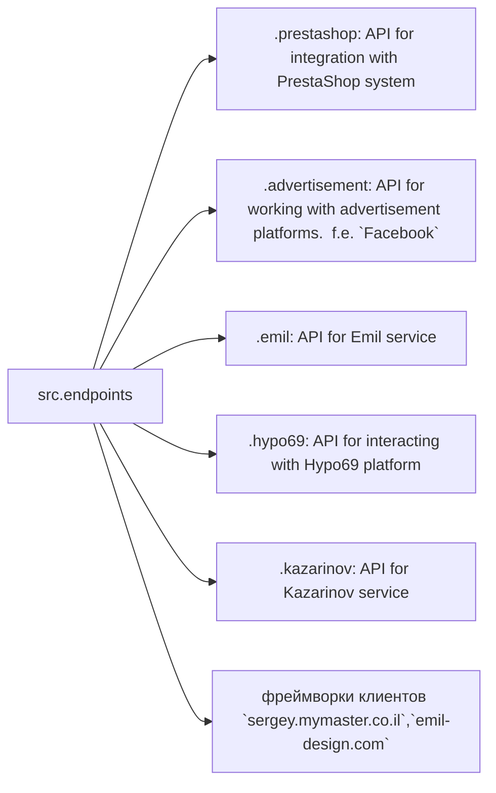

# endpoints Module

## Overview

This module provides API implementations for interacting with data consumers. Each subdirectory represents a separate module implementing an API for a specific service. The `endpoints` module includes submodules for integrating with various consumer systems, enabling interaction with external services.

## Table of Contents

- [Structure](#structure)
- [Final Consumer Endpoints](#final-consumer-endpoints)
- [Modules Description](#modules-description)
- [Installation and Usage](#installation-and-usage)
- [Contributing to Development](#contributing-to-development)

## Structure



## Final Consumer Endpoints

* **1. PrestaShop**: Integration with PrestaShop API. Uses standard APIs.
* **2. bots**: Submodule for managing integration with Telegram and Discord bots.
* **3. emil**: Submodule for integration with the https://emil-design.com client (prestashop + facebook).
* **4. kazarinov**: Submodule for integration with the Kazarinov data provider (pricelist creator, facebook promotion).


## Modules Description

### 1. `prestashop`

This module is designed for integration with the PrestaShop e-commerce system. It implements functionalities for interacting with orders, products, and customers.

* **Key Functions**:
    * Creating, editing, and deleting products.
    * Managing orders and users.

### 2. `advertisement`

This module provides an API for managing advertising platforms, including campaign creation and analytical reports.

* **Key Functions**:
    * Managing advertising campaigns.
    * Collecting and processing analytics data.


### 3. `emil`

Interface for working with the Emil service, providing an API for data exchange.

* **Key Functions**:
    * Processing and sending requests to the service.
    * Collecting data from the Emil API.


### 4. `hypo69`

API for interacting with the Hypo69 platform, providing specific business solutions.

* **Key Functions**:
    * Retrieving customer data.
    * Working with custom reports.


### 5. `kazarinov`

Module for integration with the Kazarinov service. Supports analytics and data exchange functionalities.

* **Key Functions**:
    * Integrating data between systems.
    * Creating reports and analytics.


## Installation and Usage

### Installation

Ensure all project dependencies are installed:

```bash
pip install -r requirements.txt
```

### Usage

Import the required module in your code:

```python
from src.endpoints.prestashop import PrestashopAPI
from src.endpoints.advertisement import AdvertisementAPI
```

Then configure and use the methods depending on your specific case.


## Contributing to Development

If you wish to contribute to this module, please adhere to the following guidelines:

1. Adhere to [PEP 8](https://peps.python.org/pep-0008/) coding style.
2. Include tests for new functionalities.
3. Provide detailed comments for changes.

For questions and suggestions, contact the repository owner or leave a comment in the [Issues](#).