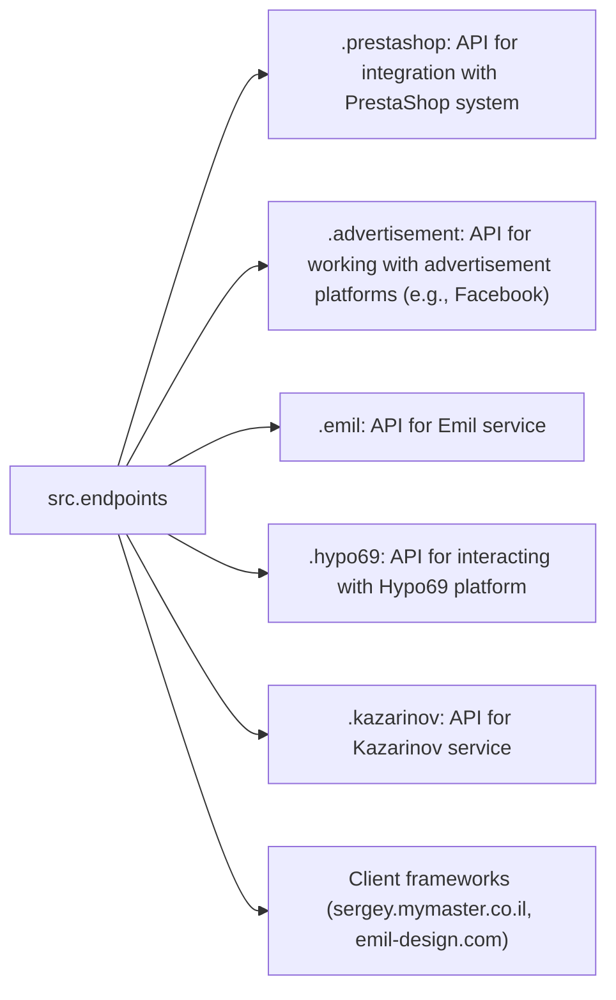

# Data Consumer Endpoints Module

## Overview

This module provides implementations of APIs for interacting with data consumers.  Each subdirectory represents a separate module implementing the API for a specific service, ensuring seamless interaction with external services.

## Table of Contents

[TOC]

## Module Structure



## Final Consumer Endpoints

#### 1. **PrestaShop**
Integration with the PrestaShop API, utilizing standard API features.

#### 2. **bots**
Submodule for managing integration with Telegram and Discord bots.

#### 3. **emil**
`https://emil-design.com`
Submodule for integrating with the client at `https://emil-design.com` (PrestaShop + Facebook).

#### 4. **kazarinov**
`https://sergey.mymaster.co.il`, `@hypo69_kazarinov_bot`
Submodule for integrating with the Kazarinov data provider (pricelist creator, Facebook promotion).


## Module Descriptions

### 1. `prestashop`

This module integrates with the PrestaShop e-commerce system, implementing functionality for managing orders, products, and customers.

- **Key Features**:
    - Create, edit, and delete products.
    - Manage orders and users.


### 2. `advertisement`

This module manages advertising platforms, including campaign creation and analytical reporting.

- **Key Features**:
    - Manage advertising campaigns.
    - Collect and process analytics data.


### 3. `emil`

Interface for working with the Emil service, providing an API for data exchange.

- **Key Features**:
    - Process and send requests to the service.
    - Retrieve data from the Emil API.


### 4. `hypo69`

API for interacting with the Hypo69 platform, offering specific business solutions.

- **Key Features**:
    - Retrieve client data.
    - Work with custom reports.


### 5. `kazarinov`

Module for integrating with the Kazarinov service, supporting analytics and data exchange functionality.

- **Key Features**:
    - Data integration between systems.
    - Generate reports and perform analytics.


## Installation and Usage

### Installation

Ensure all project dependencies are installed before starting. Use the following command:

```bash
pip install -r requirements.txt
```

### Usage

Import the required module into your code:

```python
from src.endpoints.prestashop import PrestashopAPI
from src.endpoints.advertisement import AdvertisementAPI
```

Then configure and use the methods as needed in your use case.


## Contribution

If you want to contribute, please follow these guidelines:

1. Adhere to [PEP 8](https://peps.python.org/pep-0008/) style.
2. Add tests for new features.
3. Provide detailed comments for any changes.

For questions or suggestions, contact the repository owner or use the Issues section.