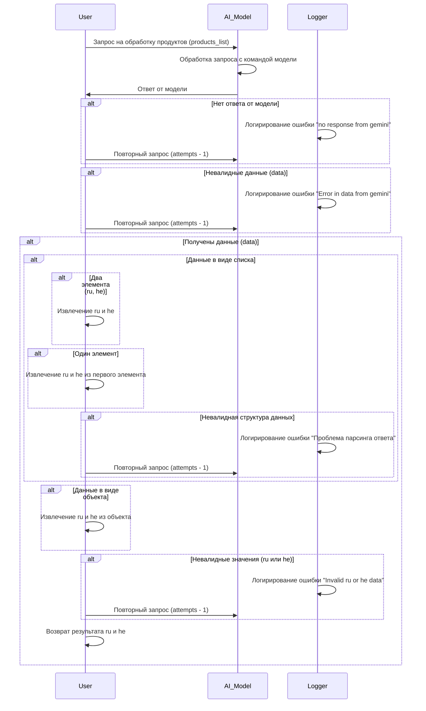

# Сценарии обработки продуктов

## Обзор

Данный документ описывает сценарии обработки запросов на обработку списка продуктов (products_list). Он охватывает процесс запроса к модели, обработку ответа, логирование ошибок и различные возможные варианты ответа модели и данных.

## Диаграмма последовательности

## Процесс обработки

1. **Запрос пользователя:** Пользователь отправляет запрос на обработку списка продуктов (products_list) к модели.

2. **Обработка модели:** Модель получает запрос и выполняет соответствующую обработку.

3. **Ответ модели:** Модель возвращает ответ, который может содержать различные типы данных и структур.

4. **Обработка ответа:**
    * **Проверка на отсутствие ответа:** Если ответа нет, происходит логирование ошибки "no response from gemini" и повторный запрос (с уменьшением попыток).
    * **Проверка на невалидные данные:** Если полученные данные некорректны (невалидная структура данных, неверный формат), происходит логирование ошибки "Error in data from gemini" и повторный запрос.
    * **Обработка списка:**
        * **Два элемента:** Если данные представляют собой список с двумя элементами (предполагается `ru` и `he`), происходит извлечение значений.
        * **Один элемент:** Если список содержит один элемент, происходит попытка извлечения значений `ru` и `he` из этого единственного элемента.
        * **Невалидная структура данных:** Если данные имеют невалидную структуру списка, происходит логирование ошибки "Проблема парсинга ответа" и повторный запрос.
    * **Обработка объекта:** Если данные представлены в виде объекта, происходит извлечение значений `ru` и `he`.
    * **Проверка на невалидные значения:** Если извлеченные значения `ru` или `he` некорректны, происходит логирование ошибки "Invalid ru or he data" и повторный запрос.
    * **Возврат результата:** После успешной обработки данных возвращается результат с значениями `ru` и `he`.

## Логирование

В процессе обработки используются логгеры для записи ошибок ("no response from gemini", "Error in data from gemini", "Проблема парсинга ответа", "Invalid ru or he data") и отслеживания выполнения процесса.

##  Возможные ошибки

* **Отсутствует ответ от модели:**  Модель не возвращает ожидаемого ответа.
* **Некорректные данные:**  Полученные данные имеют неверный формат или структуру.
* **Некорректные значения `ru` или `he`:**  Извлеченные значения `ru` или `he` имеют неверный тип или значение.

## Заключение

Этот сценарий описывает процесс обработки запроса на получение данных `ru` и `he` из списка продуктов или объекта. Он предоставляет информацию о потенциальных ошибках и процедурах обработки таких ошибок.