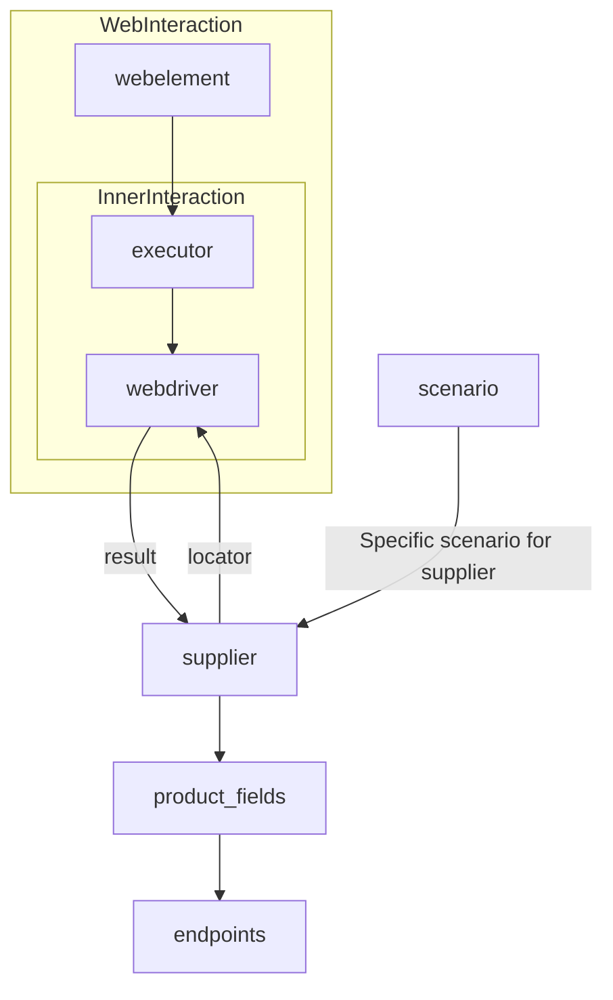

# Supplier Class Documentation

## Overview

This module defines the `Supplier` class, which serves as a base class for interacting with various data providers (suppliers).  It handles initialization, configuration, authentication, and execution of workflows for different data sources, including websites like `amazon.com`, `walmart.com`, and more.  It also allows users to define custom suppliers.  The class is designed for standardized interaction with suppliers, using specific prefixes and workflows.

## Table of Contents

- [Supplier Class](#supplier-class)
    - [Attributes](#attributes)
    - [Methods](#methods)
    - [How it Works](#how-it-works)
- [Implemented Suppliers](#implemented-suppliers)

## Supplier Class

### Description

The `Supplier` class is the base class for all suppliers, providing a common interface for interacting with different data sources. It manages initialization, configuration, authentication, and executing workflows.

### Attributes

- `supplier_id` (int): Unique identifier for the supplier.
- `supplier_prefix` (str): Supplier prefix (e.g., 'amazon', 'aliexpress').
- `supplier_settings` (dict): Supplier settings loaded from a JSON file.
- `locale` (str): Localization code (default: 'en').
- `price_rule` (str): Rules for price calculations (e.g., VAT rules).
- `related_modules` (module): Helper modules for specific supplier operations.
- `scenario_files` (list): List of scenario files to be executed.
- `current_scenario` (dict): Scenario currently being executed.
- `login_data` (dict): Data for authentication.
- `locators` (dict): Dictionary of web element locators.
- `driver` (Driver): WebDriver instance for interacting with the supplier's website.
- `parsing_method` (str): Data parsing method (e.g., 'webdriver', 'api', 'xls', 'csv').

### Methods

#### `__init__`

**Description**: Constructor of the `Supplier` class. Initializes the supplier with its prefix, locale, and WebDriver type.

**Parameters**:
- `supplier_prefix` (str): The supplier's prefix.
- `locale` (str, optional): Localization code. Defaults to 'en'.
- `webdriver` (str | Driver | bool, optional): Type of WebDriver. Defaults to 'default'.

**Raises**:
- `DefaultSettingsException`: If default settings are not properly configured.

#### `_payload`

**Description**: Loads supplier settings, locators, and initializes the WebDriver.

**Parameters**:
- `webdriver` (str | Driver | bool): Type of WebDriver.

**Returns**:
- bool: `True` if loading was successful.

#### `login`

**Description**: Handles authentication on the supplier's website.

**Returns**:
- bool: `True` if login was successful.

#### `run_scenario_files`

**Description**: Runs the provided scenario files.

**Parameters**:
- `scenario_files` (str | List[str], optional): List or path to scenario files. Defaults to None.

**Returns**:
- bool: `True` if scenarios were executed successfully.

#### `run_scenarios`

**Description**: Executes specified scenarios.

**Parameters**:
- `scenarios` (dict | list[dict]): Scenarios to be executed.

**Returns**:
- bool: `True` if all scenarios were executed successfully.

### How it Works

1.  **Initialization**: The `__init__` method initializes the supplier with its prefix, localization, and WebDriver type.
2.  **Loading settings**: The `_payload` method loads the configuration, initializes locators, and creates the WebDriver instance.
3.  **Authentication**: The `login` method handles the authentication process on the supplier's website.
4.  **Executing scenarios**: The `run_scenario_files` and `run_scenarios` methods execute the specified scenarios.

## Implemented Suppliers

- [aliexpress](aliexpress) - Implemented with two workflows: `webdriver` and `api`
- [amazon](amazon) - `webdriver`
- [bangood](bangood) - `webdriver`
- [cdata](cdata) - `webdriver`
- [chat_gpt](chat_gpt) - Interacts with the ChatGPT interface (NOT THE MODEL!)
- [ebay](ebay) - `webdriver`
- [etzmaleh](etzmaleh) - `webdriver`
- [gearbest](gearbest) - `webdriver`
- [grandadvance](grandadvance) - `webdriver`
- [hb](hb) - `webdriver`
- [ivory](ivory) - `webdriver`
- [ksp](ksp) - `webdriver`
- [kualastyle](kualastyle) - `webdriver`
- [morlevi](morlevi) - `webdriver`
- [visualdg](visualdg) - `webdriver`
- [wallashop](wallashop) - `webdriver`
- [wallmart](wallmart) - `webdriver`

[Details on WebDriver :class:`Driver`](../webdriver)
[Details on workflows :class:`Scenario`](../scenarios)

