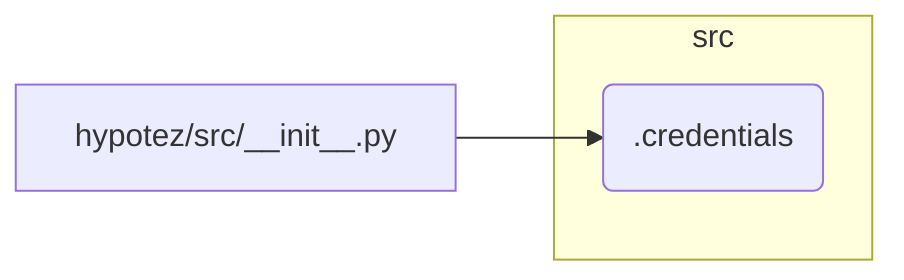

# <input code>

```python
## \file hypotez/src/__init__.py
# -*- coding: utf-8 -*-\
#! venv/Scripts/python.exe
#! venv/bin/python/python3.12

"""
.. module: src 
	:platform: Windows, Unix
	:synopsis:

Root of the project.
========================================================================================

This module provides a structured overview of various modules within the project,
detailing their primary functionalities and roles.

Usage Example
--------------------

.. code-block:: python

    # No usage example available for this module.
"""
MODE = 'dev'

from .credentials import gs
```

# <algorithm>

No algorithm is present in this code as it is an `__init__.py` file. It serves as an entry point for the `src` package and imports submodules.

# <mermaid>



**Dependencies Analysis:**

The `__init__.py` file imports `gs` from the `.credentials` module within the same package. This implies that the `.credentials` module is likely defining a variable or function named `gs`.

# <explanation>

* **Imports:**
    * `from .credentials import gs`: This line imports the variable or function named `gs` from the `.credentials` module within the `hypotez/src` package.  The `.credentials` file would need to contain a definition like `gs = "my-google-service-credentials"` or similar, or a function that returns the value of `gs`.  This is a standard Python package initialization pattern.


* **Variables:**
    * `MODE = 'dev'`: This defines a global variable named `MODE` with the string value 'dev'. This variable likely controls the execution mode (e.g., development, production) of the application.

* **Potential Errors/Improvements:**
    * **Missing Documentation:** The docstring for `gs` is crucial; it should clearly define what the variable represents and how it's used.
    * **No Usage Example:** The docstring lacks a clear example of how `src` module would be used in practice.
    * **File Path Specificity**:  The use of `#! venv/Scripts/python.exe` and `#! venv/bin/python/python3.12` at the top is unusual within a Python file and might cause issues if the script is not being executed from the expected environment.  It would be better to rely on the operating system environment to discover the correct Python interpreter.


* **Relationships with other parts of the project:**
    * The `src` package likely contains other modules that utilize the `gs` variable or function imported here.  This `gs` likely represents a Google Service Account or some other crucial project-specific resource or data. This suggests that the `credentials` module handles authentication or configuration and that other parts of the code depend on the value of `gs` for initialization or access to services.


**Overall:**

This `__init__.py` file acts as a central point for the `hypotez/src` package, importing necessary elements and defining a constant for potentially conditional logic later in the project.  The missing usage example and the lack of documentation for `gs` hinder understanding the precise role of this module in the broader application's architecture.