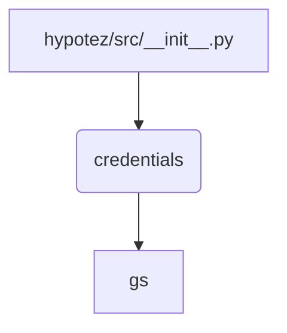

# Code Explanation for hypotez/src/__init__.py

## <input code>

```python
## \file hypotez/src/__init__.py
# -*- coding: utf-8 -*-
#! venv/Scripts/python.exe
#! venv/bin/python/python3.12

"""
.. module: src 
	:platform: Windows, Unix
	:synopsis:

Root of the project.
========================================================================================

This module provides a structured overview of various modules within the project,
detailing their primary functionalities and roles.

Usage Example
--------------------

.. code-block:: python

    # No usage example available for this module.
"""
MODE = 'dev'

from .credentials import gs
```

## <algorithm>

No algorithm is present as this file is primarily a module initialization file. It imports a module named `credentials` and defines a variable `MODE`.


## <mermaid>



**Explanation of Dependencies:**

* `credentials`: The `.credentials` module (likely in the same `src` directory or a subdirectory) is imported. This suggests that the `credentials` module contains necessary information or configurations (possibly for authentication or access to external services like Google Cloud Storage) to be used elsewhere in the project.  It appears that `credentials.py` exports the variable `gs` which is then accessible.

## <explanation>

* **Imports:**
    * `from .credentials import gs`: This line imports a variable named `gs` from the `credentials.py` module within the `hypotez/src` directory. The `.` before the module name indicates that the `credentials.py` module is located in the same directory as the current file. This import likely allows using Google Cloud Storage or some other service that the `credentials.py` file sets up.


* **Variables:**
    * `MODE = 'dev'`: This variable likely controls the operation mode of the application (e.g., development, production). This allows for configuration changes that would affect how the project is run.

* **Potential Errors/Improvements:**
    * **Missing Usage:** The docstring mentions a lack of usage example, but it could be helpful to document the purpose of this init file and any special considerations of using the imported functions.  For example, it could describe the expected structure of the `credentials.py` module.
    * **Possible Redundancy:**  The shebang lines (`#! venv/Scripts/python.exe`, `#! venv/bin/python/python3.12`) might be redundant if the project already uses a virtual environment management tool.  The best practice is to rely on the tool's mechanisms for executing Python files.


* **Relationship to Other Parts:** This `__init__.py` file acts as an entry point to the `src` directory. It imports necessary components from other modules, which then, in turn, are used in other parts of the application.  The specific function/class from `credentials` is not described here, but it provides essential configuration or access to services.  This init file is a central place to define project-wide constants or establish a link to external services.