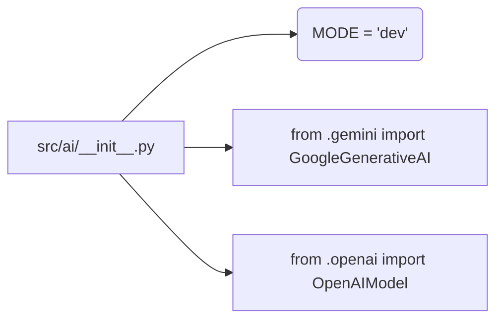

# Code Explanation for hypotez/src/ai/__init__.py

## <input code>

```python
## \file /src/ai/__init__.py
# -*- coding: utf-8 -*-
#! venv/Scripts/python.exe
#! venv/bin/python/python3.12

"""
module: src.ai
	:platform: Windows, Unix
	:synopsis: Модуль интерфейса моделей ИИ.
	"""
MODE = 'dev'

from .gemini import GoogleGenerativeAI
from .openai import OpenAIModel
```

## <algorithm>

This file acts as an initialization module for the `ai` package.  It primarily imports classes from submodules (`gemini` and `openai`). No complex algorithm is present. It simply defines a global variable and imports the specified classes.

**Step-by-step Block Diagram:**

1. **Initialization:** The `MODE` variable is defined, setting a global variable with a string value 'dev'.  (Example value).
2. **Import Statements:**  The file imports `GoogleGenerativeAI` and `OpenAIModel` from their respective submodules (`gemini` and `openai`).  This establishes the availability of these classes within the `ai` module.

## <mermaid>



**Dependencies Analysis:**

This mermaid diagram shows the basic structure. The imports `from .gemini import GoogleGenerativeAI` and `from .openai import OpenAIModel` indicate that the `ai` module depends on the submodules `gemini` and `openai` for functionality.  The dependency relationship suggests that `gemini` and `openai` contain the definitions for the `GoogleGenerativeAI` and `OpenAIModel` classes, respectively. The `.` prefix in the import statements implies that the modules `gemini` and `openai` reside within the `src/ai` directory.

## <explanation>

* **Imports:**
    * `from .gemini import GoogleGenerativeAI`: Imports the `GoogleGenerativeAI` class from the `gemini` module, which is likely to handle interactions with Google's Gemini AI models. The `.` indicates that the `gemini` module is located within the same directory structure as `ai`.
    * `from .openai import OpenAIModel`: Imports the `OpenAIModel` class from the `openai` module, responsible for interactions with OpenAI's models.  This import structure suggests a modular design, separating the model interactions into distinct parts of the project.


* **Variables:**
    * `MODE = 'dev'`:  A global variable likely used to indicate the current operating mode (e.g., development, production).  This is a simple way to control which model or configurations are used in different environments.

* **Classes (implied):**
    * `GoogleGenerativeAI`: This class likely handles the specific API calls and interactions for the Google Gemini model.
    * `OpenAIModel`: This class likely handles the API calls and interactions for the OpenAI models.

* **Functions (implied):**
    * Methods within `GoogleGenerativeAI` and `OpenAIModel` are crucial for the functionality, enabling actions like generating text, making requests to the respective APIs, etc.

* **Potential Errors/Improvements:**

    * **Error Handling:**  No error handling is present. It's highly recommended to add `try...except` blocks around the import statements to catch potential issues (e.g., missing modules).
    * **Configuration:**  Hardcoding the `MODE` variable might not be ideal.  In a real application, a configuration file (e.g., YAML or JSON) would be better for managing environment-dependent settings.
    * **Docstrings:**  While the module docstring is present, the lack of docstrings for variables and classes hinders understanding. This would improve the overall code's documentation quality.

**Relationships to other parts of the project:**

The `src.ai` module appears to be part of a larger project with different components. The modules `gemini` and `openai` likely implement the communication protocols for interacting with the external AI services, forming a dependency chain where `src.ai` utilizes the functionality provided by those external layers.
```