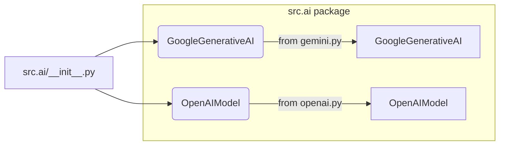

# Code Explanation for hypotez/src/ai/__init__.py

## <input code>

```python
## \file /src/ai/__init__.py
# -*- coding: utf-8 -*-
#! venv/Scripts/python.exe
#! venv/bin/python/python3.12

"""
module: src.ai
	:platform: Windows, Unix
	:synopsis: Модуль интерфейса моделей ИИ.
	"""
MODE = 'dev'

from .gemini import GoogleGenerativeAI
from .openai import OpenAIModel
```

## <algorithm>

This file acts as an entry point for the AI models within the `hypotez` project.  It primarily imports classes from other modules within the `src.ai` package.  There's no algorithmic workflow *within* this file itself; it only prepares access to the AI models.

* **Step 1:**  Import declarations. The file imports classes from submodules.
    * Example:  Calling `from .gemini import GoogleGenerativeAI` imports the `GoogleGenerativeAI` class from the `gemini.py` file.


## <mermaid>



**Dependencies Analysis**:

The mermaid diagram shows a simple import structure.  `src.ai` imports classes from `gemini.py` and `openai.py`, which are likely located within the `src.ai` folder.  This indicates a module/package structure within the project.


## <explanation>

* **Imports:**
    * `from .gemini import GoogleGenerativeAI`: Imports the `GoogleGenerativeAI` class from the `gemini.py` module within the `src.ai` package.  The `.` indicates a relative import, meaning the module is located in a subdirectory (i.e., `gemini.py`). The implication is `gemini.py` likely defines and implements a Google Generative AI model API or interface.
    * `from .openai import OpenAIModel`: Imports the `OpenAIModel` class from the `openai.py` module within the `src.ai` package. Similar to the previous import, this likely defines an OpenAI model interface.

* **Variables:**
    * `MODE = 'dev'`: A string variable likely indicating the current operating mode (e.g., development, production).  This variable is likely used for conditional logic in other parts of the project, enabling different configurations during different stages.

* **Classes (implicitly defined):**
    * `GoogleGenerativeAI`: A class representing a Google Generative AI model.
    * `OpenAIModel`: A class representing an OpenAI model.

* **Functions (none explicitly defined):**  This file doesn't contain any functions. It solely manages imports.

* **Potential Errors/Improvements:**

    * **Missing documentation:** While the file has a docstring, the classes `GoogleGenerativeAI` and `OpenAIModel` likely need more comprehensive documentation in their respective modules.  Lack of comprehensive documentation will make it harder to understand these classes' intended behavior and usage.

    * **Dependency management:**  While the current structure is straightforward, a more sophisticated dependency management system (e.g., `requirements.txt`) would be a good practice for a larger project, helping to clarify dependencies and ensure consistent setups across different environments.


* **Relationships with other parts of the project:**

This file acts as an interface to AI models.  Other parts of the project (e.g., modules handling user input, data processing, or UI) will likely use these classes to interact with the AI models.  Therefore, this `src.ai/__init__.py` file is a crucial part of the project's architecture for interacting with AI model functionality.