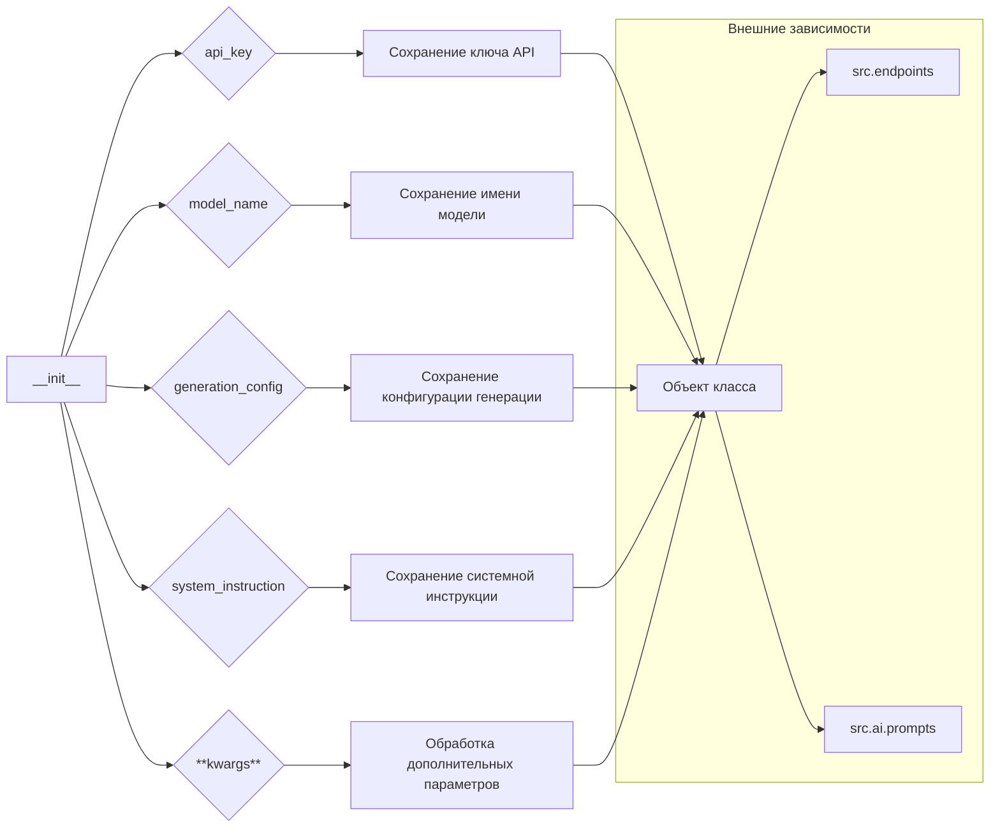

# Анализ кода модели `gemini`

## <input code>

```python
    def __init__(self, 
                 api_key: str, 
                 model_name: Optional[str] = None, 
                 generation_config: Optional[Dict] = None, 
                 system_instruction: Optional[str] = None, 
                 **kwargs):
        ...
```

## <algorithm>

Эта функция `__init__` представляет собой конструктор класса, инициализирующий его состояние.  Нет явного алгоритма в представленном коде, так как он не содержит логики.  Он лишь определяет параметры, которые могут быть использованы внутри класса.

**Блок-схема (пример):**

```
+-----------------+
|      __init__   |
+-----------------+
|  api_key: str   | -->| Сохранение ключа API|
|  model_name: str | -->| Сохранение имени модели |
| generation_config: Dict | -->| Сохранение конфигурации генерации |
|  system_instruction: str| -->| Сохранение системной инструкции |
+-----------------+
  |  **kwargs      | -->| Обработка дополнительных параметров |
+-----------------+
| Возврат объекта |
+-----------------+
```

**Примеры данных:**

* `api_key`: "your_api_key_here"
* `model_name`: "gemini-pro"
* `generation_config`: `{'max_tokens': 100, 'temperature': 0.7}`
* `system_instruction`: "Generate a concise summary of the provided text."

## <mermaid>



**Объяснение зависимостей:**

* `src.endpoints`:  Возможно, содержит конфигурацию конечных точек API, необходимых для взаимодействия с моделью Gemini.
* `src.ai.prompts`:  Скорее всего, содержит определения глобальных инструкций, используемых для контекста запросов к модели.

## <explanation>

* **Imports:** Нет импортов в приведенном коде. Зависимости имплицированы через `Optional`, `Dict`, `str` и `**kwargs`.

* **Classes:** Конструктор `__init__` определяет, как будут инициализироваться экземпляры класса.  Полный код класса `gemini` отсутствует, поэтому невозможна полная оценка его функциональности.

* **Functions:** Функция `__init__`  — это конструктор класса. Она принимает аргументы для инициализации объектов класса:
    * `api_key`:  Ключ API для доступа к Gemini.
    * `model_name`:  Название модели Gemini, используемой для генерации текста.
    * `generation_config`:  Дополнительные параметры для настройки процесса генерации текста.
    * `system_instruction`: Системная инструкция, которая задаёт контекст для всех запросов к модели.
    * `**kwargs`: Дополнительные ключевые аргументы, которые могут быть переданы при создании объекта.
    * Возвращает: Объект класса `gemini`.


* **Variables:** `api_key`, `model_name`, `generation_config`, `system_instruction` - переменные, хранящие параметры, необходимые для работы с моделью.  `**kwargs`  - переменная, хранящая любые другие аргументы.  Эти переменные являются атрибутами экземпляра класса.

* **Potential Errors or Areas for Improvement:**


    * Отсутствует обработка ошибок.  Необходимо добавить проверку корректности входных данных (`api_key`, `model_name`).
    * Необходимо задокументировать, как обрабатываются дополнительные аргументы `**kwargs`.
    * Неясно, как будут обрабатываться изменения `system_instruction` после инициализации.


**Chain of Relationships:**

```
src/ai/gemini -> src/endpoints (для запросов к API) -> src/ai/prompts (для системных инструкций)
```

В данном коде представлены только начальные этапы работы с моделью.  Для полной оценки функциональности необходим весь класс `gemini`, а также код использующих его компонентов.