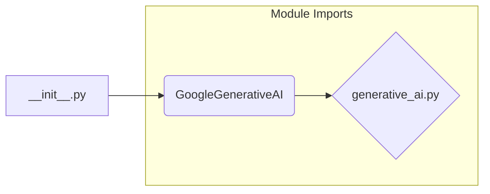
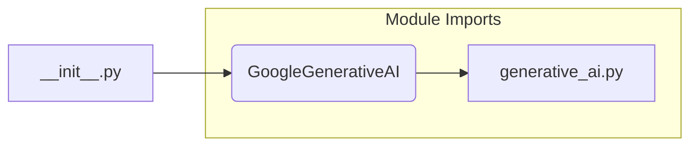

# <input code>

```python
## \file hypotez/src/ai/gemini/__init__.py
# -*- coding: utf-8 -*-\
#! venv/Scripts/python.exe
#! venv/bin/python/python3.12

"""
.. module: src.ai.gemini 
	:platform: Windows, Unix
	:synopsis: Модуль модели `gemini`

"""
MODE = 'dev'


from .generative_ai import GoogleGenerativeAI
```

# <algorithm>



**Step-by-Step Workflow:**

1.  The `__init__.py` file is the entry point for the `gemini` module.
2.  It imports the `GoogleGenerativeAI` class from the `generative_ai.py` module within the `gemini` subpackage.
3.  The module sets `MODE` to `'dev'`. This is a global variable, likely for configuration purposes (e.g., different settings for development and production environments).


# <mermaid>



**Dependencies:**

The diagram shows a direct dependency of `__init__.py` on `generative_ai.py` within the `gemini` package.  This is a standard Python package structure. The `generative_ai.py` module likely contains the implementation details for the `GoogleGenerativeAI` class.

# <explanation>

* **Imports:**
    * `from .generative_ai import GoogleGenerativeAI`: This line imports the `GoogleGenerativeAI` class from the `generative_ai.py` module within the `gemini` subpackage. The `.` indicates that the module is located within the current package.  This is a standard Python import pattern.

* **Variables:**
    * `MODE = 'dev'`: This variable likely controls configuration options for the module.  In a typical application, this would be used to define different behaviors in development or production.


* **Classes:**
    * `GoogleGenerativeAI`: The imported class, its detailed implementation is located in `generative_ai.py`. Without the code from `generative_ai.py`, we cannot fully describe its attributes and methods.  It likely represents a wrapper around a Google AI generative model.

* **Functions:**
    * There are no functions defined directly in `__init__.py`.  All function implementations would reside within the imported `GoogleGenerativeAI` class or other modules.

* **Potential Errors/Improvements:**
    * The docstrings are in Russian. Consider using English docstrings for broader accessibility.
    * The use of `#! venv/Scripts/python.exe` and `#! venv/bin/python/python3.12` as shebang lines is unusual. This likely part of a custom setup or a virtual environment issue (using `#!python3`). Consider using standard Python shebangs.


**Relationships with Other Parts of the Project:**

The `gemini` package likely interacts with other modules (possibly other `ai` subpackages or models) in the `hypotez` project. The `generative_ai.py` module further defines the dependencies and relationships within the AI models' architecture. Without access to the other parts of the project, these relationships cannot be fully described.

**Summary:**

This `__init__.py` file acts as a module initializer for the `gemini` package, primarily importing and configuring the `GoogleGenerativeAI` class for use elsewhere in the project. Its current structure is typical of Python package initialization.