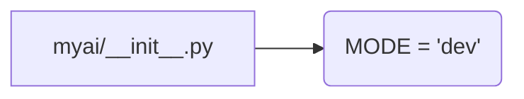

## <input code>

```python
## \file hypotez/src/ai/myai/__init__.py
# -*- coding: utf-8 -*-
#! venv/Scripts/python.exe
#! venv/bin/python/python3.12

"""
.. module: src.ai.myai 
	:platform: Windows, Unix
	:synopsis:

"""
MODE = 'dev'
```

## <algorithm>

This Python file (`__init__.py`) is a module initialization file within the `hypotez/src/ai/myai` package.  It's responsible for setting up the module for use in other parts of the project.

There are no functions or classes defined here.  It's essentially a configuration file for the package.

* **Step 1:** The module is initialized.
* **Step 2:** The global variable `MODE` is set to 'dev'.


## <mermaid>



This `mermaid` code simply depicts a single relationship: the initialization file `myai/__init__.py` sets the value of the `MODE` variable.  There are no external dependencies in this file other than python's built-in modules.


## <explanation>

* **Imports:** There are no imports in this file. This is a common pattern for `__init__.py` files; they often serve as containers for global configuration or setup variables.

* **Classes:** There are no classes defined.

* **Functions:** There are no functions defined.

* **Variables:**
    * `MODE`: A string variable. Its purpose appears to be a configuration setting.  In this case, the value `'dev'` likely signifies a development mode for the `myai` module, which could affect behavior or logging in other parts of the system.

* **Potential Errors/Improvements:**

    * **Lack of documentation:** While docstrings are present, they lack specific details about the usage and purpose of the `MODE` variable.  A more detailed explanation of what "dev" mode entails would be beneficial.  Ideally, a brief explanation (e.g., "Development mode, enabling debug logging") would be included.
    * **Constant naming convention:** Consider using all-uppercase names (e.g., `DEVELOPMENT_MODE`) for configuration constants to easily differentiate them from other variables.
    * **Missing context:** The file doesn't show how this variable is used or how it might affect other parts of the application. The lack of context makes it hard to understand its real-world significance.


**Relationships with other parts of the project:**

The `MODE` variable in this file could potentially be accessed and used by other modules within the `hypotez/src/ai` package (or even outside of it). For instance, other parts of the application might use this variable to customize their behavior based on whether the system is in development mode or production mode.  Understanding where the `myai` module is used would allow a more detailed analysis of its impact.


**Chain of relationships:**

1. `hypotez/src/ai/myai/__init__.py` defines `MODE`
2. Other modules or classes within `hypotez/src/ai/myai` (or possibly even outside `src.ai`) might use `MODE`.
3. These potentially use it for conditional logging, configuration settings, or execution logic.  The specifics depend entirely on the code in the other related parts of the program.


In summary, this `__init__.py` file is a very basic configuration file for the `myai` module. Its value will likely be accessed in other parts of the `hypotez` project to control aspects of the `myai` functionality.