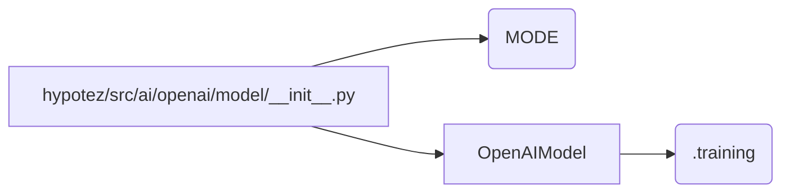

```MD
# Code Explanation for hypotez/src/ai/openai/model/__init__.py

## <input code>

```python
## \file hypotez/src/ai/openai/model/__init__.py
# -*- coding: utf-8 -*-\
#! venv/Scripts/python.exe
#! venv/bin/python/python3.12

"""
.. module: src.ai.openai.model 
	:platform: Windows, Unix
	:synopsis:

"""
MODE = 'dev'


from .training import OpenAIModel
```

## <algorithm>

This file acts as an initialization module for the `openai` model components within the `hypotez` project.  It primarily establishes a global variable `MODE` and imports the `OpenAIModel` class from a submodule named `training`.

**Step 1:**  Define the `MODE` variable (no data flow, pure configuration).


```
MODE = 'dev'
```


**Step 2:** Import `OpenAIModel`

```
from .training import OpenAIModel
```

(Import the `OpenAIModel` class from a submodule `training`.)


## <mermaid>



**Dependencies:**

* `OpenAIModel` is imported from `hypotez/src/ai/openai/model/training.py`. This implies a dependency between the `model` and `training` modules.


## <explanation>

* **Imports:**
    * `from .training import OpenAIModel`: This line imports the `OpenAIModel` class from the `training` submodule within the `openai` package. The `.` in front of the `training` submodule indicates that the `training` module is located within the same package as the current file. This is a common Python practice for organizing related modules in a package. The `training` module is expected to contain the implementation details for the `OpenAIModel`.

* **Variables:**
    * `MODE = 'dev'`:  This global variable likely controls the behavior of the model.  In a development environment, 'dev' mode might enable different logging configurations or use debug versions of dependencies.

* **Classes (indirect):**
    * `OpenAIModel`: This class definition is not present in the provided code snippet. It will be defined in `hypotez/src/ai/openai/model/training.py`. It would presumably implement the logic for interacting with the OpenAI API, potentially handling training, inference, or other functionalities.


* **Functions (indirect):** The initialization file does not define any functions. The functions, which would execute specific OpenAI Model operations, are likely within the `OpenAIModel` class or within related classes/functions in the `training` module.


* **Potential Errors/Improvements:**
    * **Missing docstrings:**  Adding docstrings to `MODE` would be beneficial to explain the meaning and impact of different mode values.
    * **Missing `OpenAIModel` implementation:** The `OpenAIModel` class is not fully defined within this file.  This part of the code relies on a separate file within the same package hierarchy.


**Relationship Chain:**

1. `hypotez/src/ai/openai/model/__init__.py` imports `OpenAIModel`
2. `OpenAIModel` (presumably) interacts with OpenAI API libraries.
3. `OpenAIModel` might utilize other functions/classes within the `src` package that are responsible for setting up and managing communication with the external API.

**In Summary:**  This `__init__.py` file serves as a way of making the `OpenAIModel` class available for use within the other modules of the `hypotez` project.  The core logic and implementation are contained in another file named `training.py` in the same package directory.