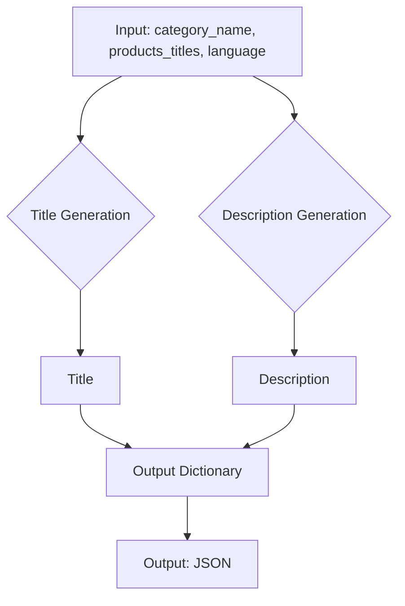

# Code Explanation: AliExpress Campaign System Instruction

## 1. <input code>

```
your role: `promo_creater`
I send you the category name, a list of product titles, and the language to use. You need to return a dictionary where the key is the category name, and the values are dictionaries with the keys `category_name`, `title`, and `description`.
`category_name` should be equal to the category name.
`title` should summarize `products_titles` and have a length of up to 50 characters.
`description` Create a note for housewives based on the names of products. Use products to diversify the note. The length should not exceed 1200 characters.
A note ас from a household calendar is called a calendar note or calendar entry. In traditional calendars, especially household or tear-off ones, such notes contain various useful tips, information about events, historical facts, folk signs, astrological forecasts or useful household recommendations for each day.
Use the language defined in `language`. Output format: `JSON`

Example input:
language = "RU"
category_name = "liitokala_18650"
products_titles = [Зарядное устройство LiitoKala Lii-M4S-M4 для аккумуляторных батарей, 3,7 в, 18650, 26650, 21700, 18500, литий-ионный, 1,2 в, Ni-MH, AA, испытательная Емкость
LiitoKala Lii-S12 Lii-D4XL-Lii S8 LCD 21700 18650 3,7 V Li-Ion 3,2 V LiFePO4 1,2 V NiMH/Cd 26650 32700 D AA AAA 9V зарядное устройство
... (many more product titles)
]

Example result:
{
    "liitokala_18650": {
        "category_name": "liitokala_18650",
        "title": "Зарядные устройства LiitoKala для аккумуляторов 18650 ...",
        "description": "LiitoKala для разных типов аккумуляторов: iitoKala Lii-M4S-M4,  LiitoKala Lii-S12 Lii-D4XL-Lii S8 LCD, LiitoKala Lii-S12 Lii-S8 Lii-PD4 Lii-PD2 Lii-500S, LiitoKala Lii-M4,  LiitoKala Lii-202 Lii-402,  LiitoKala Lii-D4,  LiitoKala Lii-PD2,  LiitoKala Lii-M4S + U1,  OPUS BT-C3100,   Зарядное устройство LiitoKala для Li-Ion LiFePO4 Ni-MH Ni-Cd батарей с ЖК-дисплеем,  Зарядное устройство LiitoKala для аккумуляторов  AA AAA 10440 14500 16340 17335 17500 18490 17670  и другие. Все зарядные устройства отличаются высоким качеством, функциональностью и надежностью. Выбирайте зарядное устройство LiitoKala для ваших аккумуляторов и будьте уверены в их безопасности и долговечности"
    }
}
```

## 2. <algorithm>

**Step 1:** Input: `category_name`, `products_titles`, `language`.

**Step 2:** Generate a concise title for the category, summarizing the product titles.  (Example:  "LiitoKala Chargers for 18650 Batteries" - this example is not precise because the input code has a long title with multiple product models).

**Step 3:**  Craft a detailed description (calendar note) for housewives about the products.  The description should mention various product models and highlight key features.  (Example: mentions multiple models like LiitoKala Lii-M4S-M4, LiitoKala Lii-S12, etc).

**Step 4:**  Assemble the output dictionary with keys `category_name`, `title`, and `description`, adhering to the specified character limits.

**Data Flow:** Input data (`category_name`, `products_titles`, `language`) are passed to the function. The function processes this data to generate the title and description. The result, a JSON dictionary, is returned.

## 3. <mermaid>



**Dependencies Analysis:**

The mermaid code defines a simple data flow graph. No explicit dependencies on external libraries or files are shown. This is a conceptual representation; the actual code likely interacts with system resources (e.g., for string manipulation) implied by the required actions in the instructions.

## 4. <explanation>

**Imports:**  There are no imports in the provided code snippet.

**Classes:** There are no classes.

**Functions:**

The code snippet describes the expected behavior of a function (likely a method or part of a larger program) called `promo_creater`. This function takes three arguments:

   - `category_name`: (String) The name of the category of products.
   - `products_titles`: (List of Strings) A list of product titles.
   - `language`: (String) The language for generating the description.


The function is expected to return a JSON dictionary with the following structure:

   ```json
   {
       "category_name": {
           "category_name": "category_name",
           "title": "Summary of products",
           "description": "Detailed note about products."
       }
   }
   ```

**Variables:**

- `category_name`: String
- `products_titles`: List of strings
- `language`: String

**Potential Errors/Improvements:**

- **Data Validation:** The code doesn't explicitly validate the input data (e.g., checking if `products_titles` is a list or if `language` is a valid language code). This could lead to unexpected behavior or errors if the input format is incorrect.  Robust error handling should be implemented to check the data types, lengths, and validity of the inputs.

- **Scalability:** Handling very large lists of `products_titles` could become computationally expensive, especially in the `description` generation. Optimizations might be needed to avoid performance issues with large datasets.

- **Language Support:** The code's language handling is limited to the examples shown. Expanding to support more languages would be beneficial.

- **Description Structure/Quality:**  The prompt's description of the desired output could be more precise in terms of the information that should be extracted from `products_titles` and the style of the generated description.

**Relationship with other project parts:**

The `promo_creater` function likely exists as part of a larger system for generating promotional content for an e-commerce platform. Its output would be consumed by other modules in the system.  For example, it might feed into a marketing campaign pipeline to populate descriptions, titles, and related data into advertising platforms. This implied relationship means this function plays a critical role in the wider system.