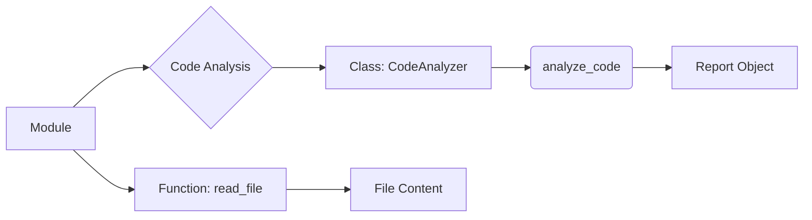

# Code Documentation Style Guide

## 1. Introduction

This document outlines the style guide for documenting code, focusing on consistency and clarity.  This guide emphasizes using Markdown (.md) for comments and explanations within the code.

## 2. Documentation Structure

The documentation should follow a structured format, providing comprehensive information for each module, class, function, and method.


## 3. Module Documentation

**Format:**

```markdown
# Module: [Module Name]

[Module description]

## Example Usage

```python
[Example code]
```

## Platforms and Synopsis

[Platform details, e.g., Python version, supported OSes]
[Brief overview of the module's purpose]

## Attributes

[List of attributes, descriptions]

## Methods

[List of methods, descriptions, examples, parameters, return values]
```

**Example:**

```markdown
# Module: FileProcessor

This module provides functions for processing files.

## Example Usage

```python
import FileProcessor

result = FileProcessor.process_file("myfile.txt")
print(result)
```

## Platforms and Synopsis

Supports Python 3.8+.  Provides basic file reading and processing tools.

## Attributes

- `file_path`: The path to the file.

## Methods
### `process_file(file_path)`

Reads a file and returns its content.

## Parameters
- `file_path`: The path to the file.


## Return Value

- Returns the content of the file as a string.  Returns `None` if the file doesn't exist.


```

## 4. Class Documentation

**Format:**

```markdown
# Class: [Class Name]

[Class description]

## Attributes
[List of attributes, descriptions]

## Methods
### [Method Name]

[Method description, parameters, return values, examples]
```

**Example:**

```markdown
# Class: CodeAnalyzer

This class analyzes code files and generates reports.

## Attributes
- `file_paths`: List of file paths to analyze.

## Methods
### `analyze_code()`

Analyzes code files and generates a report.


## Parameters
- `file_paths`: List of file paths to analyze


## Return Value

- Returns a report object containing analysis results or `None` on error.

```

## 5. Function and Method Documentation

**Format:**

```markdown
# Function/Method: [Name]

[Function/Method description, parameters, return values, examples]
```

**Example:**

```markdown
# Function: read_file

Reads a file and returns its content.


## Parameters
- `filepath`: The path to the file


## Return Value

- Returns the file content as a string or None if there was an error.

## Example Usage

```python
content = read_file("my_file.txt")
if content:
    print(content)
else:
    print("Error reading file")
```
```

## 6. Comments in Code

Comments should be in markdown, and use blocks rather than single line comments.


## 7. Exceptions

**Format:**

```markdown
# Exception: [Exception Name]

[Exception description, parameters, examples]
```


**Example:**

```markdown
# Exception: FileNotFoundError

Raised when a file is not found.

## Parameters
- `file_path`: The path of the file not found.

## Example Usage

```python
try:
    open("nonexistent.txt")
except FileNotFoundError as e:
    print(f"Error: {e}")
```
```


## 8.  Coding Style


*   Use consistent indentation.
*   Keep code blocks concise and readable.
*   Avoid overly complex logic.
*   Prioritize code clarity and maintainability.


## 9.  Conclusion


This guide provides a comprehensive structure for documenting code. Following this guide helps ensure that code is well-understood, maintained, and easily used by other developers.
```



**<explanation>**

This document is a style guide for documenting code, not actual code. It provides templates for various code documentation elements (modules, classes, functions, methods, exceptions).  It encourages using Markdown within code comments for better readability and structure.  The `mermaid` code shows a basic relationship diagram with a Module calling a function within a class.

**Dependencies:**

There are no external dependencies in this provided code example. The documentation is self-contained and relies only on the Markdown syntax.